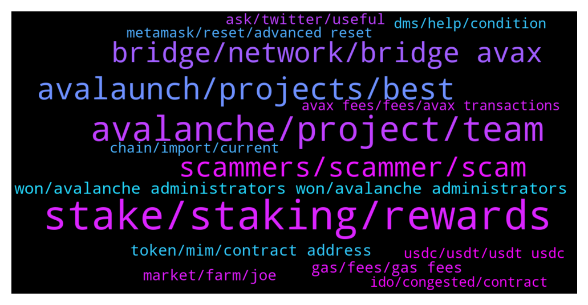

# **@avalancheavax**
 ## Analysis for **2022-01-23** - **2022-01-30**.

---

## 📊 **Basic Stats**

**n_messages_sent**: 1047

---

---

## 🔝 **Top keywords and related messages**

1. **stake, staking, rewards**

    @oathtobarbatos --- *2000 AVAX are required to stake. 25 to delegate.* **--->** [TG Discussion](https://t.me/avalancheavax/323285)

    @ravasude --- *Is there a way to get free AVAX for staking purpose? (Similar to Matic Vault)* **--->** [TG Discussion](https://t.me/avalancheavax/325370)

    @Jenkinz999 --- *They don’t seem to want to answer this question, I have less than the 25 minimum required therefore can’t use the avalanche web wallet* **--->** [TG Discussion](https://t.me/avalancheavax/323276)

    @Kazue --- *Hi guys. What is the best apy to stake avax with the less risk? I staked on avalanche wallet for 10% any better way to do?* **--->** [TG Discussion](https://t.me/avalancheavax/323096)

    @jk00124 --- *What’s the best way to stake AVAX* **--->** [TG Discussion](https://t.me/avalancheavax/323912)

    @Nicolas_A --- *Means more than 4500 transactions per second. 4500 was a figure achieved a few years ago. Current maximum would be higher. Anyway max tps is a bit of an overrated figure. Finality is more important* **--->** [TG Discussion](https://t.me/avalancheavax/323423)

2. **avalanche, project, team**

    @lord --- *no does not support avalanche at this time, this is why i need to convert it to another token first, just wondering if anyone has a suggestion* **--->** [TG Discussion](https://t.me/avalancheavax/325045)

    @iwouldbediogenes --- *Fake news. Competitors are scared.. Avalanche tech is the N. 1* **--->** [TG Discussion](https://t.me/avalancheavax/324049)

    @Olagbemide --- *Beta finance  is coming  to avalanche  platform  is that true* **--->** [TG Discussion](https://t.me/avalancheavax/323333)

    @okumanntyojya --- *Avalanche has any relationship with avaxwarriors (NFT project kind a BAYC fork)? avalanche twitter retweet  avaxwarriors tweet a lot of time. and they said Avalanche support us. Any relationship?* **--->** [TG Discussion](https://t.me/avalancheavax/324598)

    @forbitspacex --- *Why we build protocol on Avalanche not support an recognized?* **--->** [TG Discussion](https://t.me/avalancheavax/323558)

    @Cody_0x --- *My understanding is Avalanche actually solves scalability issues with its 3 tier blockchain technology. If I search avalanche scalability issues I only find information on how it solves this problem.   It makes me think these concerns may come from competitors who are scared?* **--->** [TG Discussion](https://t.me/avalancheavax/324048)

3. **avalaunch, projects, best**

    @arcterex --- *Thanks.  I've followed Avalaunch, Avaxholic, AvxLaunchpad, Avalanche Today....any other ones for new projects?* **--->** [TG Discussion](https://t.me/avalancheavax/325385)

    @Lukmankhalique --- *Hey there. Are there any avax specific launchpads beside avalaunch?* **--->** [TG Discussion](https://t.me/avalancheavax/324138)

    @modelRh --- *How do I get Avax projects* **--->** [TG Discussion](https://t.me/avalancheavax/323401)

    @YuYuHakusho22 --- *what are the best and most active avax defi communities to find out about new projects with utilities on the chain? best social media outlets. tg Twitter etc? thanks in advance* **--->** [TG Discussion](https://t.me/avalancheavax/324082)

    @alexanderppkv --- *Hi there! Could someone from AVAX team contact me? I’m representing ChangeNOW exchange service and we’ve gor some difficulties with integration of the AVAX on our platform – would like to ask for some assistance* **--->** [TG Discussion](https://t.me/avalancheavax/323181)

    @investing_q --- *Hello everyone, please tell me if there is one team behind AVAX and Avalaunch launchpad, with the XAVA token.  Or is it just a project created on the AVAX blockchain and has nothing to do with the Avalanche team?* **--->** [TG Discussion](https://t.me/avalancheavax/324925)

4. **bridge, network, bridge avax**

    @Global_Defi --- *https://bridge.avax.network/   <— is this avax's official bridge ?  it says beta at the top left of the web page.   is there another bridge that we could move big money  ?* **--->** [TG Discussion](https://t.me/avalancheavax/323649)

    @oathtobarbatos --- *Yeah, that's the official one. bridge.avax.network* **--->** [TG Discussion](https://t.me/avalancheavax/323650)

    @Nicolas_A --- *Bridge.Avax.network if it’s on Ethereum else I would recommend synapse protocol / Celer network* **--->** [TG Discussion](https://t.me/avalancheavax/323216)

    @LONGDONGWONG --- *How do I go about bridging UST from Terra to AVAX* **--->** [TG Discussion](https://t.me/avalancheavax/324871)

    @ShinJaiya --- *Hey all what is the easiest way to transfer ust from terra chain to avax ?* **--->** [TG Discussion](https://t.me/avalancheavax/323150)

    @JustZee12 --- *Best bridge for bnb/eth to avax?* **--->** [TG Discussion](https://t.me/avalancheavax/323211)

5. **scammers, scammer, scam**

    @oathtobarbatos --- *This is a scammer, be careful* **--->** [TG Discussion](https://t.me/avalancheavax/323640)

    @lord --- *isn't it comforting to know this place is just scammer central, no legit help on here* **--->** [TG Discussion](https://t.me/avalancheavax/325066)

    @lord --- *just had the following text, is this another scammer ...* **--->** [TG Discussion](https://t.me/avalancheavax/325053)

    @pupmkin_l --- *But I know the right ones so I can’t get scammed tho* **--->** [TG Discussion](https://t.me/avalancheavax/322839)

    @pupmkin_l --- *Lol 😂 so many scams actually especially in this group* **--->** [TG Discussion](https://t.me/avalancheavax/322838)

    @Crysis112 --- *Wow the amount of scammers trying to contact you after 1 message is insane* **--->** [TG Discussion](https://t.me/avalancheavax/323532)

6. **won, avalanche administrators won, avalanche administrators**

    @oathtobarbatos --- *Avalanche administrators won't DM you first, also, they won't ask you for money.* **--->** [TG Discussion](https://t.me/avalancheavax/323061)

    @oathtobarbatos --- *Be careful with anyone's DM and, remember, Avalanche administrators won't ask you for money and, they won't DM you first.* **--->** [TG Discussion](https://t.me/avalancheavax/324965)

    @oathtobarbatos --- *Be careful with anyone's DM. Avalanche administrators won't DM you first!* **--->** [TG Discussion](https://t.me/avalancheavax/325258)

    @oathtobarbatos --- *Be always be careful with anyone's DM. Avalanche administrators won't ask you for money and, they won't DM you first!* **--->** [TG Discussion](https://t.me/avalancheavax/323862)

    @oathtobarbatos --- *Be careful with anyone's DM. Avalanche administrators won't DM you first and, they won't ask you for money!* **--->** [TG Discussion](https://t.me/avalancheavax/324309)

    @oathtobarbatos --- *Be careful with anyone's DM. Avalanche administrators won't DM you first and, they won't ask you for money.* **--->** [TG Discussion](https://t.me/avalancheavax/322795)

7. **token, mim, contract address**

    @holiadour --- *Yesterday circulation 156M token today 157M and tomorrow 158M ………* **--->** [TG Discussion](https://t.me/avalancheavax/323505)

    @Toto --- *hi , i send some aave.e to the adress of aave.e is there a way to send back the tokens to the adress it came from ?* **--->** [TG Discussion](https://t.me/avalancheavax/323229)

    @tibgram --- *Hi is MIM going to desappear?* **--->** [TG Discussion](https://t.me/avalancheavax/325025)

    @iNeverDM --- *Do your own research. Everyone using MIM* **--->** [TG Discussion](https://t.me/avalancheavax/322723)

    @Kayelowinny --- *Universe/mim on avax check it out node/token/nft project* **--->** [TG Discussion](https://t.me/avalancheavax/324708)

    @blockchain_superman --- *MIM token is scam token. Do not use this* **--->** [TG Discussion](https://t.me/avalancheavax/322728)

8. **gas, fees, gas fees**

    @ruch149 --- *Wtf is this? 3$ to swap from one token to the other? Why are gas fees so high* **--->** [TG Discussion](https://t.me/avalancheavax/322939)

    @l0nEr00 --- *seriously whats up with the gas fees now.... the IGO sale isnt filling up very fast... but gas is so high* **--->** [TG Discussion](https://t.me/avalancheavax/322966)

    @faggins --- *Im about to unstake JLP But gas is on the high side.   Gas Limit 372,550 Max Priority Fees: 130 Max Fee: 130* **--->** [TG Discussion](https://t.me/avalancheavax/324531)

    @faisala777 --- *are gas fees higher than normal right now?* **--->** [TG Discussion](https://t.me/avalancheavax/323047)

    @W --- *Gas price seem like it went up* **--->** [TG Discussion](https://t.me/avalancheavax/323940)

    @mkchaves --- *Exactly. I mean you have literally 15 hours to buy it.* **--->** [TG Discussion](https://t.me/avalancheavax/322955)

9. **market, farm, joe**

    @Rick --- *Guys, is everyone in the long on BTC? Some kind of prolonged correction, I'm thinking about closing all positions. Not destined to wait for the second altszn* **--->** [TG Discussion](https://t.me/avalancheavax/324376)

    @Anabeli2 --- *What are your opinion on the market movement* **--->** [TG Discussion](https://t.me/avalancheavax/323873)

    @lilly5671 --- *The market is bad now but we are still doing well 😋* **--->** [TG Discussion](https://t.me/avalancheavax/324129)

    @pupmkin_l --- *I’m just looking for real investors and traders here that’s all* **--->** [TG Discussion](https://t.me/avalancheavax/322843)

    @Briggsservic --- *I wonder why we complain when the market tanks, obviously if you in long term you know what you want tbh it’s awkward if I’m looking for short term gains I’d preferably farm my crypto n stack w my earning into my position* **--->** [TG Discussion](https://t.me/avalancheavax/324706)

    @Paige_Turna80 --- *Hi everyone!! Wish we have a beautiful weekend ahead, with this market drop down I’d advice anyone to keep stacking the dips. As for me I’ve re accumulated into my portfolio with my farm earnings 😅😅 it’s the usual price cycle. So farm and HODL ✅* **--->** [TG Discussion](https://t.me/avalancheavax/323885)

10. **ask, twitter, useful**

    @oathtobarbatos --- *I'd recommend you to ask that in this channel: https://t.me/avalanche_trading* **--->** [TG Discussion](https://t.me/avalancheavax/324561)

    @YuYuHakusho22 --- *do you have the links or will they come up like that from searching* **--->** [TG Discussion](https://t.me/avalancheavax/324087)

    @oathtobarbatos --- *I think this could be useful for what you are asking https://avascan.info/stats/genesis* **--->** [TG Discussion](https://t.me/avalancheavax/323835)

    @hrbooms --- *Thank you very much! this is exactly what I was looking for* **--->** [TG Discussion](https://t.me/avalancheavax/323836)

    @oathtobarbatos --- *Twitter is one good way to find them, for example!* **--->** [TG Discussion](https://t.me/avalancheavax/325382)

    @Nicolas_A --- *I don't use it myself so can't give you tips. Perhaps ask in 1inch channels* **--->** [TG Discussion](https://t.me/avalancheavax/325302)

11. **dms, help, condition**

    @Nicolas_A --- *Sure you can send me a dm* **--->** [TG Discussion](https://t.me/avalancheavax/323182)

    @debrakingston --- *I have numbers of them calming to be in my dm* **--->** [TG Discussion](https://t.me/avalancheavax/323113)

    @oathtobarbatos --- *Be careful with anyone's DM, guys* **--->** [TG Discussion](https://t.me/avalancheavax/325333)

    @Alara --- *I wanna help 10 person here but there is a condition  dm now to know that condition* **--->** [TG Discussion](https://t.me/avalancheavax/324916)

    @Nicolas_A --- *You can send me a message* **--->** [TG Discussion](https://t.me/avalancheavax/324511)

    @Jborum --- *I can’t send you a dm* **--->** [TG Discussion](https://t.me/avalancheavax/322923)

12. **usdc, usdt, usdt usdc**

    @Link4Questions --- *Is there any cex with usdt or usdc withdrawal in avalanche? (Usdt.e or usdc.e)* **--->** [TG Discussion](https://t.me/avalancheavax/323538)

    @mehmet07btc --- *Guys in which cexes are native usdt and usdc traded* **--->** [TG Discussion](https://t.me/avalancheavax/324687)

    @wireframester --- *you mean, swap USDC for USDC.e? is that possible on traderjoe or Pangolin?* **--->** [TG Discussion](https://t.me/avalancheavax/323187)

    @wireframester --- *Hello, I cant find USDC on the avalanche bridge, I only see USDC.e, which is not what i want! any advice? Scammer and anyone else, spare me your PMs!* **--->** [TG Discussion](https://t.me/avalancheavax/323184)

    @Ace422 --- *what about USDC & USDT, and what's the different between *.e and the regular ones?* **--->** [TG Discussion](https://t.me/avalancheavax/325424)

    @AceInTheHat --- *What are the fees to bridge ETH USDC to AVAX USDC.e on https://bridge.avax.network/login? Is there a tutorial on how to use?* **--->** [TG Discussion](https://t.me/avalancheavax/322773)

13. **chain, import, current**

    @WelshNik --- *What chain do you withdraw on? Is it c or x chain, doesn’t say…* **--->** [TG Discussion](https://t.me/avalancheavax/324841)

    @Nicolas_A --- *You can't make transfer from an X chain address to a C chain address and vice versa. It won't be accepted by the network* **--->** [TG Discussion](https://t.me/avalancheavax/322747)

    @Nicolas_A --- *Go to the advanced tab and click Import X from C* **--->** [TG Discussion](https://t.me/avalancheavax/322745)

    @EJoker99 --- *https://docs.avax.network/build/tutorials/nodes-and-staking/run-avalanche-node  follow this page ,when synchronization is complete,can use RPC-API Service with C-chain ?* **--->** [TG Discussion](https://t.me/avalancheavax/324389)

    @Block_Monkey --- *I checked each option for chain import, but all say nothing to import.* **--->** [TG Discussion](https://t.me/avalancheavax/324657)

    @Mell0w_633 --- *X to C chain I mean* **--->** [TG Discussion](https://t.me/avalancheavax/323510)

14. **metamask, reset, advanced reset**

    @oathtobarbatos --- *Try restarting your Metamask account Settings -> Advanced -> Reset just in case* **--->** [TG Discussion](https://t.me/avalancheavax/323906)

    @oathtobarbatos --- *Yeah, that's what I was about to say, try resetting your Metamask. It should fix it* **--->** [TG Discussion](https://t.me/avalancheavax/323828)

    @Nicolas_A --- *Not aware of any issue with Metamask on mobile. Be sure to be connected to the Avalanche network. Try to reset Metamask perhaps* **--->** [TG Discussion](https://t.me/avalancheavax/323426)

    @Nicolas_A --- *With Metamask ? Would try using Rabby instead and see if it works* **--->** [TG Discussion](https://t.me/avalancheavax/324091)

    @Nicolas_A --- *Would recommend trying to reset Metamask : settings > advanced > reset* **--->** [TG Discussion](https://t.me/avalancheavax/323751)

    @researchone --- *hmm stil the same issue, any other recommendations?* **--->** [TG Discussion](https://t.me/avalancheavax/324715)

15. **ido, congested, contract**

    @LONGDONGWONG --- *network grinding to a halt again* **--->** [TG Discussion](https://t.me/avalancheavax/324903)

    @makiob --- *does anyone what dapp is this contract ? https://snowtrace.io/address/0x41ed99efeab7f5e82cc2ba69fa1b81f7abb7b064 ? it is consuming a lot of gas* **--->** [TG Discussion](https://t.me/avalancheavax/322938)

    @mkchaves --- *Network is not down, it's just busy. This IDO has 30k participants I don't know how many are trying to buy at the same time* **--->** [TG Discussion](https://t.me/avalancheavax/322953)

    @mkchaves --- *Network is heavily congested, gwei is 274 right now* **--->** [TG Discussion](https://t.me/avalancheavax/323808)

    @Laikevin --- *Omg the network is so congested* **--->** [TG Discussion](https://t.me/avalancheavax/323012)

    @r0lex --- *What's up with this thing?  How do I move my funds out of here now?  Also what's up with turning slow mode on in a channel where nobody's talking?* **--->** [TG Discussion](https://t.me/avalancheavax/324736)

