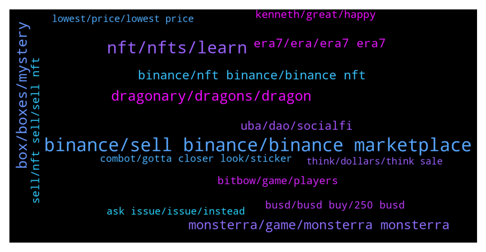

# **@binancenfts**
 ## Analysis for **2022-01-23** - **2022-01-30**.

---

## 📊 **Basic Stats**

**n_messages_sent**: 3056

---

---

## 🔝 **Top keywords and related messages**

1. **binance, sell binance, binance marketplace**

    @aisha153 --- *Thinking about it but i don't know what does it used for. Also i am just a manual trade in Binance so am not familiar with other things inside of it.* **--->** [TG Discussion](https://t.me/binancenfts/441647)

    @Bikasba --- *I'm new in binance ..  Is there any roles for new user..* **--->** [TG Discussion](https://t.me/binancenfts/436209)

    @Sahib_BNB --- *Please contact Online Binance Support >  https://www.Binance.com/en/chat* **--->** [TG Discussion](https://t.me/binancenfts/442549)

    @Sahib_BNB --- *Its not possible anyways > Please contact Online Binance Support >  https://www.Binance.com/en/chat* **--->** [TG Discussion](https://t.me/binancenfts/435967)

    @Jaraed --- *I dont think there is a way to caculate it but binance has many millions useing it and there where only 750 rewards so i could be wrong but there is decentchance all rewards already claimed cheek out rules of the evwnt for more/better info* **--->** [TG Discussion](https://t.me/binancenfts/448767)

    @semeerkv --- *Go Binance market market place and buy and sell* **--->** [TG Discussion](https://t.me/binancenfts/436919)

2. **nft, nfts, learn**

    @SyronEU --- *i said whats happening with eth =  everything????  because all the nfts dropping wow* **--->** [TG Discussion](https://t.me/binancenfts/440020)

    @just_text_me --- *How do I create a nft* **--->** [TG Discussion](https://t.me/binancenfts/436044)

    @Crypto_Mongers01 --- *Where are we going to be holding the NFTs* **--->** [TG Discussion](https://t.me/binancenfts/435608)

    @ashwin24aug --- *Okay. I am not doing all this in fact. We are implementing nft project in our organization. So trying to get answer of above queries* **--->** [TG Discussion](https://t.me/binancenfts/436187)

    @katelynMal --- *Can anyone explain something about the NFTs* **--->** [TG Discussion](https://t.me/binancenfts/435977)

    @arianagrinder89 --- *Still no demand for your nfts? Last time we talked you were thinking of nft fragmentation* **--->** [TG Discussion](https://t.me/binancenfts/443854)

3. **box, boxes, mystery**

    @kusluy1 --- *if they don't buy all the tickets, what will happen to the rest of the boxes* **--->** [TG Discussion](https://t.me/binancenfts/444035)

    @elifdemdem --- *Opportunity for you. With 99 you can buy 15 new boxes 🤣* **--->** [TG Discussion](https://t.me/binancenfts/436118)

    @Rams2025 --- *Ahh okay I should buy 1 mystery box when it price <$19.9* **--->** [TG Discussion](https://t.me/binancenfts/439105)

    @InsaneChemical --- *I'm going to try and buy a few. The price of the mystery boxes are reasonably cheap 😄* **--->** [TG Discussion](https://t.me/binancenfts/439112)

    @amit2017kk --- *@ChibiMaya_bnb i got this but it is written not tradable then, what's use of this box?* **--->** [TG Discussion](https://t.me/binancenfts/436207)

    @aleBiT27 --- *Let's hope it goes well, mystery boxes are always a scam. All "normal" haha... Congratz.* **--->** [TG Discussion](https://t.me/binancenfts/435683)

4. **dragonary, dragons, dragon**

    @elmakhannam --- *I’m actually a bit of a noob in blockchain game,How do i play Dragonary on my Desktop? How many players are playing Dragonary?anyone can play it or any requirement for play? #Dragonary* **--->** [TG Discussion](https://t.me/binancenfts/436291)

    @RamiroCH --- *Dragonary is a RPG, the Dragons play different roles inside the battle, depending on their elements. Like most online games, we have PVE and PVP battles. In the PVE you can find the story mode, the ember mode (used to create more dragons), and the Dungeon mode where you can test yourself, this is the most difficult PVE mode by far! And in the recently released PVP mode, you can fight against random players or friends. Regarding's playing, that a yes, you can create an account on our HUB, download the game, and start playing totally F2P, there will be 3 dragons waiting for you ingame :D* **--->** [TG Discussion](https://t.me/binancenfts/436250)

    @<UNK> --- *" @DragonaryGame " Is there any mode where i can test myself as a beginner??   #Dragonary    .* **--->** [TG Discussion](https://t.me/binancenfts/436327)

    @borsha3 --- *What are the processes involved if i want to breed my Dragon? And what is the advantages of breeding a Dragon? #Dragonary @RamiroCH @acoinary* **--->** [TG Discussion](https://t.me/binancenfts/436318)

    @RamiroCH --- *Anyone can play it! You can enter dragonary.com and download the game right away. We have around 235k different users per month.* **--->** [TG Discussion](https://t.me/binancenfts/436354)

    @Anous_hka --- *The structure of the Dragonary game is geared only for experienced and professional players? or can any average user play?#Dragonary* **--->** [TG Discussion](https://t.me/binancenfts/436321)

5. **monsterra, game, monsterra monsterra**

    @Black4_L --- *@thangmd Are u still willing to launch under these market conditions, or u might postpone? #Monsterra* **--->** [TG Discussion](https://t.me/binancenfts/445287)

    @chromia999 --- *Monsterra When will the officially game be launch and How many modes can users play...? #Monsterra* **--->** [TG Discussion](https://t.me/binancenfts/445321)

    @Uamos --- *-It caught my attention that currently, Monsterra is a double chain game on BSC and Terra, but, I wonder, are you thinking of expanding to other networks? How about Ethereum or Polygon? @thangmd   #Monsterra* **--->** [TG Discussion](https://t.me/binancenfts/445264)

    @Jallenreyesm --- *Given that Monsterra was inspired from the famous game Axie Infinity, does your game also have a scholarship program/feature for those who does not have enough funds to start their own team in the game?  #Monsterra* **--->** [TG Discussion](https://t.me/binancenfts/445260)

    @Naikgauresh481 --- *Can you tell us about the Mongens collections available in Monsterra? Can you tell us if there are multi-Platform ecosystems in Monsterra? @thangmd #Monsterra* **--->** [TG Discussion](https://t.me/binancenfts/445274)

    @Yaktia --- *Do we need to buy land in the Monsterra game and for what reasons we need to acquire it?#Monsterra* **--->** [TG Discussion](https://t.me/binancenfts/445272)

6. **binance, nft binance, binance nft**

    @kallmenelly17 --- *Why is it so hard to sell any nfts on Binance NFT Marketplace* **--->** [TG Discussion](https://t.me/binancenfts/447389)

    @martinez575 --- *How do I sell my NFT on Binance* **--->** [TG Discussion](https://t.me/binancenfts/436040)

    @telapiaex69 --- *Sell post  First creating binance NFT* **--->** [TG Discussion](https://t.me/binancenfts/444350)

    @vanw_n --- *How to sell an NFT on Binance NFT Marketplace* **--->** [TG Discussion](https://t.me/binancenfts/438062)

    @robilone --- *How can i start selling my nfts  on binance NFTs* **--->** [TG Discussion](https://t.me/binancenfts/438749)

    @robilone --- *How can i start selling my NFTs on binance NFTs* **--->** [TG Discussion](https://t.me/binancenfts/438770)

7. **era7, era, era7 era7**

    @arianagrinder89 --- *just google it. top result is official era7 website* **--->** [TG Discussion](https://t.me/binancenfts/444016)

    @Bikase --- *Anyone give me era7 website link* **--->** [TG Discussion](https://t.me/binancenfts/444000)

    @TERRIFICZ --- *So... what are the extra features that Era7 providing which makes it different from your compatitors ?  #ERA7* **--->** [TG Discussion](https://t.me/binancenfts/444231)

    @DmitriPro --- *For right now, i feel happy to be with Era7, i believe in  big future of this game.* **--->** [TG Discussion](https://t.me/binancenfts/444108)

    @DmitriPro --- *Our smart contract addresses were code-checked with the audit certificate, indicating no flaws found.   So far, Era7 has received strategic investment and backing from renowned VCs, industry heavyweights, and institutions in the blockchain industry, including Hash key, Huobi Ventures, Okcoin, Binary Capital, DAG, Waterdrop, Dreamseeker, BTC12, Tembusu, and Mobox.* **--->** [TG Discussion](https://t.me/binancenfts/444142)

    @Anous_hka --- *Is Era7 completely secure? Which security firm do you work with to provide a safe space for players? Have security checks been completed?#ERA7* **--->** [TG Discussion](https://t.me/binancenfts/444248)

8. **uba, dao, socialfi**

    @irfanecruz --- *Does higher 3D Avatar Rank mean more DAO rights in the UBA Community? If I get the lowest rank can I still participate in DAO? #UBA @LeviBini* **--->** [TG Discussion](https://t.me/binancenfts/435252)

    @LeviBini --- *I’m building UBA DAO because I believe it will bring about real changes to the world we live in.* **--->** [TG Discussion](https://t.me/binancenfts/435191)

    @LeviBini --- *UBI is an income in Fiat currency. Organized in a top-down fashion. Requires large government efforts.  Universal Basic Asset is an asset, built on the blockchain, organized by the community Bottom-Up.  With new DAO governance, it can even be governed by community. We are very excited to see the chemistry reaction between DAO and Universal Basic Asset, it could be a perfect solution to a very expensive problem.* **--->** [TG Discussion](https://t.me/binancenfts/435275)

    @LeviBini --- *UBA DAO gives society builders a platform to test their idea as a SocialFi project, raise funds, and rally support.* **--->** [TG Discussion](https://t.me/binancenfts/435197)

    @LeviBini --- *UBA DAO proposes a bottom-up alternative to achieve the same result, in which a decentralized underlying asset is accessible to everyone, so anyone can get the asset, contribute to its growth, and vote on the development of the organization.* **--->** [TG Discussion](https://t.me/binancenfts/435217)

    @Riyadchoudhory --- *🚦What are UBA  and what is their role in UBA DAO and SocialFi NFT? #UBA* **--->** [TG Discussion](https://t.me/binancenfts/435266)

9. **sell, nft sell, sell nft**

    @MarcoForex --- *Request of NFT before pay, Buy Offline, Selling Project with Crypto pay* **--->** [TG Discussion](https://t.me/binancenfts/446459)

    @asilvaferreira --- *I created an NFT, how do I sell it?* **--->** [TG Discussion](https://t.me/binancenfts/442653)

    @Hamza_shah_0 --- *Where can i post my nfts for sale without giving any gass fee ?* **--->** [TG Discussion](https://t.me/binancenfts/447639)

    @MrSource2 --- *How can I make my own NFT and sell at a good price please I need your help* **--->** [TG Discussion](https://t.me/binancenfts/447454)

    @chuchenli11 --- *Any idea on how to sell NFT without gas fee?* **--->** [TG Discussion](https://t.me/binancenfts/443123)

    @boxyboxx --- *SELLING 10 NFTS FOR 50 USDT* **--->** [TG Discussion](https://t.me/binancenfts/437532)

10. **kenneth, great, happy**

    @InsaneChemical --- *Its an amazing opportunity for you all 🙌* **--->** [TG Discussion](https://t.me/binancenfts/439273)

    @SushiGMI --- *Wow I look good here thanks for getting my NFT🍣❤️* **--->** [TG Discussion](https://t.me/binancenfts/438903)

    @xxilsmr --- *you love to praise yourself too much, stop it🤣* **--->** [TG Discussion](https://t.me/binancenfts/438910)

    @aisha153 --- *Didn't know that there would be some good people out of here😊Thank you so much!* **--->** [TG Discussion](https://t.me/binancenfts/441668)

    @Kenikky --- *Great to have you with us* **--->** [TG Discussion](https://t.me/binancenfts/435187)

    @Kenikky --- *was great having you with us* **--->** [TG Discussion](https://t.me/binancenfts/435286)

11. **bitbow, game, players**

    @dlee7769 --- *This is actually what makes BitBow stand out, because our game is playable at any device and requires a relatively low size of memory. You can play the game on your laptop using a web browser or using your mobile phone. We have sucessfully tested our app on both Android and iOS and receives a great feedbacks from our beta testers that are coming from our early community members* **--->** [TG Discussion](https://t.me/binancenfts/438450)

    @YilanGulsum --- *Why "ARCHERY"? Why not other sports? Has there been any movie, book, game, etc. characters that gave you the idea of making a game about archery? #BitBow* **--->** [TG Discussion](https://t.me/binancenfts/438401)

    @GoodMaleficent --- *Hello 👋 @dlee7769   Most of the Crypto Gaming projects requires a high investment to let the gamers play!  Can you kindly tell us, how much should we invest in to start playing BitBow? Is BitBow suitable for small investors and Crypto Beginners?  #BitBow* **--->** [TG Discussion](https://t.me/binancenfts/438393)

    @TERRIFICZ --- *I’m actually a novice in blockchain game! How do I play BitBow on my laptop? (Any Blog/Video illustration for beginners) Does anyone can play it or any requirement for play?  #BitBow* **--->** [TG Discussion](https://t.me/binancenfts/438428)

    @InsaneChemical --- *Yes its a great project. I have already played the beta version of BitBow. I must say its so satisfying to hit targets and earn in game😌🙂* **--->** [TG Discussion](https://t.me/binancenfts/439101)

    @<UNK> --- *Where can i see the game play and roadmap? #Bitbow @dlee7769* **--->** [TG Discussion](https://t.me/binancenfts/438405)

12. **busd, busd buy, 250 busd**

    @aawwsup --- *so is there a chance that in the future i will be able to sell it for 350 busd ? :D* **--->** [TG Discussion](https://t.me/binancenfts/434755)

    @Readynl --- *If you have busdbusdon your spot. Then its enough.* **--->** [TG Discussion](https://t.me/binancenfts/443563)

    @law737 --- *250 busd buy it now. dm me for link* **--->** [TG Discussion](https://t.me/binancenfts/434635)

    @kryptoak --- *Idk why people are selling it for 350 BUSD XD* **--->** [TG Discussion](https://t.me/binancenfts/434752)

    @antivkonst --- *I can put it in busd* **--->** [TG Discussion](https://t.me/binancenfts/444942)

    @AndrewGarci --- *I have one of this... 190 busd!!!* **--->** [TG Discussion](https://t.me/binancenfts/436849)

13. **ask issue, issue, instead**

    @RealJassia --- *@GencKimyasal Please asked your issue here Instead of DM* **--->** [TG Discussion](https://t.me/binancenfts/435472)

    @RealJassia --- *@Themirnavv please ask your issue here instead of DM* **--->** [TG Discussion](https://t.me/binancenfts/445903)

    @Sahib_BNB --- *@Crypto_inclined  , 🚫Dont DM me , kindly message here your issue ⚠️* **--->** [TG Discussion](https://t.me/binancenfts/442513)

    @RealJassia --- *@MarcoForex Please ask your issue here instead of DM* **--->** [TG Discussion](https://t.me/binancenfts/445781)

    @Profblinks --- *Send me a dm for the link* **--->** [TG Discussion](https://t.me/binancenfts/434879)

    @RealJassia --- *@prior_ity Please ask your issue here instead of dm* **--->** [TG Discussion](https://t.me/binancenfts/445787)

14. **combot, gotta closer look, sticker**

    @c_hinmay --- *What was that video? ... some kind of showoff🤣🤣🤣* **--->** [TG Discussion](https://t.me/binancenfts/441968)

    @ravindu25 --- *What the hell is this 😂😂😂* **--->** [TG Discussion](https://t.me/binancenfts/448835)

    @Chyou99 --- *👀👀I don't have any extra $ for it 😏* **--->** [TG Discussion](https://t.me/binancenfts/448289)

    @RealJassia --- *Yeah. Our Mr. Combot is very sharp in these things😉* **--->** [TG Discussion](https://t.me/binancenfts/445874)

    @Inosuke1 --- *I haven't received any as I'm holding all of them🥺* **--->** [TG Discussion](https://t.me/binancenfts/442023)

    @Inosuke1 --- *Looks like a cartoon episode 🤣* **--->** [TG Discussion](https://t.me/binancenfts/436584)

15. **lowest, price, lowest price**

    @PixArt_Badass_Spartacus_Club --- *👀nice floor price rising on these quick* **--->** [TG Discussion](https://t.me/binancenfts/443015)

    @kryptoak --- *It's literally the lowest price is the market. You can verify it yourself.* **--->** [TG Discussion](https://t.me/binancenfts/440424)

    @moazzehry --- *This is the lowest price 2$* **--->** [TG Discussion](https://t.me/binancenfts/448048)

    @Z777QQ --- *The search system is so buggy I click on the lowest price and it still doesnt show the lowest one Just bought something that i thought was the lowest but when i searched again it wasnt* **--->** [TG Discussion](https://t.me/binancenfts/446852)

    @Ramuk_Arvind --- *Lowest price in market for sale* **--->** [TG Discussion](https://t.me/binancenfts/436661)

    @HariBol --- *Why the price at market is lower than at presale? ))* **--->** [TG Discussion](https://t.me/binancenfts/438222)

