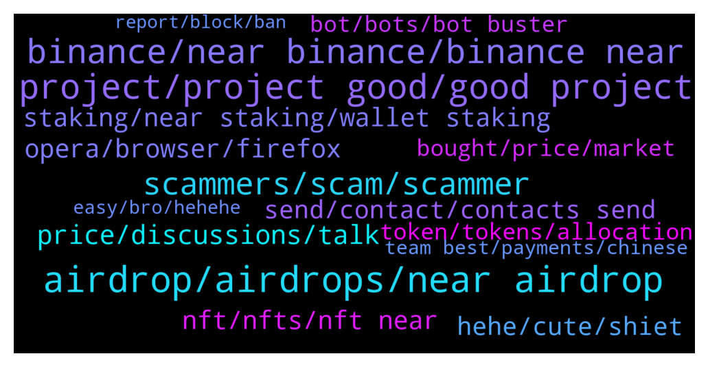

# **@cryptonear**
 ## Analysis for **2022-01-23** - **2022-01-30**.

---

## 📊 **Basic Stats**

**n_messages_sent**: 4544

---

---

## 🔝 **Top keywords and related messages**

1. **airdrop, airdrops, near airdrop**

    @bailey_12 --- *Hey gangz,  This is a little side project of mine. If you looking for some quality time, and maybe wining some airdrop. Do not miss this  https://twitter.com/BaileyVu12/status/1484084138240245762* **--->** [TG Discussion](https://t.me/cryptonear/294553)

    @JAbioye1 --- *Hey guys quick one, does staking with a validator give me acces to airdrops?* **--->** [TG Discussion](https://t.me/cryptonear/290863)

    @mayanktanwar2 --- *Hey i submit form i m eligible to Airdrop?* **--->** [TG Discussion](https://t.me/cryptonear/300458)

    @crazytoken --- *when start distri airdrop sir ?* **--->** [TG Discussion](https://t.me/cryptonear/298753)

    @a1sunny --- *No idea bro it's my first time, so 0lease if you guide me i will be thankful to you. I want to get the new Airdrops. No interested in apy/APR. So please...* **--->** [TG Discussion](https://t.me/cryptonear/291259)

    @israel_igboze --- *No. This is not airdrop. This is just a Twitter contest* **--->** [TG Discussion](https://t.me/cryptonear/289539)

2. **project, project good, good project**

    @upance --- *This is excellent project for the future with strong team, a transparent, planned and project roadmap. it will be successfulI. Always be waiting for the progress of this project.* **--->** [TG Discussion](https://t.me/cryptonear/301438)

    @praveen9008 --- *That's a really amazing project. I'm so excited and happy to be participating in this project. I hope this project will gain more popularity in the future. ❤️🎉* **--->** [TG Discussion](https://t.me/cryptonear/315516)

    @momotazchy --- *A good project and strong team in a predictable and transparent road map, planned and projected. I think in the near future we will see an unprecedented growth of this project.* **--->** [TG Discussion](https://t.me/cryptonear/300862)

    @oppzsmoKe --- *I’m pretty sure the admin of this project knows but they may be sleeping* **--->** [TG Discussion](https://t.me/cryptonear/296123)

    @Chris --- *Lolololol what is up with all these “good project” statements* **--->** [TG Discussion](https://t.me/cryptonear/304068)

    @moein_mardani --- *What are the long-term goals of the Nearprotocol project?* **--->** [TG Discussion](https://t.me/cryptonear/295002)

3. **binance, near binance, binance near**

    @BTD111 --- *I sent near from my near wallet to binance (they had the 64 digit address but its been 15min and funds still not there..* **--->** [TG Discussion](https://t.me/cryptonear/294114)

    @WallsOflife --- *I bought near on Binance. How do I transfer to near Wallet to stake ? I don’t have a wallet yet .* **--->** [TG Discussion](https://t.me/cryptonear/292353)

    @Limtf --- *Withdrawal from wallet deposit to binance* **--->** [TG Discussion](https://t.me/cryptonear/295402)

    @DarasLabi --- *can you tell me the fees?if i want to send it from binance to wallet?\* **--->** [TG Discussion](https://t.me/cryptonear/299117)

    @mvich --- *when i paste the binance adress in the metamask send function it says invalid adress* **--->** [TG Discussion](https://t.me/cryptonear/288934)

    @marcNear --- *🥳 @BinanceUS Will List @NEARProtocol - Deposits Now Open  #BinanceUS will list NEAR and open trading on $NEAR/$USD, $NEAR/$USDT, and $NEAR/$BUSD pairs 🤩 ⏰ Jan 19, 2022, at 8PM, EST / 5PM, PST   More details: 🟢 https://t.co/84lYgstJJC  #Nearinsider #NEAR $USD $USDT #BinanceUS  https://twitter.com/near_insider/status/1483692866522464257* **--->** [TG Discussion](https://t.me/cryptonear/292388)

4. **scammers, scam, scammer**

    @antieco --- *After this msg I received 4 scammers DM* **--->** [TG Discussion](https://t.me/cryptonear/290319)

    @fei_1100 --- *He dm to me too for answering my question. Not a scam* **--->** [TG Discussion](https://t.me/cryptonear/289312)

    @bradimas --- *How do you turn off DMs on TG? I asked a question earlier abiut how to buy and I have DM after DM from "near support". These scammers suck.* **--->** [TG Discussion](https://t.me/cryptonear/295949)

    @cuiking --- *The more I chat here. More those scammers DM me at the end of the day there will be about 50 to 100 scammers in my DM* **--->** [TG Discussion](https://t.me/cryptonear/297771)

    @plat123456 | plat123456.sol --- *cex,  the second i post a question, tons of scammer dm me, i better delete my question, its too annoying* **--->** [TG Discussion](https://t.me/cryptonear/296684)

    @Budisalimm --- *Why suddenly I have 2 group with same name  Near protocol officiall  How can I know which ones is scammer?* **--->** [TG Discussion](https://t.me/cryptonear/290474)

5. **price, discussions, talk**

    @Kripto_Raptor --- *and please use https://t.me/merchantsofnear or https://t.me/nearforce for price discussions 😍* **--->** [TG Discussion](https://t.me/cryptonear/289853)

    @TheGo1denBull --- *You can have price discussions here https://t.me/merchantsofnear* **--->** [TG Discussion](https://t.me/cryptonear/291466)

    @iamkemoo --- *Hey mate, please move price related dicussions to our unofficial price chat https://t.me/merchantsofnear thank you 🙏* **--->** [TG Discussion](https://t.me/cryptonear/293711)

    @iamkemoo --- *Hey, for price discussion please go to the unofficial price chat: https://t.me/merchantsofnear* **--->** [TG Discussion](https://t.me/cryptonear/318950)

    @GeorgePro1 --- *Maybe you love talking about prices. This unofficial chat group is for that  https://t.me/merchantsofnear* **--->** [TG Discussion](https://t.me/cryptonear/297040)

    @larry_lang --- *https://t.me/merchantsofnear. the price should be discussed here* **--->** [TG Discussion](https://t.me/cryptonear/290805)

6. **nft, nfts, nft near**

    @oppzsmoKe --- *Well Paras claiming this was the first   This is the first NFTs by an artist: https://paras.id/token/x.paras.near::2  This the first NFTs from the team: https://paras.id/token/x.paras.near::1  This is the first collection on Paras: https://paras.id/collection/zodiacs-ascension-by-parasnear* **--->** [TG Discussion](https://t.me/cryptonear/296750)

    @Taurus990 --- *Hello everyone, please how do i send NFT’s from my NEAR wallet to ETH wallet ?* **--->** [TG Discussion](https://t.me/cryptonear/299522)

    @Oyeolorun1 --- *Good day sir Pls official link to sell near nft* **--->** [TG Discussion](https://t.me/cryptonear/289794)

    @TheGo1denBull --- *You may have more correspondence with discord but utilize both especially if you're selling your own NFTs. And you're welcome* **--->** [TG Discussion](https://t.me/cryptonear/292551)

    @oppzsmoKe --- *Is there any NFTs On NEAR* **--->** [TG Discussion](https://t.me/cryptonear/293803)

    @saylentrader --- *mostly here on near are nft yea* **--->** [TG Discussion](https://t.me/cryptonear/294479)

7. **opera, browser, firefox**

    @TheGo1denBull --- *Try a different device? Are you using laptop or phone?* **--->** [TG Discussion](https://t.me/cryptonear/291316)

    @GeorgePro1 --- *No. Use firefox browser is smooth  Chrome and safari will give you challenges* **--->** [TG Discussion](https://t.me/cryptonear/293443)

    @larry_lang --- *can u please try again or something, maybe there was some problems like u forgot to delete the ""* **--->** [TG Discussion](https://t.me/cryptonear/289151)

    @Aflatoon123 --- *Tried already.  Only facing issue with aurora🥶 All other are working fine for me* **--->** [TG Discussion](https://t.me/cryptonear/291311)

    @saulscotland --- *chrome and opera, from the computer and the cell phone* **--->** [TG Discussion](https://t.me/cryptonear/295441)

    @rahulgoel007 --- *Or try a different browser, I checked for me too it's working fine* **--->** [TG Discussion](https://t.me/cryptonear/295431)

8. **staking, near staking, wallet staking**

    @Please Dont --- *I'm staking so much crypto it's hard to keep track 😵* **--->** [TG Discussion](https://t.me/cryptonear/289652)

    @Diederiek --- *Hey, hope you re OK. I have a question. I can accès my near wallet again since yesterday, but the balance still ain't ok. I mean 17 January I deposited NEAR from binance into my wallet, this I can see in recent activity, then I staked the amount with a validator (same day), but I cannot see these in staking panel. Instead when I go to near-staking.com I find them there (with my other delegated validators) with the rewards accumulated.* **--->** [TG Discussion](https://t.me/cryptonear/291945)

    @bailey_12 --- *Hi,  please check out this tutorial for using Near wallet and Staking  https://medium.com/nearprotocol/a-starters-guide-to-the-near-wallet-and-staking-process-d2c8f3b61f43* **--->** [TG Discussion](https://t.me/cryptonear/294336)

    @Kripto_Raptor --- *but I don't think we can see them on staking tab. maybe they will deliver them upon unstaking request. for further information let's ask https://t.me/auroraisnear* **--->** [TG Discussion](https://t.me/cryptonear/289995)

    @Bakry --- *Guys there is another group just added me and it has the same name and they claimed they have staking project and it is scam* **--->** [TG Discussion](https://t.me/cryptonear/292906)

    @supersaiyan_goku --- *Native staking on Near wallet is risk free* **--->** [TG Discussion](https://t.me/cryptonear/296063)

9. **hehe, cute, shiet**

    @larry_lang --- *=))) better keep an eye on this one ser=))) https://medium.com/nearprotocol/wannaswap-brings-new-app-launchpad-to-near-ecosystem-8e7501a2554d* **--->** [TG Discussion](https://t.me/cryptonear/297000)

    @larry_lang --- *but not gonna lie this quest is leading me to nowhere=)))* **--->** [TG Discussion](https://t.me/cryptonear/292256)

    @larry_lang --- *and your level of criticism as well=))) i can tell that from the time u ask for Skyward=))))* **--->** [TG Discussion](https://t.me/cryptonear/296817)

    @larry_lang --- *Laugh all u want Lambo u sticking with this name now ser=]].* **--->** [TG Discussion](https://t.me/cryptonear/293056)

    @larry_lang --- *ah shiet they switch from @Kripto_Raptor and @kv9990 to me now=)))* **--->** [TG Discussion](https://t.me/cryptonear/294819)

    @larry_lang --- *but still bullish though=)))  dont get me wrong* **--->** [TG Discussion](https://t.me/cryptonear/300299)

10. **send, contact, contacts send**

    @spectre011 --- *I cant dm you first @iamkemoo please dm me* **--->** [TG Discussion](https://t.me/cryptonear/299185)

    @Brownhawks_Memolabs --- *l can't send a dm. Guess l could contact mutual contacts* **--->** [TG Discussion](https://t.me/cryptonear/299002)

    @kv9990 --- *Yup. DM @larry_lang or @iamkemoo 😉* **--->** [TG Discussion](https://t.me/cryptonear/320984)

    @larry_lang --- *hmm u can DM me, Raptor is in his break^^ better not disturb him^^* **--->** [TG Discussion](https://t.me/cryptonear/298961)

    @iamkemoo --- *send me a DM please i will look into* **--->** [TG Discussion](https://t.me/cryptonear/291182)

    @NearFritz --- *You can share info here, or you can DM me. ;)* **--->** [TG Discussion](https://t.me/cryptonear/298597)

11. **bought, price, market**

    @happyeveryday2368 --- *will NEAR price still goes up in few days?* **--->** [TG Discussion](https://t.me/cryptonear/293155)

    @happyeveryday2368 --- *any news about why price goes down so quick?* **--->** [TG Discussion](https://t.me/cryptonear/294309)

    @tortoisegod --- *I have cashed out all NEAR at $20 which I bought at $3. Which price I should go in  again ?* **--->** [TG Discussion](https://t.me/cryptonear/304476)

    @turibaru_2 --- *anythere who buy near from 0.9$?* **--->** [TG Discussion](https://t.me/cryptonear/290957)

    @Anabeli2 --- *What’s your opinion on near hitting $20 before the ending of the year??* **--->** [TG Discussion](https://t.me/cryptonear/291465)

    @oppzsmoKe --- *I brought at $17 I sure hope I don’t get wrecked and didn’t buy the top* **--->** [TG Discussion](https://t.me/cryptonear/292838)

12. **token, tokens, allocation**

    @masstahcoiner --- *when will prices be seen of other tokens in near wallet?* **--->** [TG Discussion](https://t.me/cryptonear/290802)

    @anni_animal --- *Hello, we represent a small community of investors. We would like to know if it’s possible to purchase your tokens and what allocation and price it can be. Can you help me?* **--->** [TG Discussion](https://t.me/cryptonear/290243)

    @rahulgoel007 --- *Ig he meant is when we will be able to see other token price in near wallet! Like ref, Paras and all other tokens* **--->** [TG Discussion](https://t.me/cryptonear/290816)

    @NearFritz --- *I share this pic with you to see that you can have any token on your wallet* **--->** [TG Discussion](https://t.me/cryptonear/297783)

    @NearFritz --- *Cool ! I want to add learnnear.club, you can earn LnEARs tokens when learning* **--->** [TG Discussion](https://t.me/cryptonear/293943)

    @SAjayPal --- *Token sale is few months away.* **--->** [TG Discussion](https://t.me/cryptonear/289915)

13. **bot, bots, bot buster**

    @kv9990 --- *Can you name the project =) just checking for bots* **--->** [TG Discussion](https://t.me/cryptonear/301340)

    @harryfrottercrypto --- *was this just promoted in asia or did 1000 bots just join* **--->** [TG Discussion](https://t.me/cryptonear/315468)

    @cuongdcc --- *there will be a ton of bots hahahaahahha* **--->** [TG Discussion](https://t.me/cryptonear/303474)

    @TheGo1denBull --- *Bots will always be around but there are also people who are able to get their allocation even so* **--->** [TG Discussion](https://t.me/cryptonear/292829)

    @rahulgoel007 --- *Most probably but rose is taking care of bots today😂* **--->** [TG Discussion](https://t.me/cryptonear/311083)

    @larry_lang --- *it just to against bot bro* **--->** [TG Discussion](https://t.me/cryptonear/303596)

14. **team best, payments, chinese**

    @JonathanCastillo85 --- *I dunno i just like to always give the fault to the chinese...just like every scammer comes from india* **--->** [TG Discussion](https://t.me/cryptonear/294316)

    @happyeveryday2368 --- *I just worried about if the whole ecosystem is influenced by Bitcoin* **--->** [TG Discussion](https://t.me/cryptonear/294355)

    @sanjukesi --- *🇮🇳 India’s Prime Minister calls for uniform approach to crypto regulation👍  Prime Minister Narendra Modi urged other countries to come up with a uniform approach to regulating cryptocurrencies while speaking via videoconference at the World Economic Forum's Davos Agenda event earlier this Monday✈️* **--->** [TG Discussion](https://t.me/cryptonear/290265)

    @btws548 --- *Chinese are selling crypto to raise funds to give red packets 😊* **--->** [TG Discussion](https://t.me/cryptonear/294404)

    @Taurus990 --- *Sorry i am new to crypto and I’m going to asks lots of questions, just gotta understand the basics I’ll do my own research later* **--->** [TG Discussion](https://t.me/cryptonear/291416)

    @JC --- *I just join crypto end Dec, i thought it was a good time.. should have hold longer* **--->** [TG Discussion](https://t.me/cryptonear/294379)

15. **easy, bro, hehehe**

    @harryfrottercrypto --- *Ugliest thing ive ever seen 😂😂😂* **--->** [TG Discussion](https://t.me/cryptonear/299763)

    @demafx --- *There is a lot of info😅* **--->** [TG Discussion](https://t.me/cryptonear/313580)

    @Stelcy_Chelsey --- *😎🙄 @kenjay60  you are Dead 😜* **--->** [TG Discussion](https://t.me/cryptonear/299019)

    @NEARverse_xd --- *Dont know what are you talking about ;_; what not good🤔🤔* **--->** [TG Discussion](https://t.me/cryptonear/298052)

    @Doganalpaslan1 --- *İ was looking for this 😇* **--->** [TG Discussion](https://t.me/cryptonear/298397)

    @spectre011 --- *It aint easy  But am cool* **--->** [TG Discussion](https://t.me/cryptonear/298265)

