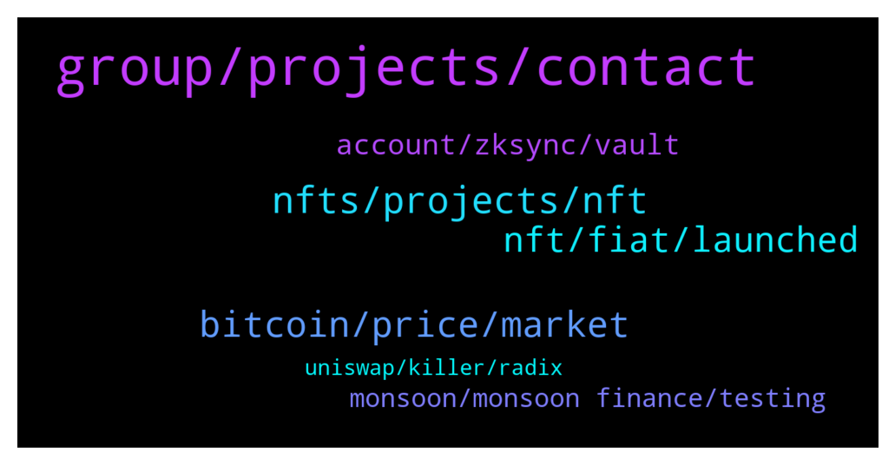

# **@de_fi**
 ## Analysis for **2022-01-23** - **2022-01-30**.

---

## 📊 **Basic Stats**

**n_messages_sent**: 175

---

---

## 🔝 **Top keywords and related messages**

1. **group, projects, contact**

    @dereksilva --- *Did you try visiting the company’s website?  https://www.superhi.com/about* **--->** [TG Discussion](https://t.me/de_fi/234879)

    @dereksilva --- *Sounds like another project that’s having liquidity or functionality problems, based on the replies to the tweet* **--->** [TG Discussion](https://t.me/de_fi/235004)

    @altstrom --- *Many projects out there told the same, but ya lets see* **--->** [TG Discussion](https://t.me/de_fi/245162)

    @xnatasx --- *For this group we just volunteerer.  Better to contact projects you like.* **--->** [TG Discussion](https://t.me/de_fi/235389)

    @Aira --- *maybe you've seen this on twitter or other channels and groups.* **--->** [TG Discussion](https://t.me/de_fi/234848)

    @blckwd --- *Thanks. It’s 4:45am here so I’ll catch some sleep. May not get back to you immediately.* **--->** [TG Discussion](https://t.me/de_fi/245290)

2. **nfts, projects, nft**

    @cryptofreakie --- *Any new projects into NFTs for this year?* **--->** [TG Discussion](https://t.me/de_fi/234582)

    @poppycoins --- *Yes, ludo will be a search engine for NFTs and it will be launched early this year.* **--->** [TG Discussion](https://t.me/de_fi/234585)

    @voyker997 --- *i think each one is tired of p2e card games now and projects like NFT Craft, with completely different mechanics, will be in the spotlight!* **--->** [TG Discussion](https://t.me/de_fi/235070)

    @poppycoins --- *Take a peek on Ludo. This is an aggregator and a discoverability service for NFTs & Play2Earn Blockchain Projects, you can think of it as the "Google" of NFTs where all creations from all marketplaces and blockchains can be listed.* **--->** [TG Discussion](https://t.me/de_fi/234583)

    @pogopogopogo --- *hey guys, I’ve come across a project and this one seems really interesting - combining NFT and DeFi.* **--->** [TG Discussion](https://t.me/de_fi/235272)

    @bitcoin_evangelist --- *But whose got some nft games I can play rn* **--->** [TG Discussion](https://t.me/de_fi/234692)

3. **bitcoin, price, market**

    @BoulevardLP --- *Then who sets or how is bitcoin price and rate set?...* **--->** [TG Discussion](https://t.me/de_fi/235194)

    @dereksilva --- *No they don’t, unless they are purposefully selling their BTC under maker value. That would be really odd behaviour against their own self interests.* **--->** [TG Discussion](https://t.me/de_fi/235192)

    @AlgoTraveler --- *We are under 40k and btc.d looks bottomed bro... No one will throw money in a BSC s...coin now😂* **--->** [TG Discussion](https://t.me/de_fi/234980)

    @BoulevardLP --- *Do bitcoin miners control and manipulate bitcoin market price anytime they want?* **--->** [TG Discussion](https://t.me/de_fi/235189)

    @Dolce V --- *No sure. The team making buyback regularly. https://twitter.com/BunnyPark_BSC/status/1484816646359646210?t=n8_bp1EYG2xhr8yb8uFSng&s=19* **--->** [TG Discussion](https://t.me/de_fi/235022)

    @Mitchell --- *Hey, fellow coiners, it's a period of a big dip in the market, but this is just a transition period. If you want to survive this big dip, you must change your countermeasures, so as to make up for the loss! ! !* **--->** [TG Discussion](https://t.me/de_fi/243739)

4. **nft, fiat, launched**

    @<UNK> --- *Hello owner/admins, please i need a response on this🌹, I am a promoter of crypto and NFT, i would like to offer you my services, would you like to see my prices and promote your coin with me? Waiting your response !* **--->** [TG Discussion](https://t.me/de_fi/234432)

    @mykgrumpy --- *Hey everyone  I'm on the dev team at Pawthereum - as of yesterday, we're live on BSC! but we've been live on ETH since October. The mission is to use crypto to help animals and we've already donated over $450k+  Feel free to check us out and join the community 🙂   Btw... Kevin O'Leary from Shark Tank has said that he holds Pawthereum!* **--->** [TG Discussion](https://t.me/de_fi/235651)

    @irishka159 --- *r there any crypto experts? What do you think of MetaSoccer? Is there any sense in investing there? Their game features r good pumps for my assets.* **--->** [TG Discussion](https://t.me/de_fi/245233)

    @tetetag --- *Midas bridges defi with metaverse & p2e projects. Allowing staking and minting. And they are coming with nodes soon, but backs after* **--->** [TG Discussion](https://t.me/de_fi/235417)

    @joshperry123 --- *Don’t miss your chance of getting these perks that come with a “Bankers NFT”. Get your own “Bankers NFT” now! Join the drop which is happening on January 31.  Check here: https://lnkd.in/gxdrY9nq  Get more details on “Bankers NFT” by checking the Unbanked website at https://lnkd.in/g-wYx7Xy  #Unbanked #BankersNFT #NFT #Defi #Crypto #Blockchain* **--->** [TG Discussion](https://t.me/de_fi/234484)

    @Polkmn27 --- *Hey Alphas, we're incredibly excited to announce that we've launched FTX Integration on the Alpha Impact platform! 🚀🚀Users without a Binance account can now link their FTX portfolio to their Alpha Impact account. 🥳  Read more at: https://t.co/JeVIkBUSLp* **--->** [TG Discussion](https://t.me/de_fi/245273)

5. **account, zksync, vault**

    @xnatasx --- *@blckwd or @itamarl   So I sent funds to a friend's brand new argent wallet. Zksync to zksync. But then when she wants to use the received eth, wallet says it's $90 to active!  Should that still be the case? We are inside of zksync section. Have I missed something?* **--->** [TG Discussion](https://t.me/de_fi/245277)

    @xnatasx --- *Brand new installation. Never had account before. Not her. Not device.* **--->** [TG Discussion](https://t.me/de_fi/245288)

    @blckwd --- *Ok so maybe she accidentally found her way into the Vault account? She may just need to tap the account switcher top left and switch to zkSync* **--->** [TG Discussion](https://t.me/de_fi/245283)

    @xnatasx --- *Sent a few dollars over to try. She never used a wallet before. But then when wanted to show, was asked to pay $90 to activate first...* **--->** [TG Discussion](https://t.me/de_fi/245282)

    @blckwd --- *It sounds like she has an older Argent wallet, i.e. created before about July 2021?   All new Argent wallets are zkSync by default. But if she has an older L1 Argent wallet, which we now refer to as “Vault”, then she needs to claim her zkSync account with her Vault, to ensure that the Vault is able to recover her zkSync account in future.  Unfortunately even though you’ve already sent the funds, she’ll need to also have funds in her L1 Vault to Claim the funds on L2.  If you have only sent a few dollars, you might want to scrap the account and create a new one, as that will be much cheaper to use.  New accounts are $3-4 to set up and $0.30 per transaction* **--->** [TG Discussion](https://t.me/de_fi/245279)

    @xnatasx --- *My first onboarding attempt after update, so bit confused when saw high fee. Was sure it's not right.  But ok, if keep trying should to right place and not be that expensive...  Will do when back inside* **--->** [TG Discussion](https://t.me/de_fi/245287)

6. **monsoon, monsoon finance, testing**

    @dOn_k0 --- *Monsoon? sounds like familiar to me* **--->** [TG Discussion](https://t.me/de_fi/234847)

    @dOn_k0 --- *Okay I will do more research on this Monsoon Finance project* **--->** [TG Discussion](https://t.me/de_fi/234863)

    @Aira --- *Also Monsoon Finance Already audited by Armor Lab* **--->** [TG Discussion](https://t.me/de_fi/234862)

    @Aira --- *Currently, monsoon supports BSC mainnet, polygon testent and avalanche testent* **--->** [TG Discussion](https://t.me/de_fi/234856)

    @Aira --- *Monsoon enables privacy transactions on every smart contracts blockchain* **--->** [TG Discussion](https://t.me/de_fi/234851)

    @chanfoundation --- *If anyone is on BSC, this Analytics App is super legit! Just sharing https://www.treehouse.finance/overview/connect* **--->** [TG Discussion](https://t.me/de_fi/235015)

7. **uniswap, killer, radix**

    @altstrom --- *Is that gonna be next ETH killer? Lmao* **--->** [TG Discussion](https://t.me/de_fi/245161)

    @Adneycal --- *Bet y'all not too familiar with Radix, isnt it? It has big chance to be the next Layer 1 which gonna be massive IMO, can say it has unlimited potential growth since having better scalling solution and Scrypto is now live. Game changer is here!* **--->** [TG Discussion](https://t.me/de_fi/245160)

    @Adneycal --- *DYOR and see whats differ from Radix and other L1s. Radix can scale limitless without breaking composability as L1* **--->** [TG Discussion](https://t.me/de_fi/245164)

    @SixShooterCrypto --- *Protectron is at it again lol* **--->** [TG Discussion](https://t.me/de_fi/239157)

    @Mankija --- *Depo is a beast, uniswap killer.* **--->** [TG Discussion](https://t.me/de_fi/234439)

    @defiking007 --- *A uniswap killer? Well, wait until uniswap includes polygon I think* **--->** [TG Discussion](https://t.me/de_fi/234490)

