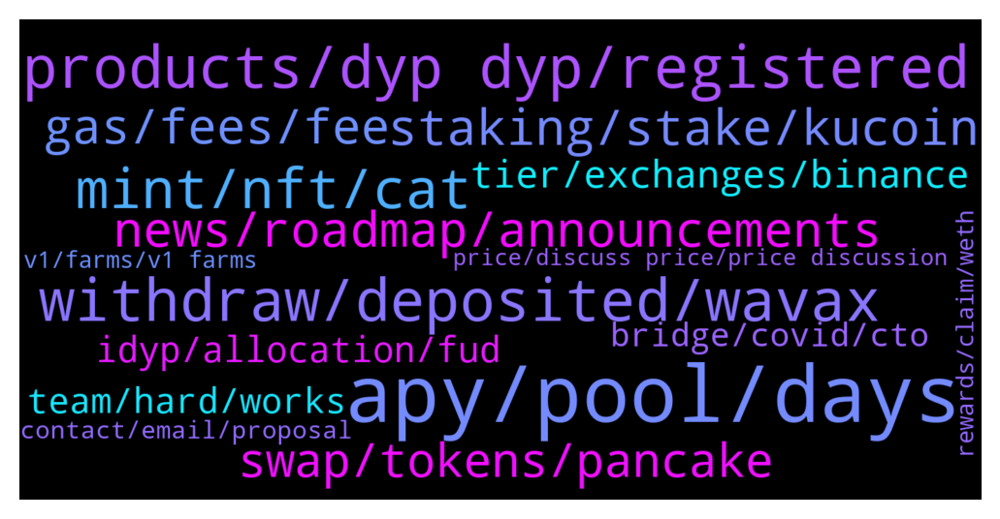

# **@dypfinance**
 ## Analysis for **2022-01-23** - **2022-01-30**.

---

## 📊 **Basic Stats**

**n_messages_sent**: 891

---

---

## 🔝 **Top keywords and related messages**

1. **apy, pool, days**

    @iamJubi --- *As more users deposit on the pool, the lesser your share % will get.* **--->** [TG Discussion](https://t.me/dypfinance/242461)

    @DhoniMSD516 --- *Please head to any dApp and you can use calculate and just enter 100$ and enter days it shows you approx rewards you earn depending on current APY https://app-bsc.dyp.finance/farming-new-1* **--->** [TG Discussion](https://t.me/dypfinance/242089)

    @WatermelonNoia --- *So if i read the ERC20 tab correctly, 2h30m ago ~32AVAX would have been distributed based on individual pool %s. So if i held 10% of the LP as example (for easy maths sake) that's 3.2AVAX paid out.* **--->** [TG Discussion](https://t.me/dypfinance/240770)

    @DhoniMSD516 --- *Hey you can use calculator to check it out but be aware the APY is dynamic and your share changes too* **--->** [TG Discussion](https://t.me/dypfinance/242086)

    @hemanrock --- *APY can be increased or decreased* **--->** [TG Discussion](https://t.me/dypfinance/241645)

    @timdyp --- *Hey Barry, APYs went down because the market went down.* **--->** [TG Discussion](https://t.me/dypfinance/243222)

2. **products, dyp dyp, registered**

    @Drake --- *Is DYP considered a web 3.0 player?  Thanks for the link I'll read it* **--->** [TG Discussion](https://t.me/dypfinance/240357)

    @CryptoWilliam --- *Have Dyp team thought of implementing IL protection/insurance kinda like thorrune has? I just saw read abit about thorrune and i think thats a supergreat feature that Dyp should deffiently have also* **--->** [TG Discussion](https://t.me/dypfinance/240703)

    @Nazhadi57 --- *I thought there is a mechanism to reduce IL in DYP* **--->** [TG Discussion](https://t.me/dypfinance/242766)

    @Nji_jalen --- *Feature for dyp??. I hope see more utility for dyp coming* **--->** [TG Discussion](https://t.me/dypfinance/241829)

    @Nji_jalen --- *Only suggest. Maybe its will be good if dyp have monthly report.. Only recomend😊* **--->** [TG Discussion](https://t.me/dypfinance/241840)

    @cyryp --- *Hi have DYP self specific its own blacchain.?* **--->** [TG Discussion](https://t.me/dypfinance/243270)

3. **withdraw, deposited, wavax**

    @tejchand --- *hi i deposited 66.8 wavax with no lock period but when i withdraw i only get 16 wavax back. dont know what went wrong. please help* **--->** [TG Discussion](https://t.me/dypfinance/240567)

    @iamJubi --- *Hello. Unpair on pcs after you withdraw form the pool https://pancakeswap-v1.dyp.finance/#/remove/0x961C8c0B1aaD0c0b10a51FeF6a867E3091BCef17/BNB* **--->** [TG Discussion](https://t.me/dypfinance/241964)

    @timdyp --- *If you removed your funds, it's impossible to get it back. You can get the assets affected by the IL only if the value of your deposited assets will recover in value, this can happen only when you still providing liquidity. Again, before joining farming and providing liquidity, you should read about IL and understand the concept.  https://academy.binance.com/en/articles/impermanent-loss-explained* **--->** [TG Discussion](https://t.me/dypfinance/240572)

    @iamJubi --- *Kindly withdraw your LP first https://app-bsc.dyp.finance/staking-bnb-30* **--->** [TG Discussion](https://t.me/dypfinance/241973)

    @DhoniMSD516 --- *Hey your deposited asset is converted 75% WBNB-iDYP and 25% to DYP so you are seeing WBNB and DYP* **--->** [TG Discussion](https://t.me/dypfinance/240807)

    @ChanndiTM --- *How can I leave pls is there a pdf I can go through* **--->** [TG Discussion](https://t.me/dypfinance/241065)

4. **mint, nft, cat**

    @DhoniMSD516 --- *Hey we are launching CAWS NFT collection soon going to be minted but you can whitelist your address https://dyp.finance/whitelist A tier 1 listing, Launchpad, Polygon expansion on cards too please head here to find our Roadmap https://dyp.finance/roadmap and you can subscribe to our announcements https://t.me/dypannouncements* **--->** [TG Discussion](https://t.me/dypfinance/242372)

    @timdyp --- *Did you know that the CAWS owners will be eligible to receive 10% of minting fees and 2.5% royalties of all secondary sales?  Join Whitelist Now👇 https://dyp.finance/whitelist  #NFTCommunity #NFTs #DYP  👉https://twitter.com/dypfinance/status/1484508148518076417* **--->** [TG Discussion](https://t.me/dypfinance/241845)

    @Jabirbobo001 --- *2. If i mint a cat can i put it on other nft market place like opensea and sell?? Or only dyp nftmarket place ?* **--->** [TG Discussion](https://t.me/dypfinance/240687)

    @DhoniMSD516 --- *Yes, winning whitelist is easy tho just head here and connect your wallet https://dyp.finance/whitelist If you minted a cat, you have extra free watch minting option* **--->** [TG Discussion](https://t.me/dypfinance/240663)

    @cgrkaracan --- *I can mint my money for 250 dollars* **--->** [TG Discussion](https://t.me/dypfinance/240656)

    @jscrib5050 --- *How much are the cat nfts* **--->** [TG Discussion](https://t.me/dypfinance/241197)

5. **staking, stake, kucoin**

    @PaskaTIM --- *when is it possible to stake dyp again* **--->** [TG Discussion](https://t.me/dypfinance/242553)

    @Yilpoc --- *i dont understand your staking system. I waited on stake about 1 month for nothing. also i totaly lost money. what a interesting thing if you dont claim your reward, increase or decrease. depend of bla bla bla bla.  now bearish season but also my rewards bearish. totally disappointment for me. change project name DYP swamp protocol please.* **--->** [TG Discussion](https://t.me/dypfinance/241965)

    @Ion --- *Hy, I have one question on staking pools : plecase e plain why I lost >20% of my  capital after staking în pool?* **--->** [TG Discussion](https://t.me/dypfinance/243317)

    @Kamil --- *Just bought a bag on kucoin,  where i can stake my dyp?* **--->** [TG Discussion](https://t.me/dypfinance/240496)

    @PaskaTIM --- *How can i add then my dyp for staking ?* **--->** [TG Discussion](https://t.me/dypfinance/242556)

    @fatiherkan --- *Also, why can't we stagink kucoin on exchanges where it is located?* **--->** [TG Discussion](https://t.me/dypfinance/241632)

6. **news, roadmap, announcements**

    @DhoniMSD516 --- *Hey https://t.me/dypannouncements is good source to know the latest news 😀* **--->** [TG Discussion](https://t.me/dypfinance/242241)

    @Vl_investor --- *I don't need a source, I need news😉* **--->** [TG Discussion](https://t.me/dypfinance/242243)

    @DhoniMSD516 --- *No plans for now but we are flexible with roadmap and may include in between* **--->** [TG Discussion](https://t.me/dypfinance/242232)

    @DhoniMSD516 --- *Bear or bull we will focus on announced roadmap, we even be flexible to add multiple additions if needed :)* **--->** [TG Discussion](https://t.me/dypfinance/241824)

    @Lordofsales --- *Any plans to go on Fantom network???* **--->** [TG Discussion](https://t.me/dypfinance/242231)

    @popper1989 --- *hey guys long time that im here so ask wat is comming news ?* **--->** [TG Discussion](https://t.me/dypfinance/242371)

7. **gas, fees, fee**

    @eltho5 --- *I was wondering what the current actual fees are to claim my ETH-gains. The fees that my wallet predicts are very high ($1,166) but I read here that the actual fee will be lower. Not really feeling like gambling and losing all that money...* **--->** [TG Discussion](https://t.me/dypfinance/241675)

    @MJMuppet_JayJay --- *Can anyone explain me how that happens? As in what does the contract have to do to explain such high gas fees needed?* **--->** [TG Discussion](https://t.me/dypfinance/241021)

    @Frolman --- *Hello again!  I want to deposit usdt on eth farm pool and the transaction fee is 280$ ,I'm shocked. Is it OK?* **--->** [TG Discussion](https://t.me/dypfinance/242207)

    @DhoniMSD516 --- *Metamask shows max gas charge, but in the end the actual cost will be lesser, but also make sure the ETH network is not busy current gas trends are at 150 GWEI* **--->** [TG Discussion](https://t.me/dypfinance/242568)

    @hemanrock --- *No it wont be that high gas fees. please check back when less network congestion.  also, please make sure to check https://etherscan.io/gastracker* **--->** [TG Discussion](https://t.me/dypfinance/241679)

    @Tettluft --- *How much eth should I leave in the wallet to get to pay fees when staking dyp?* **--->** [TG Discussion](https://t.me/dypfinance/243242)

8. **swap, tokens, pancake**

    @nkemboxoffice --- *Good day admin Pls how do this help the growth of Dyp tokens? It’s alway confusing to me* **--->** [TG Discussion](https://t.me/dypfinance/241564)

    @Ali pajoo --- *I think my Cakes are on PancakeSwap not in my Metamask* **--->** [TG Discussion](https://t.me/dypfinance/242041)

    @Aloysius De Sa --- *Which is the biggest coin that is in the same field as dyp* **--->** [TG Discussion](https://t.me/dypfinance/242775)

    @Sweetejanlla123 --- *Yes. I juste ask why the price for buy and sell dyp for around 2000dollars on pancake swap are a big difference of 200dollars. There is not the same idyp.* **--->** [TG Discussion](https://t.me/dypfinance/241907)

    @Sweetejanlla123 --- *On idyp the is juste 20$ difference for swap around 2000 dollars.   Dyp is like 200 dollars. This is x10* **--->** [TG Discussion](https://t.me/dypfinance/241896)

    @DhoniMSD516 --- *Trade iDYP tokens on PancakeSwap V2 https://pancakeswap.finance/swap?inputCurrency=0xBD100d061E120b2c67A24453CF6368E63f1Be056* **--->** [TG Discussion](https://t.me/dypfinance/241484)

9. **tier, exchanges, binance**

    @DhoniMSD516 --- *Yes Binance, Coinbase, Kucoin, FTX, Kraken, Huobi etc can be considered as tier 1* **--->** [TG Discussion](https://t.me/dypfinance/242986)

    @DhoniMSD516 --- *The top 5 exchanges can be considered as tier 1 CEX* **--->** [TG Discussion](https://t.me/dypfinance/242376)

    @popper1989 --- *thx for the info and wat is tier 1 ?* **--->** [TG Discussion](https://t.me/dypfinance/242375)

    @popper1989 --- *bnb,ftx,coinbase,kucoin,hitbtc are they tier 1 ?* **--->** [TG Discussion](https://t.me/dypfinance/242382)

    @Jeffzon --- *Any update on Tier 1 exchange listing for dyp?* **--->** [TG Discussion](https://t.me/dypfinance/242171)

    @alvindrajw --- *Any latest update from tier 1 exchnage* **--->** [TG Discussion](https://t.me/dypfinance/242903)

10. **idyp, allocation, fud**

    @Kkkiran21 --- *Any plan for idyp in future 🥲it got rekt* **--->** [TG Discussion](https://t.me/dypfinance/242905)

    @error_500 --- *FYI for the community awareness on iDYP price* **--->** [TG Discussion](https://t.me/dypfinance/241514)

    @hemanrock --- *it was governance proposal for the launch of iDYP happened. https://t.me/dypannouncements/834* **--->** [TG Discussion](https://t.me/dypfinance/241577)

    @DhoniMSD516 --- *Hey iDYP is part of the new smart contracts strategies, you can find more info here https://dypfinance.medium.com/the-new-contracts-and-idyp-token-snapshot-airdrop-and-community-allocation-760a2be599c* **--->** [TG Discussion](https://t.me/dypfinance/241276)

    @DhoniMSD516 --- *Hey iDYP is part of the new smart contracts strategies, you can find more info here and this is not bad :)  https://dypfinance.medium.com/the-new-contracts-and-idyp-token-snapshot-airdrop-and-community-allocation-760a2be599c* **--->** [TG Discussion](https://t.me/dypfinance/243391)

    @sunnygummybear --- *so Tim. let’s keep it simple.   did idyp make it easier for new investors to understand?   what value does idyp hold? why pay it out as a reward ? as all we do is convert it…   etc etc   i’m not blaming you personally. nor attacking anything. i’m simply brainstorming on focus. and any (!!) good company needs feedback from its users   my best* **--->** [TG Discussion](https://t.me/dypfinance/242951)

11. **team, hard, works**

    @DhoniMSD516 --- *If anything is needed team will take all the steps nothing to worry* **--->** [TG Discussion](https://t.me/dypfinance/242070)

    @captain_protein --- *Perhaps the team can just bear this in mind before making such fundamental changes in future.* **--->** [TG Discussion](https://t.me/dypfinance/241574)

    @captain_protein --- *Sure, let's hope so. Look, the project is a good one and the team is clearly talented. All I would ask, as someone who has been very negatively affected by this change, is for the team to acknowledge that and learn from it.* **--->** [TG Discussion](https://t.me/dypfinance/241618)

    @captain_protein --- *There are definitely ways this could have been avoided* **--->** [TG Discussion](https://t.me/dypfinance/241608)

    @A Human --- *Most ppl come here to just complain  False Complain, everyone only post about how lost they are but never spoke of the rewards or gains which is so sad, Team is doing great job if you cannot appreciate them atleast don't blame them, DYOR how everything works, don't come here just to abuse or blame team* **--->** [TG Discussion](https://t.me/dypfinance/240635)

    @herbie1996 --- *This was a community vote not the teams fault. Originally it was going to be done but they gave the option for us all to vote* **--->** [TG Discussion](https://t.me/dypfinance/241578)

12. **bridge, covid, cto**

    @F --- *Is this mean Idyp bridge is active right now ? 🙂* **--->** [TG Discussion](https://t.me/dypfinance/240861)

    @Disguy125 --- *@Tekkol @timdyp  anything new being released this week. Bridge completion etc.* **--->** [TG Discussion](https://t.me/dypfinance/240379)

    @herbie1996 --- *Morning guys & jubi, please will the bridge be active before the 20th I only ask as I brought some idyp to earn a little profit to help me buy a miner on a white list that runs out on 20th. Please activate it guys. This is my only shot 💎* **--->** [TG Discussion](https://t.me/dypfinance/240801)

    @tamtamkanto --- *Is it possible to launch idyp bridge this week? or next week?* **--->** [TG Discussion](https://t.me/dypfinance/241214)

    @Cj --- *When will the idyp bridge be online? Was supposed to happen today right?* **--->** [TG Discussion](https://t.me/dypfinance/240319)

    @Implemrnt --- *Can anyone help me with the bridge? I can't claim my tokens since yesterday* **--->** [TG Discussion](https://t.me/dypfinance/241815)

13. **contact, email, proposal**

    @makeitrainhaku --- *Hello, who may i contact for a partnership proposal?* **--->** [TG Discussion](https://t.me/dypfinance/240714)

    @DhoniMSD516 --- *Please email your proposal to contact@dyp.finance* **--->** [TG Discussion](https://t.me/dypfinance/241239)

    @hemanrock --- *Hey email your proposal to contact@dyp.finance* **--->** [TG Discussion](https://t.me/dypfinance/242790)

    @hemanrock --- *Hey please email your proposal to contact@dyp.finance* **--->** [TG Discussion](https://t.me/dypfinance/240716)

    @iamJubi --- *if you have any proposal, Please email to contact@dyp.finance* **--->** [TG Discussion](https://t.me/dypfinance/241723)

    @hemanrock --- *if you have any proposal then Please email to contact@dyp.finance* **--->** [TG Discussion](https://t.me/dypfinance/241338)

14. **rewards, claim, weth**

    @BeachLifeX --- *I was collecting rewards on Jan 10th* **--->** [TG Discussion](https://t.me/dypfinance/240415)

    @BeachLifeX --- *Admin I have not received my rewards for 2 days.  I’m in V1 avax farm* **--->** [TG Discussion](https://t.me/dypfinance/240410)

    @DhoniMSD516 --- *Hey @shinigamikami  sorry forgot to update you The rewards are paid when the users click Harvest, please note that the rewards have a 14 days vesting period. At this moment no infos of whether it will be extended or not* **--->** [TG Discussion](https://t.me/dypfinance/242370)

    @fthciftci --- *But it is affecting my previous rewards* **--->** [TG Discussion](https://t.me/dypfinance/241646)

    @captain_protein --- *I would be very surprised, bearing in the rewards up til now* **--->** [TG Discussion](https://t.me/dypfinance/241605)

    @DhoniMSD516 --- *I just checked the next rewards are after 11H so that means the last rewards claimed are 13H ago so this will be the rewards transaction 38.14 WAVAX shared to pool* **--->** [TG Discussion](https://t.me/dypfinance/240772)

15. **v1, farms, v1 farms**

    @BeachLifeX --- *Bro I asked for the exact date the last deposits into the V1 farms were allowed* **--->** [TG Discussion](https://t.me/dypfinance/240440)

    @BeachLifeX --- *So provide me with the last date to make a deposit in the V1 farms* **--->** [TG Discussion](https://t.me/dypfinance/240432)

    @BeachLifeX --- *When was the last date to deposit on the V1 farms?* **--->** [TG Discussion](https://t.me/dypfinance/240425)

    @BeachLifeX --- *It feels like you guys want me to withdraw  And you’re not telling me the date the last deposit into the V1 farms was allowed* **--->** [TG Discussion](https://t.me/dypfinance/240449)

    @DrStoneforyou --- *What’s the difference in earn v2 vs earn v1* **--->** [TG Discussion](https://t.me/dypfinance/241736)

    @BeachLifeX --- *I don’t know why we’re talking about anything other than the exact date the last deposits into the V1 farms happened* **--->** [TG Discussion](https://t.me/dypfinance/240442)

