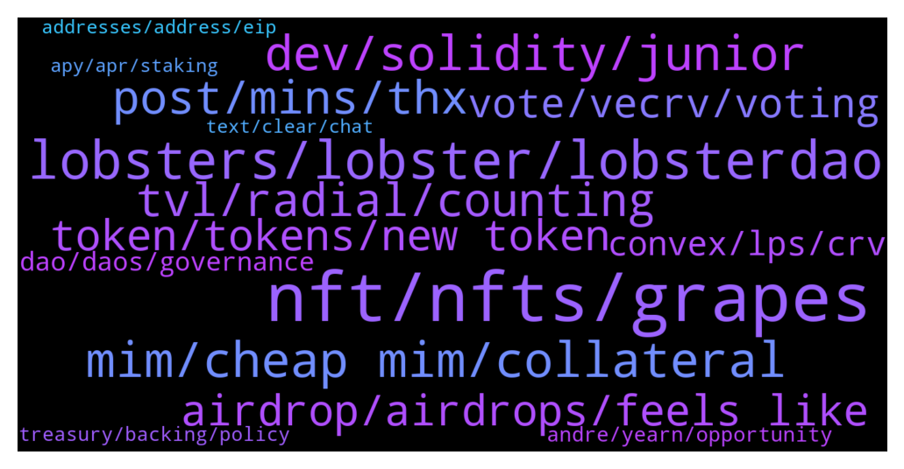

# **@lobsters_chat**
 ## Analysis for **2022-01-23** - **2022-01-30**.

---

## 📊 **Basic Stats**

**n_messages_sent**: 3020

---

---

## 🔝 **Top keywords and related messages**

1. **nft, nfts, grapes**

    @basmag0x --- *do you have horse in race ser? if so disclosure could be good  anyway here is difference…  farm-to-get-NFT: zero-sum game. I get more TVL, you get NFT with less veSOLID. I get NFT with more veSOLID.  grapes: we don’t have a horse in race. the more veSOLID NFTs work with us, the more power all those who come get. this is positive sum. Your NFT does not become less worth than mine. Make sense?* **--->** [TG Discussion](https://t.me/lobsters_chat/317160)

    @basmag0x --- *1. gib us NFT 2. we merge all NFT into one giant NFT, store in contract 3. voting of giant NFT contract is controlled by GRP token* **--->** [TG Discussion](https://t.me/lobsters_chat/316789)

    @meme_ill --- *So many things undervalued now considering the protocols are getting the NFTs* **--->** [TG Discussion](https://t.me/lobsters_chat/318253)

    @basmag0x --- *many ve(3,3) protocols launched recently - this is fine  but maybe people become confused with grapes  we DO NOT launch token or masterchef farming for making potemkin TVL on fantom to get NFT, NFT belong to real fantom projects working hard, making success for long time  we will work with project when they have NFT they deserve. they gib us NFT, help bootstrap grapes, we gib them ownership of grapes with GRP. positive sum synergy like boiled potato and shot of vodka* **--->** [TG Discussion](https://t.me/lobsters_chat/317138)

    @alexinlife --- *and yes i agree pure farms are not of interest to me either. i thought that was already assumed that we believe the farms will go on to develop positive sum protocols which have utilitity beyond being a nft wrapper. if you are losing your mind over a nft wrapper protocol, may be better to spend your time elsewhere* **--->** [TG Discussion](https://t.me/lobsters_chat/317163)

    @alexinlife --- *i hear you but ultimately the crux is the same. you either print a new valueless governance token to directly get the nft or print it to encourage protocols to deposit theirs with you. i think you make references to the tune of "OG protocols of fantom deserve the nft" which I disagree with. The NFT isnt some 1 of 1 mint special thing. Its just a representation of locked tokens which ultimately all convex forks will acquire either by buying on market or getting users/protocols to deposit. So why not just get those tokens from the very beginning.* **--->** [TG Discussion](https://t.me/lobsters_chat/317156)

2. **lobsters, lobster, lobsterdao**

    @aj_eth --- *Hi Lobsters  Check out the Proposal to work alongside Tracer DAO - eager to hear feedback  https://discourse.tracer.finance/t/lobster-dao-tracer-dao-collab-the-lobsters-want-to-swim/1039* **--->** [TG Discussion](https://t.me/lobsters_chat/317357)

    @Chris_hodl --- *No way not in the lobsters group 🙃* **--->** [TG Discussion](https://t.me/lobsters_chat/317224)

    @Pantani0k --- *So is there a lobsters' consensus on Radial? It's supposed to launch in 30mins but there aren't any smart contracts released among other suspicious things.* **--->** [TG Discussion](https://t.me/lobsters_chat/316849)

    @gas1cent --- *There is no team ser, it’s just a chat. We also have the Lobster NFTs and a separate channel for discussing them. If you’re looking for a cooperation between your project and lobster holders, @lobsterdao is the best place to go. If you want to talk defi / crypto / drama, stay here.* **--->** [TG Discussion](https://t.me/lobsters_chat/319271)

    @ivangbi --- *Jeff s semi-lobster, he has been here for a while* **--->** [TG Discussion](https://t.me/lobsters_chat/317072)

    @CC1777 --- *Hi guys, I am from a defi derivatives exchange. Would want to ask who should I contact to make a sponsor/collaboration proposal to LobsterDAO? Thanks!* **--->** [TG Discussion](https://t.me/lobsters_chat/319144)

3. **mim, cheap mim, collateral**

    @hasufly --- *Leveraged MIM farmers can be blown up. Further, it would be interesting how much MIM is backed by TIME and SPELL* **--->** [TG Discussion](https://t.me/lobsters_chat/320071)

    @PmRiviere --- *No chance. $MIM is overcollateralized to the tune of 200% and degenbox users would need to buy large volumes of $MIM to unwind positions. If it were to loose peg that would make a bunch of people really rich though* **--->** [TG Discussion](https://t.me/lobsters_chat/320012)

    @tracksuitcat --- *Hey! I'm with a DAO that wants to move out of $MIM (1.3mm) but doesn't know - should we panic? What's the best route? We haven't done anything like this before 😰* **--->** [TG Discussion](https://t.me/lobsters_chat/320581)

    @syed_jafri --- *Not in degenbox, the borrowed MIM is looped to borrow even MIM to buy UST* **--->** [TG Discussion](https://t.me/lobsters_chat/320097)

    @KeyedDepartment --- *you guys think MIM peg is safe?* **--->** [TG Discussion](https://t.me/lobsters_chat/319461)

    @satoshi_onamoto --- *Is there much chance of mim losing peg given recent developments? Would that ruin a lot of stuff?* **--->** [TG Discussion](https://t.me/lobsters_chat/320007)

4. **dev, solidity, junior**

    @rocketdev --- *i did some pet projects and worked with one startup , integrating swaps and another defi projects, it went okay, tech stack like hardhat/react/typechain blabla , everything with tests, is it still junior level?* **--->** [TG Discussion](https://t.me/lobsters_chat/317516)

    @rocketdev --- *can anyone describe difference between junior solidity developer and middle solidity developer for example?* **--->** [TG Discussion](https://t.me/lobsters_chat/317445)

    @joehquak --- *I would classify that as junior dev for sure* **--->** [TG Discussion](https://t.me/lobsters_chat/317524)

    @Light --- *Actually, been meaning to ask for a while, but what’s the average salary for a blockchain dev? Say solidity or rust.. say the dev is senior web2 and mid-level solidity* **--->** [TG Discussion](https://t.me/lobsters_chat/318543)

    @rocketdev --- *maybe someone can interview me for detect if im senior or junior solidity dev? 😕* **--->** [TG Discussion](https://t.me/lobsters_chat/317487)

    @Figu3 --- *Wait, you can hire solidity devs at 2500$/ month ? 🤣* **--->** [TG Discussion](https://t.me/lobsters_chat/317495)

5. **post, mins, thx**

    @enderwiggins1 --- *Guys this is the link - https://discord.gg/y4fTFWUG* **--->** [TG Discussion](https://t.me/lobsters_chat/316320)

    @amplice --- *i cant type here and press sell buttons at the same time ser* **--->** [TG Discussion](https://t.me/lobsters_chat/317294)

    @jeff093 --- *What kind of info? Feel free to post there and you will be replied.* **--->** [TG Discussion](https://t.me/lobsters_chat/318050)

    @ivangbi --- *Wait do you have more info on 2)? Wtf* **--->** [TG Discussion](https://t.me/lobsters_chat/320757)

    @ivangbi --- *Shit s not loading properly, need txt output blz* **--->** [TG Discussion](https://t.me/lobsters_chat/320458)

    @unchainedoneawoken --- *very nice, love the content from chadass.  I've been a ZNN boy for a while now.* **--->** [TG Discussion](https://t.me/lobsters_chat/317663)

6. **tvl, radial, counting**

    @akashking0 --- *how Radial TVL is different than it's MasterChef* **--->** [TG Discussion](https://t.me/lobsters_chat/318052)

    @priyeshu --- *vampire attack about to hit a 1b TVL at https://www.oxdao.fi/* **--->** [TG Discussion](https://t.me/lobsters_chat/317700)

    @xmons --- *So apart from Andre's tvl drop, just an fyi that ftm has its own network incentives if you can maintain TVL above some certain benchmarks  https://fantom.foundation/blog/updated-requirements-for-the-incentive-rewards-program/* **--->** [TG Discussion](https://t.me/lobsters_chat/316510)

    @ivangbi --- *I believe just TVL based, so whatever u deposit* **--->** [TG Discussion](https://t.me/lobsters_chat/316912)

    @ivangbi --- *Oh so it was TVL based* **--->** [TG Discussion](https://t.me/lobsters_chat/318584)

    @ivangbi --- *Ofc Radial is better, I will ban the other guys soon if they don’t pay* **--->** [TG Discussion](https://t.me/lobsters_chat/316705)

7. **airdrop, airdrops, feels like**

    @ivangbi --- *It’s 3,3. If u don’t deposit or deposit too late, it will lose the snapshot, so ur airdrop will be worthless* **--->** [TG Discussion](https://t.me/lobsters_chat/316908)

    @duckdegen --- *https://medium.com/paladin-protocol/paladin-summons-its-pals-aa5e0e910218  << seems like lots of governooors got airdrops. If you voted on Aave, Compound, Uniswap or Curve governance you might have another worthless non-transferable governance airdrop.* **--->** [TG Discussion](https://t.me/lobsters_chat/320928)

    @xylophonez --- *a DAO forming to farm an airdrop doesn't feel good to me is all* **--->** [TG Discussion](https://t.me/lobsters_chat/317400)

    @zeThrouzz --- *seemingly some projets will disappear just after the ve(3,3) airdrop 😂💩* **--->** [TG Discussion](https://t.me/lobsters_chat/317947)

    @jrrrFFFF --- *I got close to few hundred k volume and used this shit long before any airdrop announcement  I got cucked when they announce snapshot date  Dont tell me its going to be another PSP* **--->** [TG Discussion](https://t.me/lobsters_chat/320610)

    @jpwjs --- *so basically... just take the lob airdrop and commence farming other shit instead of sitting funds idly for 3 days* **--->** [TG Discussion](https://t.me/lobsters_chat/316906)

8. **token, tokens, new token**

    @kapur_sanat --- *i know there’s a lot of protocols that are building out infra for allowing treasuries to sell covered calls on their native tokens (https://ribbonfinance.medium.com/ribbon-treasury-ee311f7ce7d8) - but does anyone know of any treasuries that have actually done this?  i know some treasuries have done KPI option sales/airdrops to investors which is kind of in the ballpark - any succesful examples there would be helpful too* **--->** [TG Discussion](https://t.me/lobsters_chat/316429)

    @Sdtsll --- *I wouldnt hold a token that has chance of being gamed and me getting screwed without any assurance of knowing whats happening behind the scenes* **--->** [TG Discussion](https://t.me/lobsters_chat/320817)

    @alexinlife --- *There's a whole thread on their discord with existing token holders on ETH crying about how they are getting diluted and how a new token for each chain going forward isn't a good idea. The CEO Sid Powell basically said its to enable new farms and that there's a drop in valuation when the same token is used. The total FDV would be higher if they have a new token for each chain.* **--->** [TG Discussion](https://t.me/lobsters_chat/320758)

    @Only25x --- *I have seen a lot of 200K base + tokens...* **--->** [TG Discussion](https://t.me/lobsters_chat/318551)

    @duckdegen --- *@koeppelmann is there an idea how much a token is worth at launch in $?* **--->** [TG Discussion](https://t.me/lobsters_chat/320650)

    @andyjule0x --- *Makes total sense.   The team has engineered the protocol tokenomics with the gov token use in mind — stake (ve) gov token to:  1/ earn rewards for staking gov token 2/ boost yields (similar to Curve’s 2.5x yield boost) for lending/borrowing/staking DEX LPs 3/ get a share of treasury funds 4/ vote on DAO proposals and protocol parameters  Any other suggestions re pool2 (trading pool with protocol's gov toke) are super appreciated. Thanks! ✌️* **--->** [TG Discussion](https://t.me/lobsters_chat/316641)

9. **vote, vecrv, voting**

    @godefi --- *Why are veCRV made non transferrable in curve? I know for voting you don't want people moving tokens to vote again, but that's normally solved by staking. Did this locking help grow the bribing system? I don't see why bribes can't be done given transferrable voting tokens also. How does Convex etc contract leverage veCRV tokens to vote on behalf of the briber?* **--->** [TG Discussion](https://t.me/lobsters_chat/321003)

    @ivangbi --- *Tokenize for what? You can’t vote with portions, somebody 1 (holder, contract) still needs to vote* **--->** [TG Discussion](https://t.me/lobsters_chat/316774)

    @godefi --- *Smart. And why is veCRV voting power made to fall in time, while no other veCRV benefits do?* **--->** [TG Discussion](https://t.me/lobsters_chat/321015)

    @astonchik --- *that is to be decided by voting yet* **--->** [TG Discussion](https://t.me/lobsters_chat/319309)

    @Steff_Bullishkid --- *but i still don't understand why any time owner would vote for the merge* **--->** [TG Discussion](https://t.me/lobsters_chat/318995)

    @coine_r --- *You can probably stake your life on two facts  - tokens will concentrate - few people are interested in voting  The outcome of anything depending on those not being true should be obvious, and "democracy" isn't one of it* **--->** [TG Discussion](https://t.me/lobsters_chat/319775)

10. **convex, lps, crv**

    @bernyn --- *Anyone have good experiences in lpb? I have seen many that after it, previous rounds sells for lower than minimum lpb point. Not sure if any lpb has gone well for their participants* **--->** [TG Discussion](https://t.me/lobsters_chat/317887)

    @nourharidy --- *And the answer is no unless Curve changes the A param, causing IL to all LPs* **--->** [TG Discussion](https://t.me/lobsters_chat/321148)

    @Figu3 --- *Anyone knows where I can find data on Curve LPs vs Convex LPs ? Curious to know how many people are not farming on Convex* **--->** [TG Discussion](https://t.me/lobsters_chat/316432)

    @basmag0x --- *Ser, it is like yearn and convex for curve* **--->** [TG Discussion](https://t.me/lobsters_chat/316783)

    @alexinlife --- *Is Radial a Convex for ve(3,3)?* **--->** [TG Discussion](https://t.me/lobsters_chat/316665)

    @nourharidy --- *That’s assuming the A param will be changed in the next few months. The balance must be restored first or LPs suffer IL* **--->** [TG Discussion](https://t.me/lobsters_chat/321208)

11. **dao, daos, governance**

    @TyraBlackbeard --- *Plato already said DAOs can't work like over 2000 years ago...so..* **--->** [TG Discussion](https://t.me/lobsters_chat/319712)

    @DeadMeatHK --- *Anyone here have experience with how a DAO interacts with traditional commercial entities? In particular, if a DAO controlled protocol wants to open an account with a CEX, how is the KYC managed? Do DAOs often (at all?) have a legal entity that can interact with other companies?* **--->** [TG Discussion](https://t.me/lobsters_chat/320266)

    @justsomedeveloper --- *Same between dao and danieles personal addy btw, it’s just a piggy bank imho.* **--->** [TG Discussion](https://t.me/lobsters_chat/319028)

    @nickbtts --- *for sure, this is an ongoing discussion right now, as usual there are differing opinions within a DAO. FWIW I agree with you, things just went a bit...a lot...quicker than expected* **--->** [TG Discussion](https://t.me/lobsters_chat/316498)

    @yic_alex --- *>The art collecting DAO is looking to raise capital from external investors, after taking an undisclosed sum from a16z in December.* **--->** [TG Discussion](https://t.me/lobsters_chat/318927)

    @ivangbi --- *Other DAOs syphon out less, if not nothing. So ye it’s unique level of tard. Non-DAO projects ofc are just a fugezi usually w their accounting* **--->** [TG Discussion](https://t.me/lobsters_chat/318960)

12. **andre, yearn, opportunity**

    @ivangbi --- *OMG ANDRE ALREADY SAY THE WORDS AND TICKERS WHAT IS THIS BLABLA* **--->** [TG Discussion](https://t.me/lobsters_chat/316830)

    @Ppwdw --- *Curious on why people keep associating Andre with yearn when he basically left yearn more than 1 year ago* **--->** [TG Discussion](https://t.me/lobsters_chat/319593)

    @admiralape --- *It isn’t curious if you notice how yearn eco continuously supports Andre’s projects along the way. Like one of the daos hunting fantom tvl for the solidly snapshot.* **--->** [TG Discussion](https://t.me/lobsters_chat/319594)

    @ivangbi --- *Idk Andre didn’t say anything yet. No rush.* **--->** [TG Discussion](https://t.me/lobsters_chat/318215)

    @SpikeSpiege1 --- *Him and Andre doing AMA together today. Maybe they'll discuss some of it* **--->** [TG Discussion](https://t.me/lobsters_chat/316369)

    @Sp33qr --- *Exact same situation happened with RAY if anyone participated* **--->** [TG Discussion](https://t.me/lobsters_chat/317100)

13. **treasury, backing, policy**

    @ivangbi --- *Ser me no supporter and no simp for this, but if we take away the past and view it just as a "big treasury" since IV now - almost the FDV, then it becomes o-k? Then it needs to make products and use that liquidity well, like what Dani does w "his" bags? Imho, kill the staking APYs (it's not token dilution for no reason, just let it go at the big dip, let people exit). There is no point innit since bonds can't really bring that much anymore: likely token dilution % will be larger than $ of treasury accrual. And... just pivot 100%* **--->** [TG Discussion](https://t.me/lobsters_chat/316123)

    @yic_alex --- *It doesn't matter whether you automate it. If you get hit by massive liquidity at once due to a spike in selling and/or liquidations this will be the result. Otherwise you'd need to put 100% of the treasury into the limit order. Which of course defeats the whole purpose because it's supposed to generate yield.  Imho the whole issue behind the OHM model is that it's running on people who don't understand that they're funding a treasury and in turn get nothing more than a ticket to participate in a self referential staking ponzi. They somehow don't seem to connect with the fact that the hard cash doesn't remain in the same system since the treasury follows different rules - which are depending on the fork arbitrarily decided by it's inventors.* **--->** [TG Discussion](https://t.me/lobsters_chat/318848)

    @Angelentropy --- *Should not include time but need to take a deep look on their treasury if it really is below backing* **--->** [TG Discussion](https://t.me/lobsters_chat/318963)

    @nickbtts --- *"Defi 2.0"...it's Dynamic Set Dollar but with a treasury managed by one guy* **--->** [TG Discussion](https://t.me/lobsters_chat/319636)

    @DeadMeatHK --- *When we say "backing" are we referring to current treasury market value or only the portion of the treasury that's not TIME? If the latter, is it really "below backing"?* **--->** [TG Discussion](https://t.me/lobsters_chat/318954)

    @juju1234534 --- *If you automate buybacks, you can simply frontrun them and empty the treasury in record time.* **--->** [TG Discussion](https://t.me/lobsters_chat/319127)

14. **addresses, address, eip**

    @ShardYaco --- *Yep. Address generation algorithm does not care about the content of your contract. Just your address and nonce* **--->** [TG Discussion](https://t.me/lobsters_chat/318540)

    @ivangbi --- *If you are at 1:1, what’s the difficulty? Why can’t you simply all in a limit order? What’s the complication / security concern?* **--->** [TG Discussion](https://t.me/lobsters_chat/318831)

    @SpikeSpiege1 --- *That address has over 25k trans. Must be intermediary for a contract or something* **--->** [TG Discussion](https://t.me/lobsters_chat/317036)

    @ivangbi --- *Also one of those addresss is my public ens* **--->** [TG Discussion](https://t.me/lobsters_chat/317043)

    @harithk17 --- *think some of you noticed earlier, but sharing a cool feature (if i may say so myself) for all EVM-chain addresses =) https://twitter.com/etherscan/status/1485968502284775424* **--->** [TG Discussion](https://t.me/lobsters_chat/318650)

    @zhongfu --- *so it seems like the first EIP-1559 block on polygon was ~2h ago, but validators still have their target block gas limit set to 15M* **--->** [TG Discussion](https://t.me/lobsters_chat/316350)

15. **text, clear, chat**

    @Sp33qr --- *Haha you seems new to this. Ofc it can.* **--->** [TG Discussion](https://t.me/lobsters_chat/315977)

    @Sergelove --- *thank you Alex. now its all clear. 😭* **--->** [TG Discussion](https://t.me/lobsters_chat/317123)

    @ivangbi --- *Goddamn I am so embarrassed, as usual, thank u. Clear now! And wow fk :DD* **--->** [TG Discussion](https://t.me/lobsters_chat/316104)

    @Sp33qr --- *I didn't tag you why you came to type lol* **--->** [TG Discussion](https://t.me/lobsters_chat/317301)

    @tesslerc --- *But yeah... re-iterating previous topics I guess, you're right 🙂* **--->** [TG Discussion](https://t.me/lobsters_chat/320441)

    @stkmaAkita --- *haha its ok I learned something new today because of you too :D* **--->** [TG Discussion](https://t.me/lobsters_chat/316105)

