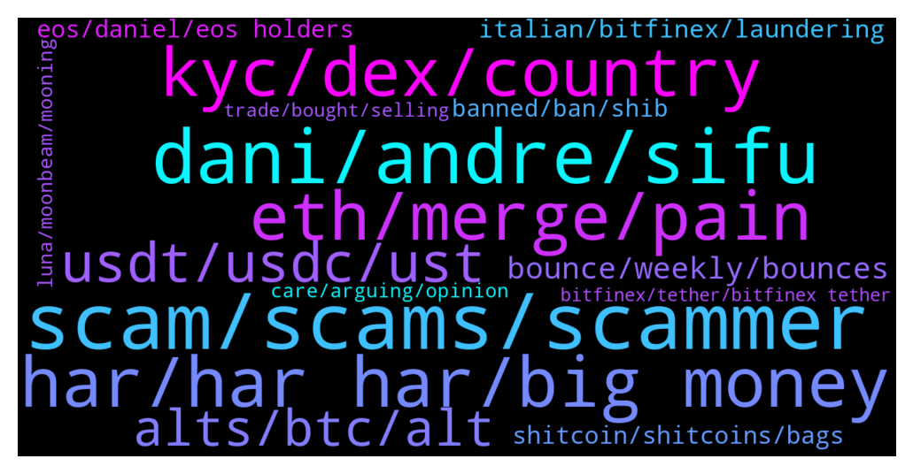

# **@shitpool**
 ## Analysis for **2022-01-23** - **2022-01-30**.

---

## 📊 **Basic Stats**

**n_messages_sent**: 1903

---

---

## 🔝 **Top keywords and related messages**

1. **scam, scams, scammer**

    @kekurikekukaka --- *This guy is a scammer, I can see it on his face.* **--->** [TG Discussion](https://t.me/shitpool/717467)

    @onchainjoe --- *what the utility to put "ill never msg u first" in your name if you're not a scammer though* **--->** [TG Discussion](https://t.me/shitpool/720204)

    @wanker007 --- *Btw I called spell scam from first week of launch :) just sayin* **--->** [TG Discussion](https://t.me/shitpool/720621)

    @ThePresidents --- *The best scam. They are fucking double dipping in bull markets. Theh but own btc, then sell it to 401k, then charge mgmt fees. They make mgmt fees regardless,  and when btc news they profit more. It's the best double dipping scam that 401k holders can't sell. And no calls him out* **--->** [TG Discussion](https://t.me/shitpool/718898)

    @monkey993 --- *It wasn’t a scam for a few months* **--->** [TG Discussion](https://t.me/shitpool/720624)

    @pizza_dog --- *there's room in the ecosystem for new scams* **--->** [TG Discussion](https://t.me/shitpool/721177)

2. **dani, andre, sifu**

    @MoneroPal --- *He said that Sifu should not be apart of the treasury and says he still supports Dani. Andre is likely another BitFinex lacky* **--->** [TG Discussion](https://t.me/shitpool/720555)

    @MoneroPal --- *There is massive negative sentiment towards the whole team and there are many calling out Dani, Sifu, and the other team members on their dumping, it is all ignored on Twitter and deleted on Discord and Telegram* **--->** [TG Discussion](https://t.me/shitpool/718481)

    @MoneroPal --- *Subtract Merlin, the rest is true, Dani is a total and outright fraud to the height degree...* **--->** [TG Discussion](https://t.me/shitpool/721592)

    @pizza_dog --- *What’s really suspicious is that Dani the “cso” went private on Twitter just before today* **--->** [TG Discussion](https://t.me/shitpool/719965)

    @pizza_dog --- *True. There’s rumors that the other guy besides Dani actually got liquidated. If it is actually his wallet* **--->** [TG Discussion](https://t.me/shitpool/717765)

    @Blazmeen --- *Thoughts on Andre Conje backing Dan? That makes me think he has poor judgement and makes me weary of FTM overall* **--->** [TG Discussion](https://t.me/shitpool/720918)

3. **har, har har, big money**

    @ptsolorid --- *yeh nobody in crypto really gives a shit about that though.* **--->** [TG Discussion](https://t.me/shitpool/721437)

    @AsianFever --- *be careful, there will be new cryptopias in this bear for sure* **--->** [TG Discussion](https://t.me/shitpool/718754)

    @BigBombo --- *almost everyone here / most ppl in crypto generally started from somewhere between nothing and not much* **--->** [TG Discussion](https://t.me/shitpool/717509)

    @Obli1 --- *Steganography has been a part of encrypting messages for millenia. Wtf you on about?* **--->** [TG Discussion](https://t.me/shitpool/719072)

    @yesbutalsono --- *imagine all of those who quit their jobs to go full time crypto lol* **--->** [TG Discussion](https://t.me/shitpool/720881)

    @da0man --- *Killing crypto slowly without pissing off the big investors* **--->** [TG Discussion](https://t.me/shitpool/719850)

4. **eth, merge, pain**

    @pizza_dog --- *Eth not looking so good either* **--->** [TG Discussion](https://t.me/shitpool/718088)

    @goldencatpat --- *as zhu was shit posting ETH, retail went all in on his ETH killer and he proceeded to unload on u* **--->** [TG Discussion](https://t.me/shitpool/719544)

    @gonubie --- *why would you have a yourname.eth* **--->** [TG Discussion](https://t.me/shitpool/720649)

    @OxZilla --- *The eth locked in beacon chain won’t become unlocked at the same time as merge* **--->** [TG Discussion](https://t.me/shitpool/720169)

    @Finita_est --- *That would be terrific, but this is likely the bottom day for eth* **--->** [TG Discussion](https://t.me/shitpool/718848)

    @yesbutalsono --- *imagine all the eth thats gonna unlock at the merge* **--->** [TG Discussion](https://t.me/shitpool/720163)

5. **kyc, dex, country**

    @SupreemKai --- *its another account and another KYC though, i'd rather just pay someone here* **--->** [TG Discussion](https://t.me/shitpool/718216)

    @da0man --- *future DEXes can require KYC-ed wallets* **--->** [TG Discussion](https://t.me/shitpool/719854)

    @da0man --- *99.9% of people here, if you use some indian guy for KYC, you will get rekt. Especially if he has to hold a sign saying “for trading on FTX/Binance/Kraken”.* **--->** [TG Discussion](https://t.me/shitpool/719824)

    @da0man --- *Most Americans have never been outside the US, and you expect them to go and open a bank account in some country that won’t report to the US — which is rare* **--->** [TG Discussion](https://t.me/shitpool/719841)

    @da0man --- *if u pay some indian guy for kyc, that account belongs to him/her and if he knows what u used it for he can take ur mils* **--->** [TG Discussion](https://t.me/shitpool/719814)

    @MoneroPal --- *No country except the US can enforce compliance as US citizens are barred from banking worldwide due to FACTA. No other country has the authority or power to do anything about it. Almost all wealthy non-US citizens legally or illegally avoid taxes in their home country without reprocussion.  The KYC requirements are bogus, they just get some darks to faciliate KYC and continue as usual* **--->** [TG Discussion](https://t.me/shitpool/719810)

6. **usdt, usdc, ust**

    @MoneroPal --- *I don’t understand why USDT, UST, or USDC would be threatened* **--->** [TG Discussion](https://t.me/shitpool/720973)

    @MoneroPal --- *usdc is fine, mim is rekt though, and likely all his projects will go belly u p* **--->** [TG Discussion](https://t.me/shitpool/720962)

    @MoneroPal --- *He doesn’t care, he sold out into USDT anyway* **--->** [TG Discussion](https://t.me/shitpool/717773)

    @BlockChainUp --- *I really think USDT should be worth moar compared to all this shit that is defi* **--->** [TG Discussion](https://t.me/shitpool/720840)

    @jjj1616 --- *from one perspective usdt should be a bit more us-legislationproof than usdc, but from the fundaments and the narrative about these coins, usdc and us based stable coins such as usdp are better and generally feel safer than offshore creations* **--->** [TG Discussion](https://t.me/shitpool/720850)

    @yesbutalsono --- *yeah usd rn looks safer then usdc* **--->** [TG Discussion](https://t.me/shitpool/720848)

7. **alts, btc, alt**

    @da0man --- *we might be at the 2019 stage sir where bitcoin pumped from 3k to 13k but alts got obliterated* **--->** [TG Discussion](https://t.me/shitpool/719278)

    @BearishWhale --- *everyone knows Feb is gonna be magical for alts circulating supply addups, utiutiu* **--->** [TG Discussion](https://t.me/shitpool/717966)

    @MoneroPal --- *Much less then you’d think none of the prop shops really trade alts for there are no derivative products* **--->** [TG Discussion](https://t.me/shitpool/718160)

    @onchainjoe --- *I really want btc to retake its lead and decimate the alts in sats* **--->** [TG Discussion](https://t.me/shitpool/717666)

    @wonderwarraior --- *BTC may go down even more from here who knows but will better than holding any alts now* **--->** [TG Discussion](https://t.me/shitpool/718130)

    @da0man --- *at some point it is bound to happen. BTC pairs are still dangerously high on many alts.* **--->** [TG Discussion](https://t.me/shitpool/719253)

8. **bounce, weekly, bounces**

    @goldencatpat --- *Relief bounces are now down only, relieving you of your longs* **--->** [TG Discussion](https://t.me/shitpool/718976)

    @wojackdegreate --- *What is this, a bounce for ants?* **--->** [TG Discussion](https://t.me/shitpool/719456)

    @da0man --- *What will be the bounce play?* **--->** [TG Discussion](https://t.me/shitpool/718539)

    @da0man --- *this trash should do an insane bounce before death* **--->** [TG Discussion](https://t.me/shitpool/719668)

    @tornadotrading --- *relieve bounce because friday ended in panic and (retail) liquidation rounds* **--->** [TG Discussion](https://t.me/shitpool/719423)

    @pizza_dog --- *oh well i'm waiting for a tiny relief bounce (if that happens) before i consider that* **--->** [TG Discussion](https://t.me/shitpool/719137)

9. **italian, bitfinex, laundering**

    @MoneroPal --- *There is a 50/50 chance, unless you have proof to dispell the rumors, there is a 50% chance it’s true. It’s highly suspicious all of his transfers of USDT went to Bitfinex and not any other exchange. This is the same for Sifu…* **--->** [TG Discussion](https://t.me/shitpool/721607)

    @MoneroPal --- *Have you been living under a rock? Daniele is in person with this guy in Dubai. They collaborated on this project and dumped on investors from day 1. They did this by getting their 5% of free time as salary, per the whitepaper, wrapped it into wMEMO, then borrowed MIM against wMEMO on Abra, then dumped this into fiat via USDT. This was the “lick” the robbery, this allowed them to exit without moving price and maintaining that they too got liquidated when it did, but they received the token for free, the investors did not...  Daniele is linked to known Italian money launders, he has a company in Switzerland where the person was a director, the person was convicted and is serving prison time.   Sifu is a gigacriminal, the entire Wonderland, Abra, Popsicle team is non-doxxed outside of Dani and now Sifu, they’re all Bitfinex employees, 0xMerlin has been uncovered to be the CFO of Bitfinex* **--->** [TG Discussion](https://t.me/shitpool/721393)

    @michael_ssss --- *@Horselorde where do you fit in with all of the drama with TIME today? You mentioned you had some contacts on the inside. Are you in the Italian mafia?* **--->** [TG Discussion](https://t.me/shitpool/720700)

    @onchainjoe --- *suspicious for armchair investigators, finex is just an exchange and sesta probably kyc'ed there nothing criminal afaik* **--->** [TG Discussion](https://t.me/shitpool/721604)

    @MoneroPal --- *They wouldn’t be exposed to what is being done behind the scenes by the top level executives, founders, and hidden backers, potentially involved in criminal activity, gtfoh* **--->** [TG Discussion](https://t.me/shitpool/721603)

    @jjj1616 --- *it is possible that tether/bfxs might have connections to  italian mafia, imagine the business they run and that's interesting thing for criminal organisations to lauder funds. No evidence but just common sense* **--->** [TG Discussion](https://t.me/shitpool/720868)

10. **shitcoin, shitcoins, bags**

    @3modal --- *that means he's buying every shitcoin he can get his hands on* **--->** [TG Discussion](https://t.me/shitpool/719939)

    @arbullz --- *guys, how come youre discussing shitcoin "fundamentals"* **--->** [TG Discussion](https://t.me/shitpool/718510)

    @<UNK> --- *Guys why have people stopped buying shitcoins? How get money back?* **--->** [TG Discussion](https://t.me/shitpool/718463)

    @pizza_dog --- *this shitcoin univ that MP shilled* **--->** [TG Discussion](https://t.me/shitpool/721659)

    @Horselorde --- *Guys should I buy shitcoins here? What if moonkids don’t buy my bags in the future at a higher price? None of this has a use case and I don’t want to be the one holding useless shitcoin bags.* **--->** [TG Discussion](https://t.me/shitpool/719101)

    @nuckingfutzzzz --- *Actually, I don't even fucking remember a random shitcoin tbh.* **--->** [TG Discussion](https://t.me/shitpool/717749)

11. **eos, daniel, eos holders**

    @hatworthy --- *For anybody who doesn't know, this Horselorde dude lost 200 bucks in EOS and spent the next two years crying about it.   Check his comment history. He literally lost $200 😄* **--->** [TG Discussion](https://t.me/shitpool/717603)

    @superfishe --- *this was his EOS account: https://bloks.io/account/giztinrshege* **--->** [TG Discussion](https://t.me/shitpool/717616)

    @nuckingfutzzzz --- *Thanks for eos I can always go back to it to milk* **--->** [TG Discussion](https://t.me/shitpool/717728)

    @pk12022 --- *EOS might keep dumping longer than most of us will be alive maybe.* **--->** [TG Discussion](https://t.me/shitpool/718686)

    @superfishe --- *so DDC and Daniel Larimer are the only ones left holding EOS* **--->** [TG Discussion](https://t.me/shitpool/717643)

    @Horselorde --- *What eos altcoin other than ZEOS isn’t a dead ball sack lmao* **--->** [TG Discussion](https://t.me/shitpool/719930)

12. **banned, ban, shib**

    @BubblesTU --- *what was the utility for shib?* **--->** [TG Discussion](https://t.me/shitpool/720200)

    @da0man --- *ban shillbot and the 2 catfishes too plz* **--->** [TG Discussion](https://t.me/shitpool/721359)

    @Horselorde --- *It could also be programmed to ban them if they recently joined the chat as opposed to someone who’s been here for months* **--->** [TG Discussion](https://t.me/shitpool/721323)

    @trollkotze --- *so you would get banned for saying this* **--->** [TG Discussion](https://t.me/shitpool/721322)

    @gr1mst0n1 --- *People already came in here shilling it and got banned* **--->** [TG Discussion](https://t.me/shitpool/718607)

    @yesbutalsono --- *for those who cant get past paywalls* **--->** [TG Discussion](https://t.me/shitpool/720149)

13. **care, arguing, opinion**

    @Horselorde --- *You’re not a fan, you don’t have to type out an essay lmao* **--->** [TG Discussion](https://t.me/shitpool/718482)

    @Horselorde --- *I’m not lol I’m literally saying I’m sticking around to see what happens while MP goes on a pointless rant.* **--->** [TG Discussion](https://t.me/shitpool/718515)

    @ycmania --- *Look at mirror & say that again .* **--->** [TG Discussion](https://t.me/shitpool/719795)

    @Horselorde --- *Anyway I’m not doing this here, carry on with your day.* **--->** [TG Discussion](https://t.me/shitpool/717681)

    @Horselorde --- *Doesn’t matter to me either way lmao* **--->** [TG Discussion](https://t.me/shitpool/718486)

    @Horselorde --- *I’m not trying to justify anything, I’m just saying I’m willing to stick around to see what happens.* **--->** [TG Discussion](https://t.me/shitpool/718502)

14. **luna, moonbeam, mooning**

    @brendanplayford --- *breakdown of LUNA - short from the breakdown this morning. Targeting $55-58* **--->** [TG Discussion](https://t.me/shitpool/719301)

    @wojackdegreate --- *They sure are selling Luna to maintain that peg* **--->** [TG Discussion](https://t.me/shitpool/719001)

    @my2ter --- *LUNA looking good if it regains $60 👀* **--->** [TG Discussion](https://t.me/shitpool/720454)

    @onchainjoe --- *oh man luna really doesn't care, top5 mc soon* **--->** [TG Discussion](https://t.me/shitpool/718276)

    @czglory --- *Luna going to flip sol and xrp* **--->** [TG Discussion](https://t.me/shitpool/719240)

    @brendanplayford --- *no change in momentum on LUNA* **--->** [TG Discussion](https://t.me/shitpool/719328)

15. **trade, bought, selling**

    @BeAMightyKing --- *I wish I had faith in that trade  https://www.tradingview.com/x/Dvl8Nhty/* **--->** [TG Discussion](https://t.me/shitpool/717910)

    @BeAMightyKing --- *Getting ready for the Jan 2023 halving trade eh?* **--->** [TG Discussion](https://t.me/shitpool/719572)

    @BubblesTU --- *https://fantombank.protofi.app/  no, because I bought day one 😆* **--->** [TG Discussion](https://t.me/shitpool/720242)

    @brendanplayford --- *Last sunday and closed mid-week not the full trade you did but most of the trade* **--->** [TG Discussion](https://t.me/shitpool/719306)

    @superfishe --- *Dude, that's when you told everyone to buy* **--->** [TG Discussion](https://t.me/shitpool/717734)

    @brendanplayford --- *my last sell - closed yesterday - thank you for playing* **--->** [TG Discussion](https://t.me/shitpool/718028)

