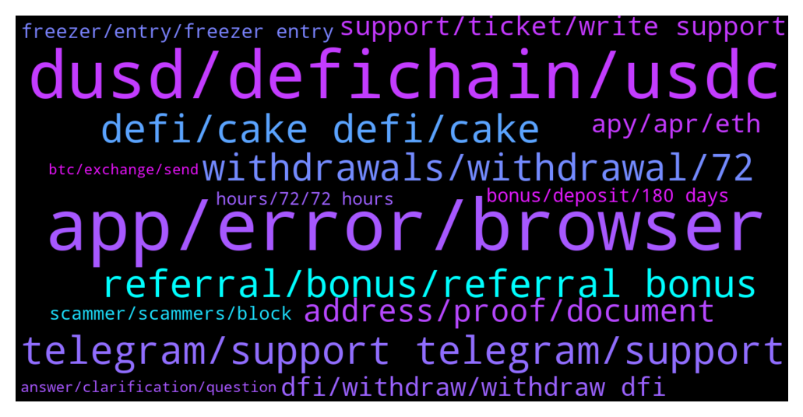

# **@CakeDeFi_EN**
 ## Analysis for **2022-01-30** - **2022-02-06**.

---

## 📊 **Basic Stats**

**n_messages_sent**: 1995

---

---

## 🔝 **Top keywords and related messages**

1. **app, error, browser**

    @Michael_Schredl --- *Everything works fine for me, what error do you get?* **--->** [TG Discussion](https://t.me/CakeDeFi_EN/167653)

    @Michael_Schredl --- *I don't think it is available in the app yet* **--->** [TG Discussion](https://t.me/CakeDeFi_EN/171492)

    @Sunny02 --- *I get this with Chrome, the Cake App (a red dot instead of the error message) and Safari* **--->** [TG Discussion](https://t.me/CakeDeFi_EN/169519)

    @JetFuelGenius --- *When I opened up the app earlier today, it told me it was out of date and needed to be updated. I was directed to the App Store, but no update was available. It is available now.* **--->** [TG Discussion](https://t.me/CakeDeFi_EN/167805)

    @JetFuelGenius --- *When you release an update, it would be nice if you would make sure it’s live and actually available before blocking the old version.* **--->** [TG Discussion](https://t.me/CakeDeFi_EN/167803)

    @Bald --- *Yes. Using Samsung. Downloaded the app from playstore. But was told the app was outdated. Problem is Playstore do not have any update* **--->** [TG Discussion](https://t.me/CakeDeFi_EN/167755)

2. **dusd, defichain, usdc**

    @Francesco --- *Thanks Kassius that’s the same answer I got from support but I still don’t understand how can I buy defichain DUSD. Do you have any clues on how to actually buy them? Thanks!* **--->** [TG Discussion](https://t.me/CakeDeFi_EN/172344)

    @DmgBautista --- *Yes DUSD has been dropping enough to offset the gain you felt in the DPDBC. DUSD has been trading already at almost 1,3$ usd aproximatelly, while currently is something around 1,1$ usd. It will drop further (my opinion only) once we get closer to the hardfork since many users are planning on exiting the pools, which will cause a drop in demand and further proximity to an actual 1$usd.* **--->** [TG Discussion](https://t.me/CakeDeFi_EN/168388)

    @mm_phoenix --- *you can swap directly to cake dfi in dusd, because you thought you could buy it cheaper somewhere, it became inconvenient. ☹️* **--->** [TG Discussion](https://t.me/CakeDeFi_EN/170208)

    @Aimun_J --- *Hi. I am trying to deposit DUSD into my cake wallet however the wallet address is flagged as invalid. Can I not transfer DUSD from my MetaMask in order to liquidity mine?* **--->** [TG Discussion](https://t.me/CakeDeFi_EN/170190)

    @Cammy2904 --- *What hard fork are you taking about? Didn't we had an update in beginning of January?* **--->** [TG Discussion](https://t.me/CakeDeFi_EN/168474)

    @Tracey --- *How to get USDC onto DefiChain? Is the the same as decentralized asset  dUSDC ?* **--->** [TG Discussion](https://t.me/CakeDeFi_EN/170579)

3. **telegram, support telegram, support**

    @DmgBautista --- *Hi! There is no direct number to call to solve such subjects.   Everything must be solved by our official support. You can find the link below. Please consider that there is no official support in telegram.   Anyone DM you or calling you claiming to be support or a mod, must be immediatelly blocked and reported.  Mods will never DM a user neither call. Any unsolicited DM or call must always be considered a scam attempt!  You can contact support by the below link. Please allow them at least 24h to answer, maybe a bit more on weekends  https://cake.zendesk.com/hc/en-us/requests/new* **--->** [TG Discussion](https://t.me/CakeDeFi_EN/169076)

    @Batuhan --- *72 hours is a very long time. That's why people can be defrauded from fake telegram accounts. and people are afraid that the money will not be withdrawn.* **--->** [TG Discussion](https://t.me/CakeDeFi_EN/171889)

    @mm_phoenix --- *if you are looking for a very easy way use dfx.swiss They also have their own Telegram group https://t.me/DFXswiss_en* **--->** [TG Discussion](https://t.me/CakeDeFi_EN/169960)

    @zachgax --- *There is no support in Telegram. Mods are also not support. You have to open a ticket here. This is the only official channel for support https://support.cakedefi.com/hc/en-us/requests/new* **--->** [TG Discussion](https://t.me/CakeDeFi_EN/171977)

    @DmgBautista --- *Good morning guys! @zachgax it seems you had a rough night 😕   Unfortunatelly when users don't read the basics on safety and how to avoid scams, that are posted every single day several times a day, such can happen.  Sorry that you had to go through that.  All users, and once again, mods don't DM or call and there is no support on telegram. If someone sends you an unsolicited DM or call, whoever it may seem to be, just block and report. Plain simple as that.  Best regards! 👍* **--->** [TG Discussion](https://t.me/CakeDeFi_EN/172135)

    @fabioandreatta --- *Fill in the form and contact our Customer Support with your request. There is no direct Support here on Telegram* **--->** [TG Discussion](https://t.me/CakeDeFi_EN/170983)

4. **defi, cake defi, cake**

    @liqprovider --- *🤤 I love to watch the thoughts and development of Cake DeFi https://www.youtube.com/watch?v=tGAz2tx0lPY&t=7s* **--->** [TG Discussion](https://t.me/CakeDeFi_EN/167636)

    @Kassius84 --- *For both questions, follow the official announcement channel of Cake DeFi and you will be notice 😃👍  Cake DeFi EN Announcements (Official) Official announcements for Cake DeFi https://t.me/CakeDeFi_EN_announcements* **--->** [TG Discussion](https://t.me/CakeDeFi_EN/168569)

    @busukman --- *Hey boss.. is it enought for just to know the cakedefi environment, i means like how to stake,how to LM , withdraw,depo and etc..because sometimes i feel this space is to deep.* **--->** [TG Discussion](https://t.me/CakeDeFi_EN/168455)

    @DmgBautista --- *No I do not 😅 Mods don't work for Cake, but we do believe in the project and are fierce and passionate about it,  think long term and want to help the community and contribute the best we can for it 🙂* **--->** [TG Discussion](https://t.me/CakeDeFi_EN/167857)

    @Kangoroooo2000 --- *If you dont like Cake and dont believe in defichain so why are you here?🤔 We prefer cake defichain lovers and dont need the haters, period😇* **--->** [TG Discussion](https://t.me/CakeDeFi_EN/168030)

    @Malii007 --- *it doesn't matter, I trust cakedefi exchange😊* **--->** [TG Discussion](https://t.me/CakeDeFi_EN/171259)

5. **referral, bonus, referral bonus**

    @muhammedbyrkn --- *How much is the referral reward?* **--->** [TG Discussion](https://t.me/CakeDeFi_EN/167562)

    @Grinched --- *Hi! Where can I find the 8DFI when a referral signed up through my link?* **--->** [TG Discussion](https://t.me/CakeDeFi_EN/169662)

    @erikaa1997 --- *Tell me about the $50 referral bonus* **--->** [TG Discussion](https://t.me/CakeDeFi_EN/171032)

    @Ahmet516 --- *Hello What is the award given to the referrer?* **--->** [TG Discussion](https://t.me/CakeDeFi_EN/170192)

    @apoyzkie09 --- *And I am already verified.. can I still put someone else referral on my account? And How.* **--->** [TG Discussion](https://t.me/CakeDeFi_EN/168006)

    @fabioandreatta --- *Check your referral page, if you have valid Referrals, you only get rewards if your referrals have enough assets (more than $50 USD) - All referral rewards were paid out yesterday, meaning there is/was no issue* **--->** [TG Discussion](https://t.me/CakeDeFi_EN/170548)

6. **withdrawals, withdrawal, 72**

    @Batuhan --- *I withdraw the most was the whale fin exchange. It took 16 hours.* **--->** [TG Discussion](https://t.me/CakeDeFi_EN/171913)

    @zachgax --- *Withdrawals can take up to 72 hours. Don’t worry, it’ll go through.   https://support.cakedefi.com/hc/en-us/articles/360035528272-How-long-does-it-take-for-my-withdrawal-to-be-processed-* **--->** [TG Discussion](https://t.me/CakeDeFi_EN/173029)

    @<UNK> --- *Few more days can finally take out. Free money though long wait* **--->** [TG Discussion](https://t.me/CakeDeFi_EN/169146)

    @Michael_Schredl --- *Withdrawals can take up to 72 hours* **--->** [TG Discussion](https://t.me/CakeDeFi_EN/172149)

    @jezzkng --- *For withdrawal, it'd take up to 72 hours.* **--->** [TG Discussion](https://t.me/CakeDeFi_EN/172042)

    @Kassius84 --- *Sure, just have some patient. Withdrawal can take up to 72h to fulfil.* **--->** [TG Discussion](https://t.me/CakeDeFi_EN/171882)

7. **address, proof, document**

    @papai699 --- *Thank you i have submitted a request as the adress proof was again rejected, the income tax return file is the last government adress proof available now.. And it is of year 2021-22* **--->** [TG Discussion](https://t.me/CakeDeFi_EN/169791)

    @papai699 --- *Can i attach income tax return file as government address proof document? @admin* **--->** [TG Discussion](https://t.me/CakeDeFi_EN/169485)

    @sunilpnwr --- *May I know if Income Tax Return Acknowledgement Document can be used for Proof for Address document? Please reply!* **--->** [TG Discussion](https://t.me/CakeDeFi_EN/167545)

    @detbul --- *my address was correct it was correct in the document but they asked me to send it again* **--->** [TG Discussion](https://t.me/CakeDeFi_EN/172658)

    @alpturkalp --- *if I send you my proof document can you tell me what should I write to the part city and street* **--->** [TG Discussion](https://t.me/CakeDeFi_EN/170485)

    @X4LPHAX --- *Good day, I have verified my identity, but my address has not been verified for 3 times. Although I chose the government document, it asks me to throw out the phone bill.* **--->** [TG Discussion](https://t.me/CakeDeFi_EN/170941)

8. **support, ticket, write support**

    @Lebroncuk --- *is there an address I can email for support?* **--->** [TG Discussion](https://t.me/CakeDeFi_EN/171285)

    @The_Euphoria69 --- *But u didnt nothing nice support* **--->** [TG Discussion](https://t.me/CakeDeFi_EN/172368)

    @TJone$ --- *Because your support team said for me to cash out some of my defichain I had to send it to a wallet so i did 🤷🏼‍♂️* **--->** [TG Discussion](https://t.me/CakeDeFi_EN/169233)

    @Michael_Schredl --- *I would write the Support if you need something* **--->** [TG Discussion](https://t.me/CakeDeFi_EN/170754)

    @Michael_Schredl --- *!Support please write the support a ticket* **--->** [TG Discussion](https://t.me/CakeDeFi_EN/171877)

    @Michael_Schredl --- *!Support feel free to write the support 🙂* **--->** [TG Discussion](https://t.me/CakeDeFi_EN/172251)

9. **dfi, withdraw, withdraw dfi**

    @macsien --- *I looked my account but I can't withdraw because it's zero dfi.* **--->** [TG Discussion](https://t.me/CakeDeFi_EN/170423)

    @Malii007 --- *yes I used DFI chain. I had withdraw before, it took a very short time. Now I'm surprised it took so long.* **--->** [TG Discussion](https://t.me/CakeDeFi_EN/171255)

    @Malii007 --- *I submitted a DFI withdrawal request.* **--->** [TG Discussion](https://t.me/CakeDeFi_EN/171241)

    @DmgBautista --- *What do you mean no direct transfer or withdrawal? That is literally the most basic function on the platform and works fine.  Just send your DFI through the defichain network to a supported exchange (kukoin, bittrex, hotbit, bitrue, and many others) and cash out if you wish so.  If you are speaking of frozen coins given as welcome bonus, those you cannot withdraw before the 180 freezer days elapse, in order to give you time to understand the platform and not attract users that are only after free money.  Best regards! 👍* **--->** [TG Discussion](https://t.me/CakeDeFi_EN/169260)

    @n01r77 --- *Hi, is this learn and earn 5$ Dfi is withdrawal or not?* **--->** [TG Discussion](https://t.me/CakeDeFi_EN/167516)

    @Lucky --- *Hello,  Can anyone tell me how can i withdraw my dfi money in account?* **--->** [TG Discussion](https://t.me/CakeDeFi_EN/168941)

10. **apy, apr, eth**

    @Manvydasm --- *Ok, but current apy is shown 0%* **--->** [TG Discussion](https://t.me/CakeDeFi_EN/168381)

    @Michael_Schredl --- *!APY rewards are shown in APY, Not APR. Check out the link to learn more about it :)* **--->** [TG Discussion](https://t.me/CakeDeFi_EN/170502)

    @默默啃书小凳子~ --- *hmm, to answer this question must know about apr and apy. According to investopedia,  APR represents the annual rate charged for earning or borrowing money. · APY takes into account compounding, but APR does not. Same number of APR and APY get different outcome. So, direct compound to LM will get more compare to staking. Remember higher return higher risk* **--->** [TG Discussion](https://t.me/CakeDeFi_EN/169763)

    @YyeapY --- *yeah i know apr apy....if i compound it on LM i will reach apr faster, just wondering which strategy is under middle risk* **--->** [TG Discussion](https://t.me/CakeDeFi_EN/169764)

    @Cammy2904 --- *Lol 😂 you know what a normal bank account gives you? 0.01% APY. YES you read that right. So everything from 40% and up APR is just heaven* **--->** [TG Discussion](https://t.me/CakeDeFi_EN/168473)

    @xavier_pwm --- *Hi everyone, would like to ask how do the rewards are determined backend. It seems that the estimated APY and actual reward payout is different by about 30%. In my case, I did a 10 year freezing, hoping to get the indicated 90+% apy return, only to be receiving about 30% less. Any advice?* **--->** [TG Discussion](https://t.me/CakeDeFi_EN/169438)

11. **freezer, entry, freezer entry**

    @fadfunky --- *All my freezer is 10 years freeze.* **--->** [TG Discussion](https://t.me/CakeDeFi_EN/172783)

    @YSL --- *I just did that few days ago .. 🤦🏻‍♀️ will still entitle ? I freeze 5 yrs few days ago* **--->** [TG Discussion](https://t.me/CakeDeFi_EN/168707)

    @xavier_pwm --- *Sigh.. just froze mine yesterday only* **--->** [TG Discussion](https://t.me/CakeDeFi_EN/168943)

    @Erkan --- *Ohh, i didn't know it, Yes, they are frozen* **--->** [TG Discussion](https://t.me/CakeDeFi_EN/171738)

    @zachgax --- *Yes, but evening you no longer have any normal freezer right? All your freezer is now 10 years. So you won’t see normal freezer anymore. 👍* **--->** [TG Discussion](https://t.me/CakeDeFi_EN/172804)

    @fabioandreatta --- *Check your freezer page for defrost day. 180 days* **--->** [TG Discussion](https://t.me/CakeDeFi_EN/170305)

12. **bonus, deposit, 180 days**

    @imohitss --- *I have created acc on dec 11 can i deposit now to get bonus* **--->** [TG Discussion](https://t.me/CakeDeFi_EN/170086)

    @Michael_Schredl --- *You can withdraw your sign up bonus after 180 days* **--->** [TG Discussion](https://t.me/CakeDeFi_EN/171563)

    @LiquidX23 --- *Why email? I see in my Balance no bonus.* **--->** [TG Discussion](https://t.me/CakeDeFi_EN/170547)

    @TadekNorek --- *After 180 days can withdraw bonus* **--->** [TG Discussion](https://t.me/CakeDeFi_EN/171189)

    @The_Euphoria69 --- *Im not talking about the singup bonus i did deposit $250 around but i cant see my moneys on my account* **--->** [TG Discussion](https://t.me/CakeDeFi_EN/172292)

    @tokyo --- *Yes I am sure that not my welcome bonus, I have now written to support, I am waiting for answer 🤔* **--->** [TG Discussion](https://t.me/CakeDeFi_EN/169550)

13. **scammer, scammers, block**

    @mamajamapuma --- *You’re just alleging without evidence. If you’ve been scammed then I’m sorry but you have to be more vigilant* **--->** [TG Discussion](https://t.me/CakeDeFi_EN/172095)

    @Sunny02 --- *ok thank you. BTW I am constantly getting PMd by you and "Michael" via DM since we startet chatting here 🙂 Probably scammers?* **--->** [TG Discussion](https://t.me/CakeDeFi_EN/169526)

    @YSL --- *Silly question. The only way scammer can access our account if we ourself provide them the information or click on the fake link right? Can’t be just chatting with them ll be able to access our account right ? Need to be sure how scammer can access our account* **--->** [TG Discussion](https://t.me/CakeDeFi_EN/171390)

    @Kassius84 --- *This sounds like scam. Never trust a message from someone asking you to transfer money or crypto. Even if that account looks like a moderator or "admin" account.* **--->** [TG Discussion](https://t.me/CakeDeFi_EN/172322)

    @Javixo --- *I know scammers are not here; just warning people 😊* **--->** [TG Discussion](https://t.me/CakeDeFi_EN/171983)

    @Martin --- *Is it possible to kick out scammers with names and pics of admins?* **--->** [TG Discussion](https://t.me/CakeDeFi_EN/171224)

14. **hours, 72, 72 hours**

    @Michael_Schredl --- *It can take up to 72 hours* **--->** [TG Discussion](https://t.me/CakeDeFi_EN/171940)

    @Michael_Schredl --- *72 Hours are the maximum, usually it takes around 1 hour* **--->** [TG Discussion](https://t.me/CakeDeFi_EN/172416)

    @Lebroncuk --- *how many hours does it take on average, then?* **--->** [TG Discussion](https://t.me/CakeDeFi_EN/171281)

    @<UNK> --- *Duh! U didnt read ? I mentioned 72 hours already* **--->** [TG Discussion](https://t.me/CakeDeFi_EN/167993)

    @KlausLberger --- *Up to 72 hrs. Mostly faster ;-)* **--->** [TG Discussion](https://t.me/CakeDeFi_EN/170793)

    @Batuhan --- *I've never waited until now.  And 3 days is not a long time.* **--->** [TG Discussion](https://t.me/CakeDeFi_EN/171902)

15. **answer, clarification, question**

    @ChanA78 --- *I see, thanks for the explanation.* **--->** [TG Discussion](https://t.me/CakeDeFi_EN/173005)

    @Bald --- *I see. Thanks for the info* **--->** [TG Discussion](https://t.me/CakeDeFi_EN/167873)

    @<UNK> --- *And no answer. Thanks for typing anyway* **--->** [TG Discussion](https://t.me/CakeDeFi_EN/167996)

    @DmgBautista --- *Good morning Zachary! And thanks for answering to the user while I was in my rest time! Good answer! Best regards :)* **--->** [TG Discussion](https://t.me/CakeDeFi_EN/170125)

    @Kenneth --- *I see Thanks for the valuable info 😁* **--->** [TG Discussion](https://t.me/CakeDeFi_EN/167715)

    @MehmetnuriDilek --- *hello i have a general question in my shots* **--->** [TG Discussion](https://t.me/CakeDeFi_EN/171866)

