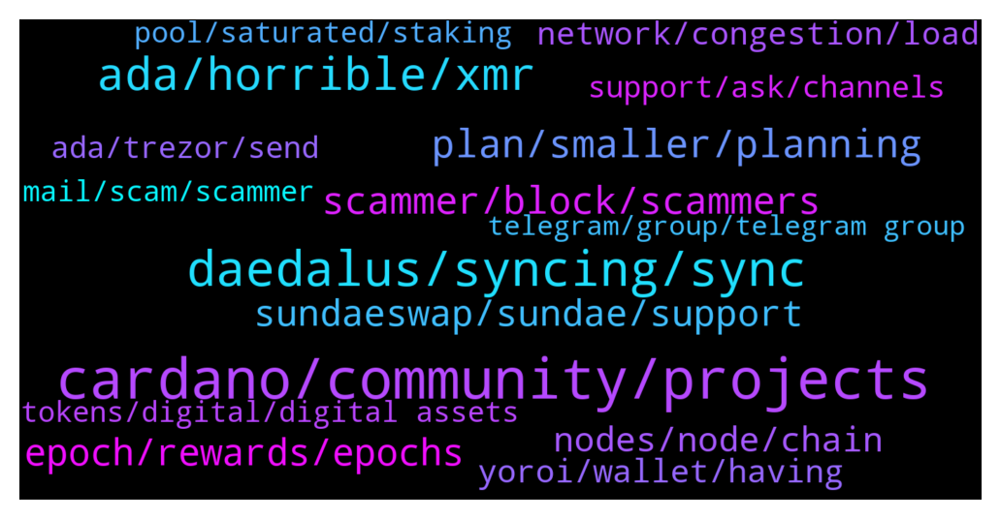

# **@Cardano**
 ## Analysis for **2022-01-30** - **2022-02-06**.

---

## 📊 **Basic Stats**

**n_messages_sent**: 629

---

---

## 🔝 **Top keywords and related messages**

1. **cardano, community, projects**

    @Lgbeano --- *This is a great community built map which shows just some of what's happening on Cardano   https://www.cardanocube.io/cardano-ecosystem-interactive-map* **--->** [TG Discussion](https://t.me/Cardano/776637)

    @cryptoduud --- *Hi, is there a official place for sharing and finding new projects on the cardano blockchain?* **--->** [TG Discussion](https://t.me/Cardano/777373)

    @jared1996z --- *What's this got to do with cardano?* **--->** [TG Discussion](https://t.me/Cardano/777012)

    @arautom --- *Hey, I'm writing an article about Cardano and was doing a research about Project Catalyst, and one doubt about some official data that I found emerged. There's someone who I could talk about this in private?* **--->** [TG Discussion](https://t.me/Cardano/775466)

    @Khalid --- *So many noisy cardano haters now on social media because of sundaeswap issues. Is it really cardano's limitations that caused these problems? or did the sundaeswap team rushed the release? Will there be an official statement from IOG addressing these concerns?* **--->** [TG Discussion](https://t.me/Cardano/775892)

    @Corey --- *Do you have a link to the discord chat by any chance?  Or can I just search Cardano?  Sorry, I don’t use discord.  Thanks in advance.* **--->** [TG Discussion](https://t.me/Cardano/778950)

2. **daedalus, syncing, sync**

    @cryptoustt --- *daedalus taking 6.6 GB memory and 33% CPU. is this normal?* **--->** [TG Discussion](https://t.me/Cardano/778849)

    @Rambod20 --- *any one else having issues with their Daedalus wallet NOT ONLY syncing/connecting with the node? (I'm not referring to the node taking long time to reach 100% sync. it simply doesn't connect.)* **--->** [TG Discussion](https://t.me/Cardano/775730)

    @Nicolasfont --- *Wtf is going on with daedalus?? Can't update to new version. Keep crashing* **--->** [TG Discussion](https://t.me/Cardano/778536)

    @Nicolasfont --- *Yes I did. I'm not new. Dealing with daedalus since over a year. I just restarted my laptop and this time it did work. So for those having the same issue just restart laptop and that should be ok.* **--->** [TG Discussion](https://t.me/Cardano/778542)

    @ExInfernis --- *did anyone had problems with installing 4.8.0 of daedalus? I receive Error opening file for wriing: C;\Program Files\Daedalus Mainnet\Daedalus Mainnet.exe* **--->** [TG Discussion](https://t.me/Cardano/778420)

    @appleFxxxPen --- *My goodness the new Daedalus wallet took almost half day to update it madness….* **--->** [TG Discussion](https://t.me/Cardano/778488)

3. **ada, horrible, xmr**

    @Angel --- *I have a question. What are the benefits of holding a huge amount of ada?. If over time the transactions fees will be lower than 0.17ADA. It's very unlikely that we need 5k ada or more. Realistically we will never transact that much. Due to the extreme volatility of ada It's not a practical medium of exchange. We will likely use Djed or other stable coins so it'd be better to just buy djed instead. There is more utility in using tokens developed in the cardano blockchain than to have ada itself* **--->** [TG Discussion](https://t.me/Cardano/776604)

    @domib97 --- *Does anyone tried https://transak.com/ yet? This is from the TerraLuna ecosystem and could help mainstream people to get some ADA too, without big complicated exchanges. As an EU-citizen I can do SEPA Bank Transfer.  I think this is a game changer.* **--->** [TG Discussion](https://t.me/Cardano/778048)

    @Khan --- *How can ppls like me be part of it ?  For all I know I have some ada coins that's all haha 😅* **--->** [TG Discussion](https://t.me/Cardano/776624)

    @crnicripto81 --- *it could be good for Ada .....* **--->** [TG Discussion](https://t.me/Cardano/776987)

    @Dionysis --- *Hello everyone! Quick question: can I transfer my ada from one wallet to another while they are delegated, without unstaking them? Is there a way?* **--->** [TG Discussion](https://t.me/Cardano/778502)

    @BinK18 --- *Ccvault is the best ada wallet* **--->** [TG Discussion](https://t.me/Cardano/775859)

4. **plan, smaller, planning**

    @Morpheus369 --- *So what is a good paradigm to follow when building a successful project? For example I tought to split up a big projekt into smaller hurdles and testing everything and fixing bugs before implementing it. I also tought that one should begin with the vision and analyzing the market. Then one should split up the plan into smaller hurdles  and plan every detail of the hurdle and then test it. Afterwards do this for the second plan. In the end one should start implementing the test code into the real projekt. But the implementation should also be done in smaller steps. Is this a good plan or what is more efficient? I also heard the biggest enemy of good enough is perfect. Is this plan too perfectionsist? So maybe there needs to be a compromise? What do you think?* **--->** [TG Discussion](https://t.me/Cardano/777572)

    @Morpheus369 --- *what do you mean with "work toward function"* **--->** [TG Discussion](https://t.me/Cardano/777588)

    @glitch04 --- *Then move to put that plan into motion, so you are not stuck in the planning phase* **--->** [TG Discussion](https://t.me/Cardano/777592)

    @Morpheus369 --- *or like also change the plan along the way...* **--->** [TG Discussion](https://t.me/Cardano/777584)

    @Morpheus369 --- *I think I got it now. What do you think?  Plan broad then implement.  Then write down mistakes and difficulties from implementing and change the plan and start implementing from scratch.  Do all this in smaller hurdles so its always easy to improve plan and start from scratch since one mistake has little influence on smaller functions. Also splitting up allows working in parallel.* **--->** [TG Discussion](https://t.me/Cardano/777601)

    @glitch04 --- *I would say the small steps but that is personal preference* **--->** [TG Discussion](https://t.me/Cardano/777600)

5. **scammer, block, scammers**

    @glitch04 --- *Look at the dm they just sent not even in the group* **--->** [TG Discussion](https://t.me/Cardano/775595)

    @Deji --- *"Help"?  Is that a scammer name?* **--->** [TG Discussion](https://t.me/Cardano/776328)

    @glitch04 --- *Anyone that dm's you offering support is a scammer so block and ignore them* **--->** [TG Discussion](https://t.me/Cardano/777061)

    @bextmany --- *This was actually a scam bait. I was waiting for them on my DM. I love putting curses on them* **--->** [TG Discussion](https://t.me/Cardano/778296)

    @glitch04 --- *Anyone that dm'd you is a scammer so please block and report them* **--->** [TG Discussion](https://t.me/Cardano/777944)

    @glitch04 --- *Shouldn't be an issue but you will likely get dm'd from scammers now* **--->** [TG Discussion](https://t.me/Cardano/777565)

6. **epoch, rewards, epochs**

    @tigonik --- *Would someone know what Total Output means in terms of an epoch? The value I see on CardanoScan for epoch 316 exceeds total supply of ADA. See link: https://cardanoscan.io/epoch/316* **--->** [TG Discussion](https://t.me/Cardano/777658)

    @Lgbeano --- *Yeah they only ran their ispo for 5 epochs* **--->** [TG Discussion](https://t.me/Cardano/775768)

    @ChrisSTR8 --- *One epoch is 5 days, if e.g. a whale moves her ADA multiple times it adds up* **--->** [TG Discussion](https://t.me/Cardano/777661)

    @KyR14c0s --- *yes but it took much more time than other days ... they were not supposed to fix this in this epoch ?* **--->** [TG Discussion](https://t.me/Cardano/775809)

    @srinivas2121 --- *Need small info... Now epoch is 319...but in yoroi... rewards showing epoch showing 317 not 318...it will always shows like this only...* **--->** [TG Discussion](https://t.me/Cardano/778757)

    @... --- *If i want to redelegate, how can i avoid losing rewards this epoch?* **--->** [TG Discussion](https://t.me/Cardano/778195)

7. **sundaeswap, sundae, support**

    @ChrisSTR8 --- *This is not a channel for sundaeswap support if you need help you should use their official discord https://discord.gg/Sundae* **--->** [TG Discussion](https://t.me/Cardano/774913)

    @notPoetEnough --- *I'm a little late to the party but just want to confirm that Sundaeswap is pretty much completely unusuable right now, correct?* **--->** [TG Discussion](https://t.me/Cardano/774918)

    @OTT2KICKASSOSHI --- *Guys where can I view the Sundaeswap charts?* **--->** [TG Discussion](https://t.me/Cardano/778348)

    @gauthamnag --- *I have set slippage at 2% in sundae swap but still in awaiting scoop status since afternoon, generally how long does it take to get this confirmed..any suggestions pls* **--->** [TG Discussion](https://t.me/Cardano/778538)

    @Lars --- *Does anyone know how long it takes to swap at sundaeswap? My order currently says "awaiting scoop"* **--->** [TG Discussion](https://t.me/Cardano/776442)

    @brzi987 --- *I'm not getting any feedback from sundaeswap on Twitter,so I'm asking here* **--->** [TG Discussion](https://t.me/Cardano/774757)

8. **nodes, node, chain**

    @Lgbeano --- *Nodes verify the blockchain, they don't work towards decentralisation.   Bitcoin is only as decentralised as the amount of miners there are now, which isn't that many.   You could shut down all the client nodes and the chain would run fine. If you shut down the miners the chain would stop.* **--->** [TG Discussion](https://t.me/Cardano/776430)

    @santiloopz --- *If client nodes are not important why are they factored in in nakamoto coefficient for decentralization? https://news.earn.com/quantifying-decentralization-e39db233c28e?gi=2be913cf8990* **--->** [TG Discussion](https://t.me/Cardano/776434)

    @Lgbeano --- *When you use a light wallet that is connected to a full node, you just don't use it.   I'm sure they want people to believe that bitcoin is super decentralised because end users are running client full nodes 🙈. But their use is limited and like you say yourself, all it does is verify the chain, it is nothing more than an observer.   Decentralisation comes from whether a single or few entities could have an impact on the chain if they were removed.   If something is centralised then one entity can turn off or control the network.   If something is decentralised the question is how decentralised is it. That can be answered by how many entities need to be removed before the chain stops functioning.   If all end users stop loading up their full nodes the chain would continue.   If all miners stopped mining the chain would stop and the nodes would no longer sync.   How many bitcoin mining firms are there around the world? That's how decentralised bitcoin is.* **--->** [TG Discussion](https://t.me/Cardano/776438)

    @santiloopz --- *Again, you are speaking from a narrow point of view which is keeping systems operational. Decentralization is broader than that, just take a few minutes to read the article.* **--->** [TG Discussion](https://t.me/Cardano/776439)

    @santiloopz --- *I would say it is advisable to hace as many full nodes as possible to favour decentralization, so I dont see why advice otherwise.* **--->** [TG Discussion](https://t.me/Cardano/776426)

    @santiloopz --- *Why then in bitcoin they say running client nodes (not miners) is good for decentralization?* **--->** [TG Discussion](https://t.me/Cardano/776428)

9. **yoroi, wallet, having**

    @EhmReally --- *Yoroi doesn't seem to be working with Ledger at the moment, have you heard anything?* **--->** [TG Discussion](https://t.me/Cardano/777532)

    @AP_ADA --- *Why i can not make transactions on Yoroi? What happened with this system? And the wallet needs very much time to go online …* **--->** [TG Discussion](https://t.me/Cardano/777237)

    @AI_Kapone --- *Does anyone known if Yoroi is impacted by this?... https://cointelegraph.com/news/hodlers-beware-new-malware-targets-metamask-and-40-other-crypto-wallets?utm_source=Telegram&utm_medium=social* **--->** [TG Discussion](https://t.me/Cardano/778068)

    @glitch04 --- *click the "pair" option after you click the "add wallet" section* **--->** [TG Discussion](https://t.me/Cardano/777978)

    @dilavima30 --- *How can i set up nami wallet ?* **--->** [TG Discussion](https://t.me/Cardano/775479)

    @ChrisSTR8 --- *Currently the chain is very busy, lots of projects adding transactions. Just try again or use a different wallet, Yoroi might have a large backlog* **--->** [TG Discussion](https://t.me/Cardano/777245)

10. **network, congestion, load**

    @Zyroxa --- *The network is currently under heavy load.* **--->** [TG Discussion](https://t.me/Cardano/776986)

    @apex_pool_spo --- *then it is normal. the network has many transactions in the last weeks.* **--->** [TG Discussion](https://t.me/Cardano/775804)

    @glitch04 --- *Not outside of heavy transaction load on the network and it taking extra time for transactions to process* **--->** [TG Discussion](https://t.me/Cardano/777534)

    @gmark --- *Well were getting heat, like ppl mocking this network, and Im just looking for what we know to also relay this feedback.* **--->** [TG Discussion](https://t.me/Cardano/774804)

    @Deji --- *Also the solaña network is operational between the hours of 9am and 5pm Monday through Friday, maybe.* **--->** [TG Discussion](https://t.me/Cardano/776320)

    @Mahoney1 --- *Is there a way to check how congested the network is now?* **--->** [TG Discussion](https://t.me/Cardano/778944)

11. **ada, trezor, send**

    @chalk01 --- *On Daedalus I get the error “transaction confirmation failed” when trying to send Ada (multiple attempts over an hour). It was working okay earlier but now I get this error. Is there anything that can be done to get past the error?* **--->** [TG Discussion](https://t.me/Cardano/777702)

    @crnicripto81 --- *hi guys, I noticed that the sending times do Ada have lengthened. There could be a problem or and the blockchein is clogged.* **--->** [TG Discussion](https://t.me/Cardano/776985)

    @chalk01 --- *I’m trying to send some staked Ada from Daedalus using Trezor but after I confirm the amount on Trezor (that matches the amount I’m trying to send) it then asks to confirm withdrawal from account #1 (this second ada amount is totally different but it‘a the same amount as my rewards).   Is this supposed to happen?* **--->** [TG Discussion](https://t.me/Cardano/777568)

    @WhirrledPeas --- *Please any help appreciated: I have an ADA Yoroi wallet in my Trezor-T with the entire balance staked to an approved SundaeSwap scooper staking pool. Yesterday, I tried to send 2.  ADA to another empty Yoroi wallet (not in my Trezor no stakes) as a routine test.  I signed the transaction with my passphrase and all was OK showing the correct receive address of my other wallet, on my Trezor-T. Then I got another message on my Trezor-T......"Change address stake credentials is a key hash. addr_vkh.....(a long hash)  I approved the green check on my screen then got..." Change address payment credential is a path m/1852......(a long hash)  I then checked the green check on my Trezor and the next screen message said, "Change amount to 900 ADA to addr1.....(a different unknown receive address than my other Yoroi wallet). At this point I pulled the plug ending the transaction of sending 2 ADA to my other empty Yoroi wallet.  I still have my total wallet staked balance intact but am afraid to try sending any ADA. Is there any way I can recreate my Yoroi wallet which is under my Trezor-T, into another wallet like CCvault ? Thanks for any suggestions.* **--->** [TG Discussion](https://t.me/Cardano/777942)

    @Jace999 --- *I went to the Nami web app wallet to recover my wallet and then seconds later all my assets were sent to another address. I'm still earning rewards from delegating my ADA tho* **--->** [TG Discussion](https://t.me/Cardano/777361)

    @Brandon --- *Why is Yoroi taking so slow to withdraw out ada* **--->** [TG Discussion](https://t.me/Cardano/776345)

12. **support, ask, channels**

    @glitch04 --- *the best place to get that information is from their official channels, but from posts they have said yes* **--->** [TG Discussion](https://t.me/Cardano/777425)

    @notPoetEnough --- *Ah okay! I thought I saw a message above saying it was on their site.* **--->** [TG Discussion](https://t.me/Cardano/776381)

    @CalusB --- *I assume it was mentioning the competitors names* **--->** [TG Discussion](https://t.me/Cardano/774811)

    @glitch04 --- *best to ask their support https://t.me/Cardano/778144* **--->** [TG Discussion](https://t.me/Cardano/778385)

    @Zyroxa --- *You might want to ask in their own channels : https://www.meld.com/* **--->** [TG Discussion](https://t.me/Cardano/777655)

    @glitch04 --- *Best to ask in their support channel* **--->** [TG Discussion](https://t.me/Cardano/778547)

13. **pool, saturated, staking**

    @walterdmw --- *What place or pool do you recommend for staking, I bought cardano for long term (i Will block dm)* **--->** [TG Discussion](https://t.me/Cardano/775026)

    @DeniseKohJE --- *Cardano peeps, may i check, at what number is a stake pool saturated? Is it at 60M ?* **--->** [TG Discussion](https://t.me/Cardano/776117)

    @jack44sk8 --- *Just something safe to hold and staking in the pools usually when I want to use a dapp i send some to nami* **--->** [TG Discussion](https://t.me/Cardano/778554)

    @juancmtzr3 --- *Thank! How much you recommend to stake? Min* **--->** [TG Discussion](https://t.me/Cardano/775679)

    @Lgbeano --- *That pool is over saturated but you can still add ₳. I'm not sure if they will be included in their ispo or not, you would need to ask the sundaeswap team.* **--->** [TG Discussion](https://t.me/Cardano/775772)

    @infwonder --- *Hi.. can anyone point me to official document that explains how the pool saturation is calculated please? Thanks!* **--->** [TG Discussion](https://t.me/Cardano/776005)

14. **tokens, digital, digital assets**

    @ChrisSTR8 --- *In my understanding you have to claim them manually. Best you ask here:  https://discord.gg/sundae* **--->** [TG Discussion](https://t.me/Cardano/776244)

    @glitch04 --- *You don't, until they create their solution for claiming* **--->** [TG Discussion](https://t.me/Cardano/776061)

    @Lgbeano --- *Just send them like normal. Your ₳ tokens are never locked when staking, they remain in your wallet under your complete control.* **--->** [TG Discussion](https://t.me/Cardano/778504)

    @Paradigm7 --- *I claimed and all good other than the only option is to hold or sell. No staking or additional incentives outside free coins that I can find.* **--->** [TG Discussion](https://t.me/Cardano/778753)

    @glitch04 --- *Beyond the site knowing the address as it has to to send the tokens, no* **--->** [TG Discussion](https://t.me/Cardano/778705)

    @NAMBLAxxx --- *What if I want the tokens back?* **--->** [TG Discussion](https://t.me/Cardano/777947)

15. **mail, scam, scammer**

    @Magi --- *I need help against a scammer who steal my whole Ada from binance with scam* **--->** [TG Discussion](https://t.me/Cardano/775167)

    @Magi --- *You need a platform scammer free  Without this   Nothing is possible* **--->** [TG Discussion](https://t.me/Cardano/775590)

    @barAbba12 --- *please, report this profile as a scam to Instagram:  https://instagram.com/charleshoskinson.adacardano?utm_medium=copy_link  tries to get ADA sent by saying to send awards in ADA with fake photos of charles.  thank you* **--->** [TG Discussion](https://t.me/Cardano/778331)

    @Mikail --- *I shouldn't have posted that message - getting spammed by scammers now 😂* **--->** [TG Discussion](https://t.me/Cardano/777189)

    @Benjamin --- *Learn how to scam you leach* **--->** [TG Discussion](https://t.me/Cardano/776103)

    @Lgbeano --- *Unfortunately scam (fraud) is a multi billion dollar industry world wide, it is not limited to crypto. Nation states struggle to deal with it because they don't work well together. Victim is usually in an entirely different country to criminal* **--->** [TG Discussion](https://t.me/Cardano/775759)

