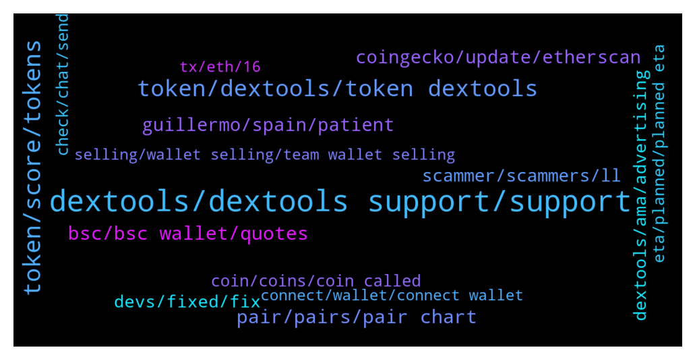

# **@DEXToolsCommunity**
 ## Analysis for **2022-01-30** - **2022-02-06**.

---

## 📊 **Basic Stats**

**n_messages_sent**: 822

---

---

## 🔝 **Top keywords and related messages**

1. **dextools, dextools support, support**

    @MademoiselleDL --- *Yes, but is there a limit to it on Dextools ?* **--->** [TG Discussion](https://t.me/DEXToolsCommunity/331162)

    @napascual --- *Not from Dextools, we don't provide an Api yet. You could use the chart tools to calculate that manually though* **--->** [TG Discussion](https://t.me/DEXToolsCommunity/328509)

    @Hardik8898 --- *Not listed yet.. we fill up form.. with dextool link.. but they reply us we can not track* **--->** [TG Discussion](https://t.me/DEXToolsCommunity/330873)

    @badelelele --- *dexscreener grew their chains in lightspeed* **--->** [TG Discussion](https://t.me/DEXToolsCommunity/328440)

    @bastardganpunk --- *Dextools doesn’t provide APIs yet. In the future it will be available though 🙂* **--->** [TG Discussion](https://t.me/DEXToolsCommunity/331203)

    @bastardganpunk --- *must be a general issue on dextools side I guess. The devs are looking into it now 🙂* **--->** [TG Discussion](https://t.me/DEXToolsCommunity/330495)

2. **token, score, tokens**

    @Ibraahiiim --- *Please how do you score a token* **--->** [TG Discussion](https://t.me/DEXToolsCommunity/328368)

    @JoeyDieleman --- *Score depends on the age of the token, liquidity and the amount of available social links. Also it the validation of the contract is taken into account* **--->** [TG Discussion](https://t.me/DEXToolsCommunity/328369)

    @HeiHei1985 --- *For example, I click 1token, but it will become a 5 token.* **--->** [TG Discussion](https://t.me/DEXToolsCommunity/330911)

    @HeiHei1985 --- *I click on the token, and other tokens will appear.* **--->** [TG Discussion](https://t.me/DEXToolsCommunity/330909)

    @CryptoFatherBoard --- *What's the real time utility that surround the token aside from the website* **--->** [TG Discussion](https://t.me/DEXToolsCommunity/330894)

    @HeiHei1985 --- *The token cannot be displayed before entering the contract.* **--->** [TG Discussion](https://t.me/DEXToolsCommunity/330901)

3. **token, dextools, token dextools**

    @whisardly --- *Hey can someone tell me what this contract is? I used dextools to purchase tokens and it interacted here.  https://bscscan.com/address/0xdef1c0ded9bec7f1a1670819833240f027b25eff* **--->** [TG Discussion](https://t.me/DEXToolsCommunity/329520)

    @lilvcj --- *Can you trending my token on dextools* **--->** [TG Discussion](https://t.me/DEXToolsCommunity/328197)

    @oni_o_n --- *good morning all, can someone please inform me how to update the dextools info for a token that I deployed* **--->** [TG Discussion](https://t.me/DEXToolsCommunity/330265)

    @farhad13345 --- *How can i trend my token in dextools* **--->** [TG Discussion](https://t.me/DEXToolsCommunity/329598)

    @Robertkaz --- *I have a token created lp added but not showing on dextools* **--->** [TG Discussion](https://t.me/DEXToolsCommunity/331295)

    @CryptoCruzin --- *Hi! How can I update the twitter and website links for out token on dextools?* **--->** [TG Discussion](https://t.me/DEXToolsCommunity/329181)

4. **pair, pairs, pair chart**

    @stanes --- *DEXT UNISWAP PAIR Chart and trade: https://www.dextools.io/app/uniswap/pair-explorer/0xa29fe6ef9592b5d408cca961d0fb9b1faf497d6d Contract: 0xfb7b4564402e5500db5bb6d63ae671302777c75a  DEXT PANCAKESWAP PAIR Chart and trade: https://www.dextools.io/app/pancakeswap/pair-explorer/0x4b729d5d871057f3a9c424792729217cde72410d Contract: 0xe91a8d2c584ca93c7405f15c22cdfe53c29896e3* **--->** [TG Discussion](https://t.me/DEXToolsCommunity/330858)

    @NoOne19944991 --- *Hi BSC hot pairs has issue Not show all of them* **--->** [TG Discussion](https://t.me/DEXToolsCommunity/329116)

    @JoeyDieleman --- *We don't remove pairs, this is the idea of centralizatuon.  We deliver tools to help identifying scams. And community can vote down pairs to give the pair a clear warning.* **--->** [TG Discussion](https://t.me/DEXToolsCommunity/329854)

    @silviagpoolOG --- *The pairs are listed on uniswap can be traded on dextools with limit order ?* **--->** [TG Discussion](https://t.me/DEXToolsCommunity/328522)

    @stanes --- *Nope, only:  DEXT UNISWAP PAIR Chart and trade: https://www.dextools.io/app/uniswap/pair-explorer/0xa29fe6ef9592b5d408cca961d0fb9b1faf497d6d Contract: 0xfb7b4564402e5500db5bb6d63ae671302777c75a  DEXT PANCAKESWAP PAIR Chart and trade: https://www.dextools.io/app/pancakeswap/pair-explorer/0x4b729d5d871057f3a9c424792729217cde72410d Contract: 0xe91a8d2c584ca93c7405f15c22cdfe53c29896e3* **--->** [TG Discussion](https://t.me/DEXToolsCommunity/328095)

    @stanes --- *Hi, yes, here: DEXT PANCAKESWAP PAIR Chart and trade: https://www.dextools.io/app/pancakeswap/pair-explorer/0x4b729d5d871057f3a9c424792729217cde72410d Contract: 0xe91a8d2c584ca93c7405f15c22cdfe53c29896e3* **--->** [TG Discussion](https://t.me/DEXToolsCommunity/329935)

5. **bsc, bsc wallet, quotes**

    @stanes --- *Both are rights, it only depends if you want to buy on ETh or BSC.* **--->** [TG Discussion](https://t.me/DEXToolsCommunity/330883)

    @peakyblinderdao --- *Could I user BSC too ?* **--->** [TG Discussion](https://t.me/DEXToolsCommunity/328589)

    @oi_mista --- *when it does load nothing shows on BSC* **--->** [TG Discussion](https://t.me/DEXToolsCommunity/328855)

    @stanes --- *You have to switch your Metamask to BSC.* **--->** [TG Discussion](https://t.me/DEXToolsCommunity/328615)

    @rpoole69 --- *Yes it is on BSC, thanks will let them know!* **--->** [TG Discussion](https://t.me/DEXToolsCommunity/328790)

    @kiss98 --- *Please   check   DogKingson       bsc's DogKingson, the quotes are suspended, can you fix it? thanks you* **--->** [TG Discussion](https://t.me/DEXToolsCommunity/331993)

6. **guillermo, spain, patient**

    @stanes --- *But he is based in Spain so it's still early there and it's the week end so please be patient, he is working a lot 🙏* **--->** [TG Discussion](https://t.me/DEXToolsCommunity/331815)

    @badelelele --- *what timezone the team at just to get an idea?* **--->** [TG Discussion](https://t.me/DEXToolsCommunity/328435)

    @JoeyDieleman --- *@crypto_knight_mike please DM @guillermorodriguez78 for ads/promotions* **--->** [TG Discussion](https://t.me/DEXToolsCommunity/332077)

    @JoeyDieleman --- *Please dm @guillermorodriguez78 for ads/promotions 👍* **--->** [TG Discussion](https://t.me/DEXToolsCommunity/330124)

    @bastardganpunk --- *Hey, Guillermo will come back to you asap. Note that the demand is very high and be patient if guillermo doesn’t answer instantly 🙂* **--->** [TG Discussion](https://t.me/DEXToolsCommunity/328076)

    @huifkar --- *I do know that the team is expanding. Hired another senior front-end dev not too long ago and a prominent Italian CIO focusing on expansion in Italy -- I believe.* **--->** [TG Discussion](https://t.me/DEXToolsCommunity/329040)

7. **coingecko, update, etherscan**

    @bastardganpunk --- *About social Information for your token, please update etherscan.io or bscscan.com or coingecko.com  We pull info from there.    For the logo please update coinGecko or TrustWallet.* **--->** [TG Discussion](https://t.me/DEXToolsCommunity/329403)

    @lilvcj --- *No one just what to trend my token* **--->** [TG Discussion](https://t.me/DEXToolsCommunity/328200)

    @JoeyDieleman --- *Update social info:  etherscan.io or bscscan.com or coingecko.com  Update logo:  CoinGecko or TrustWallet* **--->** [TG Discussion](https://t.me/DEXToolsCommunity/331101)

    @stanes --- *Hi! About social Information for your token, please update etherscan.io or bscscan.com or coingecko.com  We pull info from there.    For the logo please update coinGecko or TrustWallet.* **--->** [TG Discussion](https://t.me/DEXToolsCommunity/330269)

    @stanes --- *Hi. About social Information for your token, please update etherscan.io or bscscan.com or coingecko.com  We pull info from there.    For the logo please update coinGecko or TrustWallet.* **--->** [TG Discussion](https://t.me/DEXToolsCommunity/330386)

    @stanes --- *About social Information for your token, please update etherscan.io or bscscan.com or coingecko.com  We pull info from there.    For the logo please update coinGecko or TrustWallet.* **--->** [TG Discussion](https://t.me/DEXToolsCommunity/330597)

8. **scammer, scammers, ll**

    @stanes --- *This is a support channel, I prefer people here being aware scammers are around.* **--->** [TG Discussion](https://t.me/DEXToolsCommunity/328582)

    @E --- *but now you know 100 percent it's a scam why don't you stop it at least more people don't fall for it* **--->** [TG Discussion](https://t.me/DEXToolsCommunity/331142)

    @hmk18990 --- *ខេមរៈ I warn you already please keep the channel clean and DO NOT POST every scam token you find here.* **--->** [TG Discussion](https://t.me/DEXToolsCommunity/331258)

    @stanes --- *No sorry I don't understand why we should stop warning people of scammers.  This is not related to the app. I find your messages a bit concerning tbh, you just look like a scammer yourself 🤔* **--->** [TG Discussion](https://t.me/DEXToolsCommunity/328593)

    @Moly --- *Because I’m sure some one here is a scammer* **--->** [TG Discussion](https://t.me/DEXToolsCommunity/328314)

    @SweetMonkeyLove --- *Reported the scammers, gods work.  Thanks for the help guys.* **--->** [TG Discussion](https://t.me/DEXToolsCommunity/332018)

9. **dextools, ama, advertising**

    @salaryceo --- *Hey guys, who can I contact for advertising on Dextools. @admin please Text here, so I can DM you!* **--->** [TG Discussion](https://t.me/DEXToolsCommunity/330801)

    @EJ_FarmWars --- *How can I run ads on dextools* **--->** [TG Discussion](https://t.me/DEXToolsCommunity/330123)

    @stanes --- *Hi, this group is reserved for Dextools support. Feel free to join our Discord if you want to talk about a particular coin. https://discord.gg/aS3vuPgf6J But with this name, chances to be a scam look almost absolutes... always DYOR.* **--->** [TG Discussion](https://t.me/DEXToolsCommunity/330946)

    @Lol --- *Can you please delete all this scammers stuff because people will be afraid to join dextool you guys should be careful that all* **--->** [TG Discussion](https://t.me/DEXToolsCommunity/328580)

    @Lol --- *Yes people should be aware of scammers instead posting… people will be afraid of using DEXT Stanes I hope you understand me* **--->** [TG Discussion](https://t.me/DEXToolsCommunity/328590)

    @stanes --- *Hi, be careful, a scammer answered to your message asking you to DM him. Don't do it.  What do you mean regarding AMA? Doing an AMA in this group or proposing an AMA from the Dextools team to an other group?* **--->** [TG Discussion](https://t.me/DEXToolsCommunity/330363)

10. **devs, fixed, fix**

    @napascual --- *It has been fixed and regenerated already* **--->** [TG Discussion](https://t.me/DEXToolsCommunity/330530)

    @bastardganpunk --- *I will forward it to the devs. Please be a bit patient, they will fix it asap 🙂* **--->** [TG Discussion](https://t.me/DEXToolsCommunity/328185)

    @stanes --- *Devs just fixed the issue. Thanks for reporting 👍* **--->** [TG Discussion](https://t.me/DEXToolsCommunity/330399)

    @stanes --- *It looks fine now for me.* **--->** [TG Discussion](https://t.me/DEXToolsCommunity/330669)

    @Cryptoflencer --- *ffs disable the function until you fixed it. Should be a fking basic move.* **--->** [TG Discussion](https://t.me/DEXToolsCommunity/330682)

    @napascual --- *It’s already fixed, no need to move anything* **--->** [TG Discussion](https://t.me/DEXToolsCommunity/330683)

11. **check, chat, send**

    @NikoDikooo --- *No worries. Take your time. I will provide a screenshot via DM if needed for accurate numbers et cetera. Going to sleep now since I live in Sweden. We’ll be in touch 🙏* **--->** [TG Discussion](https://t.me/DEXToolsCommunity/328186)

    @granini7 --- *Ok I now, but I must send 319 DXT also yes?* **--->** [TG Discussion](https://t.me/DEXToolsCommunity/329831)

    @czyrs --- *can i send you a dm?* **--->** [TG Discussion](https://t.me/DEXToolsCommunity/330027)

    @gumbercules --- *Yessir be careful. None of us dm first 👀* **--->** [TG Discussion](https://t.me/DEXToolsCommunity/332001)

    @icsmen --- *Hi, can i DM you for 2 minutes please?* **--->** [TG Discussion](https://t.me/DEXToolsCommunity/330793)

    @El_M4GO --- *I have dmd you, would appreciate your help* **--->** [TG Discussion](https://t.me/DEXToolsCommunity/331854)

12. **coin, coins, coin called**

    @E --- *how can it be that such a coin is still online??? I've tried everything I can't sell ? how can it be that this coin is also in the trends that is unbelievable???* **--->** [TG Discussion](https://t.me/DEXToolsCommunity/331138)

    @preyegift --- *Please how can I sell my Terk coin* **--->** [TG Discussion](https://t.me/DEXToolsCommunity/332142)

    @FomoSapien --- *i am releasing a new coin called Excrement Token and I was wondering how much it would cost for trending on the ticker? i did not see anything about it when i looked* **--->** [TG Discussion](https://t.me/DEXToolsCommunity/330764)

    @Monolithof --- *But what I didn't know was, I even wouldn't be able to get a price alert from that coin, when the price alert is not even expired* **--->** [TG Discussion](https://t.me/DEXToolsCommunity/329952)

    @E --- *can you please help me ? I bought a coin called bird and I can't sell it anymore can you please help me?* **--->** [TG Discussion](https://t.me/DEXToolsCommunity/331133)

    @adiju97 --- *Is Atom ETP a Scam Coin?* **--->** [TG Discussion](https://t.me/DEXToolsCommunity/329763)

13. **eta, planned, planned eta**

    @MasterCryptoHolic --- *Ok would love to see this feature in near future.* **--->** [TG Discussion](https://t.me/DEXToolsCommunity/329563)

    @stanes --- *They maybe have one but if their social info are not yet updated we can't show them.* **--->** [TG Discussion](https://t.me/DEXToolsCommunity/331934)

    @stanes --- *Can take a bit of time for their api to update.* **--->** [TG Discussion](https://t.me/DEXToolsCommunity/331161)

    @JoeyDieleman --- *Yes there were more who requested this. As many other features I think its on there big backlog too 😇* **--->** [TG Discussion](https://t.me/DEXToolsCommunity/329565)

    @hmk18990 --- *nope not yet, public api planned but can't give you an ETA* **--->** [TG Discussion](https://t.me/DEXToolsCommunity/329208)

    @bastardganpunk --- *Great, then I can say tomorrow they’ll be taking a look at it 😉* **--->** [TG Discussion](https://t.me/DEXToolsCommunity/328187)

14. **tx, eth, 16**

    @bastardganpunk --- *well the tx failed, so a swpa didnt happen* **--->** [TG Discussion](https://t.me/DEXToolsCommunity/330525)

    @Jcpsey --- *Is says the transaction has failed but it has taken 0.16 Eth?* **--->** [TG Discussion](https://t.me/DEXToolsCommunity/330509)

    @Jcpsey --- *So why the charge of 0.16 eth ?* **--->** [TG Discussion](https://t.me/DEXToolsCommunity/330529)

    @peakyblinderdao --- *Here the the TX infos : https://bscscan.com/tx/0x044e65b49893f68184444800ac88721cdbccc0ac8b84850fb2b0035e1f399a41* **--->** [TG Discussion](https://t.me/DEXToolsCommunity/328667)

    @stanes --- *Please DM me the tx link.* **--->** [TG Discussion](https://t.me/DEXToolsCommunity/332198)

    @BubblesTU --- *oh yeah, 70$, the TXN got me confused* **--->** [TG Discussion](https://t.me/DEXToolsCommunity/328675)

15. **selling, wallet selling, team wallet selling**

    @AX3L_R0SE --- *all sells showing from our marketing wallet* **--->** [TG Discussion](https://t.me/DEXToolsCommunity/330670)

    @HOBOCRUNCH --- *says a team wallet is selling* **--->** [TG Discussion](https://t.me/DEXToolsCommunity/330484)

    @AX3L_R0SE --- *@admin what's with this glitch on ETH showing marketing wallets/deployer selling ??* **--->** [TG Discussion](https://t.me/DEXToolsCommunity/330648)

    @WeakEndPlayer --- *Ok would have thought you guys would have an idea why or want it fixed for your investors but whatever* **--->** [TG Discussion](https://t.me/DEXToolsCommunity/329799)

    @HOBOCRUNCH --- *so ya'll gonna be able to fix that my token says a team wallet selling when it's literally just a buyer?* **--->** [TG Discussion](https://t.me/DEXToolsCommunity/330473)

    @WeakEndPlayer --- *Ill probably just selloff if it stays like this. See ya* **--->** [TG Discussion](https://t.me/DEXToolsCommunity/329803)

