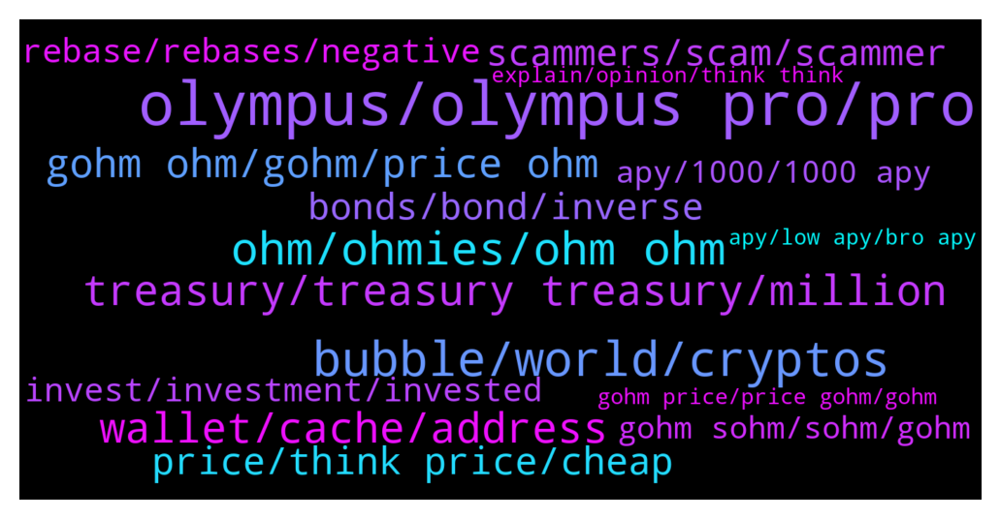

# **@OlympusTG**
 ## Analysis for **2022-01-30** - **2022-02-06**.

---

## 📊 **Basic Stats**

**n_messages_sent**: 6391

---

---

## 🔝 **Top keywords and related messages**

1. **olympus, olympus pro, pro**

    @vipdent --- *I bought on Friday at $70  Totally newbie with Ohm and staking etc  ( I have some other cryptos but all in wallet ).   Very easy - once you have done it :-)  Transfer money to an exchange ( I use Binance but any big exchange will do).   Open a MetaMask account.  ( chrome extension or phone app).  Write down your 12 words.  ( do not share with anyone - ever).   In your exchange buy ETH with your currency.  Withdraw all the ETH to the address from MetaMask  ( the blue long address).   After 2-3 minutes the ETH appear in MetaMask.   Go to Olympus.finance  Click ( tap) enter app Then click wallet.  Then get on sushiswap or get on uniswap.  ( sushiswap didn’t work for me.  Transaction timed out 3 times.  So I used uniswap).   In uniswap, tap on connect wallet.   Go back to MetaMask.  It should ask you if you want to connect.  There is a small gas fee.  Click accept.  ( in my case nothing happened.  I had to close MetaMask.  Open it again - and then the window appeared)  Now uniswap ( or sushiswap) can see your wallet.  Select “from “ ETH.  It will show you your ETH balance.  Select “TO” ohm v2  Do not select MAX.  I did this mistake.  Leave £15 ( $20) for gas fees.  I had to transfer again.  I didn’t have enough for the bloody gas fees.   And convert to ohm v2.   Now import the token ohm.  Address of ohm can be found on their DOCs. Their website.   https://docs.olympusdao.finance/main/contracts/tokens  You need ohm v2.  Somewhere in the middle.   Add this token in MetaMask.  Your balance will appear.  I also added sohm and gohm in MetaMask wallet.  All addresses from their website above.   Then go to Olympus.  Tap wallet.  Connect.  Go back to MetaMask to approve the connection.  ( in my case didn’t work again. Close MetaMask. Open it again.  The window appears.  Approve connection. )  Now you can stake.  Max.  I chose sOHM.   Again you need to approve it in MetaMask.  There are again gas fees :(  That’s it.   Good luck.   It took me 4-5 hours to do it.  I feel you.   If any issues, reply here.* **--->** [TG Discussion](https://t.me/OlympusTG/168905)

    @Anselmo007 --- *If not the apy what is the reason for invest in olympus?* **--->** [TG Discussion](https://t.me/OlympusTG/177402)

    @theMagicUnicorn --- *Olympus PRO was introduced to the world on September 17, 2021. The idea was simple: allow DAOs and projects to take control of their token emissions and liquidity mining programs through protocol-owned liquidity. Since our launch in late September, we have been full steam ahead and have onboarded 40 partners across four different blockchains and layer 2s including Ethereum, Avalanche, Fantom, and Arbitrum. In total, we’ve helped projects bond >$45,000,000 in liquidity and have produced >$2,000,000 in revenue for the OlympusDAO treasury — all in just 4 months’ time   https://olympusdao.medium.com/olympus-pro-in-2022-c21c4fedb2cc   https://docs.olympusdao.finance/pro* **--->** [TG Discussion](https://t.me/OlympusTG/179154)

    @Red1015 --- *Hi everyone. Somebody told me Sifu, the career criminal fraudster behind Wonderland Time, was also part of the Olympus team. I thought I would ask here for verification, as members here will be better poised to answer this. Thank you.* **--->** [TG Discussion](https://t.me/OlympusTG/175735)

    @Cory --- *I am new to this...good time to join olympusdao?* **--->** [TG Discussion](https://t.me/OlympusTG/179049)

    @theMagicUnicorn --- *We are pleased to present Olympus12, a 12-month action plan for how Olympus will achieve its goal of becoming Web3’s premiere decentralized reserve currency. The DAO has been actively involved in activities designed to strengthen OHM’s reserve currency status, with a special focus on dampening volatility and using the Treasury to significantly benefit and grow the Olympus ecosystem  https://olympusdao.medium.com/olympus12-building-a-strong-ecosystem-around-a-web3-native-reserve-currency-416f58175e74* **--->** [TG Discussion](https://t.me/OlympusTG/175480)

2. **bubble, world, cryptos**

    @chitangxxx --- *people are in crypto for one thing, to make money, there's no other reason to buy a coin unless it has good rewards or x potential, people won't buy because it's a good project or is doing useful things!* **--->** [TG Discussion](https://t.me/OlympusTG/170266)

    @Host_Matt --- *rng in crypto is regulators, hacks, people acting in bad faith like sifu, black swans* **--->** [TG Discussion](https://t.me/OlympusTG/171760)

    @Palancapa --- *oh shit, how much are you down if I may ask? and, when did you decide to enter the crypto space?* **--->** [TG Discussion](https://t.me/OlympusTG/171659)

    @fpietrosanti --- *And why being skeptical on web3 and “crypto”  https://www.fastcompany.com/90716841/tim-oreilly-on-web3* **--->** [TG Discussion](https://t.me/OlympusTG/178907)

    @Satoshi_know --- *Who is in the crypto space and didn’t Heard of it 🤓🤭* **--->** [TG Discussion](https://t.me/OlympusTG/180488)

    @Palancapa --- *alright ill do that. have you seen that video from whiteboard crypto on youtube? ive yet to check it out but heard good stuff about it* **--->** [TG Discussion](https://t.me/OlympusTG/171648)

3. **ohm, ohmies, ohm ohm**

    @VincentStatic --- *No. I still love Ohm. But its not perfect* **--->** [TG Discussion](https://t.me/OlympusTG/167288)

    @theMagicUnicorn --- *this is an amazing video Waple found about OHM, please check it out! 💚💚https://youtu.be/jETcS1nnv8U* **--->** [TG Discussion](https://t.me/OlympusTG/178505)

    @bike4peace --- *If you would love OHM you would provide content that backs up your arguments   What you do is a mix of salty posting and saying ohm is not perfect while bringing ZERO solutions or anything that contributes to a community in terms of knowledge* **--->** [TG Discussion](https://t.me/OlympusTG/167291)

    @Host_Matt --- *You don’t even understand ohm @ishaqniz and you made that very clear* **--->** [TG Discussion](https://t.me/OlympusTG/175254)

    @PLUTO 007 --- *What on earth has happened to OHM ?? I haven’t checked in around 3 weeks. This is disgusting.  Thank god for Strong Nodes without them I’d be finished.  If you guys are looking for a real success of a project look no further then STRONG* **--->** [TG Discussion](https://t.me/OlympusTG/173839)

    @MiaRomeo --- *U r right on that. But do we know who the team in OHM is?* **--->** [TG Discussion](https://t.me/OlympusTG/175759)

4. **wallet, cache, address**

    @David --- *👍 I deleted history and cache on chrome for it, think thats enough?* **--->** [TG Discussion](https://t.me/OlympusTG/179380)

    @nfwaple --- *try clearing your browser cache, make sure connected to the right wallet and ETH mainnet* **--->** [TG Discussion](https://t.me/OlympusTG/174955)

    @nfwaple --- *try refreshing the page, or reopen the website* **--->** [TG Discussion](https://t.me/OlympusTG/173707)

    @nfwaple --- *have you cleared your browser cache? The website could be a bit slow as well* **--->** [TG Discussion](https://t.me/OlympusTG/176759)

    @nfwaple --- *make sure you use the desktop version, if it still doesn't work clear browser cache* **--->** [TG Discussion](https://t.me/OlympusTG/180571)

    @DeFiMaximalist --- *u need to shutdown ur computer* **--->** [TG Discussion](https://t.me/OlympusTG/168626)

5. **treasury, treasury treasury, million**

    @TurboLaserClip --- *Lol just noticed,  treasury runaway 374 days,  my breakeven 380 days :DDD* **--->** [TG Discussion](https://t.me/OlympusTG/178189)

    @o_nexus_o --- *Well yeah the dev team could decide to use treasury to buy it back. I know that. I'm just saying it's not automatic, therefore not guaranteed. Because they could decide to just not do it.* **--->** [TG Discussion](https://t.me/OlympusTG/179046)

    @Device --- *Anyone know the current treasury amount at the moment? How does one find this info?* **--->** [TG Discussion](https://t.me/OlympusTG/172447)

    @nfwaple --- *the treasury growth benefits all of us* **--->** [TG Discussion](https://t.me/OlympusTG/180724)

    @Neba --- *This is where the pains are push to the investors while the treasury suffers little  or no effect.* **--->** [TG Discussion](https://t.me/OlympusTG/180721)

    @Jay_1010 --- *Seems we are just donating our funds to the treasury* **--->** [TG Discussion](https://t.me/OlympusTG/176071)

6. **gohm ohm, gohm, price ohm**

    @Palancapa --- *so it is true that anyone who is looking to invest into OHM should actually buy the gOHM on a different network, in order to save gas fees* **--->** [TG Discussion](https://t.me/OlympusTG/176975)

    @abdulrao --- *earlier i converted OHM tosOHM, so what i need to do know* **--->** [TG Discussion](https://t.me/OlympusTG/171088)

    @Palancapa --- *But i dont understand why 1 gOhm continues to gain/include more ohm over time* **--->** [TG Discussion](https://t.me/OlympusTG/173211)

    @huangkaoya --- *So holding ohm is not the best choice for appreciation, holding gohm is ~* **--->** [TG Discussion](https://t.me/OlympusTG/180604)

    @Max --- *I still don't get where I'll make money from if it is not by increasing my amount of OHMs (or in gOHM terms, by the increase of the index)* **--->** [TG Discussion](https://t.me/OlympusTG/179725)

    @xx_yocc_x_o_xo --- *Anyways its more likely to gain more money with Ohm than gohm  If this will recover* **--->** [TG Discussion](https://t.me/OlympusTG/176161)

7. **price, think price, cheap**

    @David IL --- *Trust me backing price was over 170$ and it keeps decreasing lol* **--->** [TG Discussion](https://t.me/OlympusTG/178943)

    @Host_Matt --- *heard 4 hikes were priced in* **--->** [TG Discussion](https://t.me/OlympusTG/169443)

    @nfwaple --- *price may go up, price may not go up, no one knows* **--->** [TG Discussion](https://t.me/OlympusTG/177394)

    @cdp279 --- *Yeah I think it’s priced in for sure* **--->** [TG Discussion](https://t.me/OlympusTG/169436)

    @Ap0l1o --- *Well, if you are good at it, with the current price, that is not a lot to ask for :)* **--->** [TG Discussion](https://t.me/OlympusTG/178774)

    @Palancapa --- *do you have any recommendations other than the whitepaper? im still contemplating about buying in.* **--->** [TG Discussion](https://t.me/OlympusTG/171644)

8. **bonds, bond, inverse**

    @Mine --- *OlympusDAO - OIP-76: Create Inverse Bond Policy Lever https://snapshot.org/#/olympusdao.eth/proposal/0xa544837835f3c4e681efba18d33623d4eb2acedec352dfc3c926a45902cd3612* **--->** [TG Discussion](https://t.me/OlympusTG/167863)

    @nfwaple --- *Ohmies, the Policy team is proposing to add inverse bonds to the toolbox of levers. Created only in conditions where OHM is market trading below backing, inverse bonds let users bond OHM into the treasury, and in exchange they receive some asset back. Inverse bonds use the same pricing mechanism as standard bonds.  In conjunction with standard bonds, inverse bonds allow the treasury to maintain strong backing under any market condition.  Read more on the forum (link below), provide your feedback, and vote. If the informal vote passes, it will go to snapshot.  https://forum.olympusdao.finance/d/1020-oip-76-create-inverse-bond-policy-lever* **--->** [TG Discussion](https://t.me/OlympusTG/167827)

    @Winter_Chemistry --- *There is new policy posted. The team can have inverse bonds being introduced in case it falls below backing price.* **--->** [TG Discussion](https://t.me/OlympusTG/167243)

    @Host_Matt --- *neba if people dont get a discount for bonding why would people bond when they can buy ohm and stake* **--->** [TG Discussion](https://t.me/OlympusTG/180704)

    @Neba --- *Correct, the call hear is not to eliminate bonding but to discourage it when price is falling.* **--->** [TG Discussion](https://t.me/OlympusTG/180719)

    @nfwaple --- *inverse bonding should only be triggered when price is below backing* **--->** [TG Discussion](https://t.me/OlympusTG/178938)

9. **scammers, scam, scammer**

    @chitangxxx --- *Yeah it is. Go there and tell people to chat here! They banned me for calling the leaders a bunch of scamming cunts that should immediately die of cancer together with their kids and families... Dont see anything wrong with that to be fair. Lol* **--->** [TG Discussion](https://t.me/OlympusTG/172262)

    @nfwaple --- *but I haven't heard anyone getting scammed recently so I stopped doing it* **--->** [TG Discussion](https://t.me/OlympusTG/177047)

    @nfwaple --- *I know right, decrease in scammer population, bottom signal 100%* **--->** [TG Discussion](https://t.me/OlympusTG/176299)

    @nfwaple --- *when there was little product and everyone else called them scam* **--->** [TG Discussion](https://t.me/OlympusTG/171958)

    @DocFantom --- *He probably means scam because it fell from 1.2k to $70* **--->** [TG Discussion](https://t.me/OlympusTG/167123)

    @DanielSGX --- *I was polite I just blocked her. Too many scammers you don’t know who’s the Jedi and who’s dark* **--->** [TG Discussion](https://t.me/OlympusTG/169045)

10. **rebase, rebases, negative**

    @vladdevelop --- *where they are falling every rebase* **--->** [TG Discussion](https://t.me/OlympusTG/167522)

    @Cixex --- *Go for tokens that rebase faster.  8hr rebase is too long* **--->** [TG Discussion](https://t.me/OlympusTG/169531)

    @SecuriTech24 --- *I have done this also, but depends on the amount you have in there, the more you have the fatter the rebases* **--->** [TG Discussion](https://t.me/OlympusTG/167024)

    @nfwaple --- *negative rebase is like negative interest, it exists but it would almost never happen* **--->** [TG Discussion](https://t.me/OlympusTG/167780)

    @Anosgoku --- *Pls what's the meaning of rebase and presale* **--->** [TG Discussion](https://t.me/OlympusTG/170054)

    @Cixex --- *You will soon earn $1 per rebase* **--->** [TG Discussion](https://t.me/OlympusTG/173803)

11. **invest, investment, invested**

    @Palancapa --- *yeah I know!! I still think its risky to invest but somehow I sorta feel that this project is going to be insanely profitable* **--->** [TG Discussion](https://t.me/OlympusTG/169966)

    @Yes&No --- *I dont know. But i belive in it. I have invested and short term lost alot. Butit is not a lost if you have long term goal. So be patient. It will be good and i belive in this project. Keep it up budy! Focus in other stuff this shit will rise 👊* **--->** [TG Discussion](https://t.me/OlympusTG/167131)

    @Robert --- *Why you all pessimists invested in project which you do not believe in ???.....* **--->** [TG Discussion](https://t.me/OlympusTG/173367)

    @nfwaple --- *I hope this is not your first time investing* **--->** [TG Discussion](https://t.me/OlympusTG/177286)

    @(3'3) --- *that's true too, but it would be a good idea for the community to decide on those investments... I think* **--->** [TG Discussion](https://t.me/OlympusTG/173045)

    @Ap0l1o --- *You enter, follow them and see if they are worth it to invest or not* **--->** [TG Discussion](https://t.me/OlympusTG/169788)

12. **gohm sohm, sohm, gohm**

    @RecoDedon --- *What's the difference to getting the gOHM instead?!* **--->** [TG Discussion](https://t.me/OlympusTG/169287)

    @Palancapa --- *gohm and sohm is the same* **--->** [TG Discussion](https://t.me/OlympusTG/170295)

    @Ap0l1o --- *@coyotom You have them in gOhm* **--->** [TG Discussion](https://t.me/OlympusTG/173486)

    @nfwaple --- *do you have sOHM or gOHM* **--->** [TG Discussion](https://t.me/OlympusTG/174992)

    @diegsssss --- *If it’s gohm you do not* **--->** [TG Discussion](https://t.me/OlympusTG/169654)

    @nfwaple --- *plus he also said he had gOHM, so please read properly before you start abusing anyone* **--->** [TG Discussion](https://t.me/OlympusTG/168030)

13. **apy, 1000, 1000 apy**

    @assimj --- *I hope APY stops at 1K% and doesn’t go further below ⬇️* **--->** [TG Discussion](https://t.me/OlympusTG/175020)

    @RainbowNFT --- *Thank you I am understanding things way more now!   Also when did APY drop from 4000 to 1000?* **--->** [TG Discussion](https://t.me/OlympusTG/176615)

    @ishaqniz --- *If 1000 maximum apy how it will make us something comapre to previous apg which was 7000 5000?* **--->** [TG Discussion](https://t.me/OlympusTG/177238)

    @Vishnu --- *Will they increase the APY or from now will it be limited to 1000?* **--->** [TG Discussion](https://t.me/OlympusTG/177298)

    @SMNFT7 --- *Guys what is the new APY goal? What is the APY % it aims to drop to?* **--->** [TG Discussion](https://t.me/OlympusTG/167299)

    @jamiemarkets --- *But it won’t ever be something crazy like 80k APY again* **--->** [TG Discussion](https://t.me/OlympusTG/170483)

14. **gohm price, price gohm, gohm**

    @TMAJOBY --- *ok thanks where can i see the gohm price ?* **--->** [TG Discussion](https://t.me/OlympusTG/180308)

    @Twinkieboy333 --- *Guys coinmarketcap and coin gecko often have prices that don’t match, where’s the best place to check gOHM and sOHM prices ?* **--->** [TG Discussion](https://t.me/OlympusTG/169239)

    @Mehdi_szd --- *The price of my gohm is less than the price of gohm in my Metamask wenn I try to sell!* **--->** [TG Discussion](https://t.me/OlympusTG/173754)

    @nfwaple --- *The new epoch of Dopex SSOV gOHM strikes is up on their website!  The strikes this month are set at: 5k, 6k, 7k, 8k. Deposits are live and will remain open for 72 hours or until they are sold out.   Deposit here: https://app.dopex.io/ssov/manage/GOHM* **--->** [TG Discussion](https://t.me/OlympusTG/176212)

    @nfwaple --- *that's why I have been saying look at gOHM price as well* **--->** [TG Discussion](https://t.me/OlympusTG/179718)

    @nfwaple --- *yes that's why gOHM price is higher* **--->** [TG Discussion](https://t.me/OlympusTG/169292)

15. **apy, low apy, bro apy**

    @J --- *the apy is so low for me* **--->** [TG Discussion](https://t.me/OlympusTG/179486)

    @CryptoAlex1 --- *Why is the APY dropping everyday and so fast?* **--->** [TG Discussion](https://t.me/OlympusTG/169221)

    @DocFantom --- *Sers... Apy dropped again significantly.  Ouch* **--->** [TG Discussion](https://t.me/OlympusTG/171571)

    @safuking --- *i mean apy decreased so much by now* **--->** [TG Discussion](https://t.me/OlympusTG/173454)

    @Al_S1919 --- *Hello, why is the APY so fkn low?* **--->** [TG Discussion](https://t.me/OlympusTG/171015)

    @rasputen1 --- *You know saying low apy is good is pure theory right, it hasn’t happened before you so don’t know what will happen* **--->** [TG Discussion](https://t.me/OlympusTG/174308)

