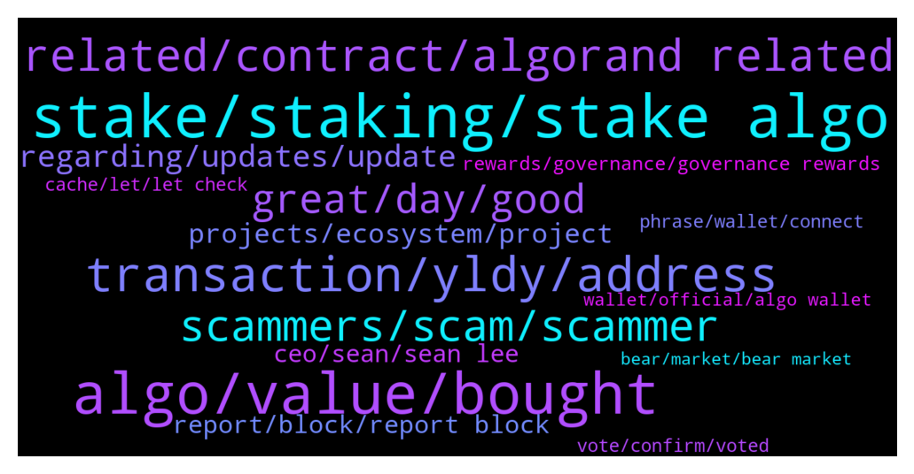

# **@algorand**
 ## Analysis for **2022-01-30** - **2022-02-06**.

---

## 📊 **Basic Stats**

**n_messages_sent**: 917

---

---

## 🔝 **Top keywords and related messages**

1. **stake, staking, stake algo**

    @MMulder432 --- *I'm using it. And i stake my algo in the Algo prize game and the yieldly i'm getting, i'm staking in the staking pools* **--->** [TG Discussion](https://t.me/algorand/335610)

    @MackDenver --- *Sure, actually every week you will automatically receive YLDY from your stake, as well as have the chance to win a big ALGO prize. Check more here: https://yieldly.finance/no-loss-prize-game/* **--->** [TG Discussion](https://t.me/algorand/335589)

    @tommynapper --- *Hey guys! New to algorand. Where is the best place to stake algo? 👀* **--->** [TG Discussion](https://t.me/algorand/336829)

    @Ferdi_Carrefour --- *Hi, can i stake algo on yieldly while i am in govrernance with the same amount?* **--->** [TG Discussion](https://t.me/algorand/336637)

    @monerowhale --- *Is this better than staking from your ledger Nano c* **--->** [TG Discussion](https://t.me/algorand/335395)

    @NightAlgorand --- *You can hold your algo coins in your wallet. It stakes automatically. You can see current APY here https://algoexplorer.io/rewards-calculator* **--->** [TG Discussion](https://t.me/algorand/335752)

2. **algo, value, bought**

    @rikaponti --- *Yes there are $Algo left but there is no trace of the $YLDY* **--->** [TG Discussion](https://t.me/algorand/336120)

    @nolambojustcivic --- *It’s always a good time to buy Algo* **--->** [TG Discussion](https://t.me/algorand/336305)

    @willywonkaflavour --- *So guys which tokken can one get on algo that will make a good profit in short time* **--->** [TG Discussion](https://t.me/algorand/336444)

    @Mikalope --- *Is buying algorand now a good thing?* **--->** [TG Discussion](https://t.me/algorand/335820)

    @D --- *What's use case for algo anyone?* **--->** [TG Discussion](https://t.me/algorand/335214)

    @acrachael --- *Like this morning sold @ 0.9550 bought back at 0.8480 I increase the quantity of my ALGO* **--->** [TG Discussion](https://t.me/algorand/334971)

3. **transaction, yldy, address**

    @MackDenver --- *Did you check your wallet balance in the Algo explorer?* **--->** [TG Discussion](https://t.me/algorand/336119)

    @Onwudiwe --- *Yes I committed and its showing eligeble* **--->** [TG Discussion](https://t.me/algorand/336368)

    @min_time1 --- *Hi i have some of algo on trust wallet but i cant transfer  Why* **--->** [TG Discussion](https://t.me/algorand/336996)

    @defirlkp --- *check your transactions for when the $YLDY left your address and to which address it went to* **--->** [TG Discussion](https://t.me/algorand/336121)

    @The Dude --- *Please confirm transaction in Algorand wallet and nothing happens* **--->** [TG Discussion](https://t.me/algorand/337131)

    @rikaponti --- *good morning. I've been trying to get some $ YLDY back for more than 1 month and I don't know where to turn. I tried with the assistance of the myalgo platform, but they don't seem to understand what the problem is. I try to explain myself. On December 24, 2021, I sent $ YLDYs from my Algoran wallet to the MEXC exchange by selecting the "close account" function to reset the balance. My mistake was to have indicated the amount of $ YLDY where instead I should have indicated the destination address. In theory, the transaction shouldn't have happened. At this moment there are none in my wallet and neither are in the recipient's exchange. How can I get my $ YLDY back?* **--->** [TG Discussion](https://t.me/algorand/336112)

4. **related, contract, algorand related**

    @deadlypuppy --- *What makes Algorand superior in terms of speed and scalability?* **--->** [TG Discussion](https://t.me/algorand/335329)

    @Cezkoa --- *Do you have some noticies about opulous?* **--->** [TG Discussion](https://t.me/algorand/336390)

    @marcooo_98 --- *Algorand will return to the level pre dump?* **--->** [TG Discussion](https://t.me/algorand/336045)

    @Lorenzo --- *Yeah I don’t like murky water. I love Algorand but this has to stop* **--->** [TG Discussion](https://t.me/algorand/336905)

    @DiederickJacobs --- *Can I PM you, about Algorand? :)* **--->** [TG Discussion](https://t.me/algorand/335912)

    @MackDenver --- *Definitely Algorand. Learn about Algorand and you will understand better: https://www.algorand.com* **--->** [TG Discussion](https://t.me/algorand/334731)

5. **scammers, scam, scammer**

    @CryptoSLP --- *Thanks. I never do. Bunch of scammers thinking I'm some noob* **--->** [TG Discussion](https://t.me/algorand/335149)

    @Pablo_cast --- *before you must be mostly a legally established business. Now they are verifing some easy to sigh scams* **--->** [TG Discussion](https://t.me/algorand/335681)

    @rikaponti --- *some scams are writing me in private ... is it possible to get help from you?* **--->** [TG Discussion](https://t.me/algorand/336124)

    @auronsan --- *they fight for their life from money scam* **--->** [TG Discussion](https://t.me/algorand/335274)

    @MKT1236 --- *I’ve gotten like 6 scam messages in last 30 minutes* **--->** [TG Discussion](https://t.me/algorand/335295)

    @Shane --- *Type in this chat and within 1 minute receive scam message lol.* **--->** [TG Discussion](https://t.me/algorand/336492)

6. **great, day, good**

    @MackDenver --- *Heo Rod, glad to see you.* **--->** [TG Discussion](https://t.me/algorand/336937)

    @MackDenver --- *Good morning, everyone! Hope everyone is doing well.* **--->** [TG Discussion](https://t.me/algorand/335421)

    @Noskilljustluck --- *Ok thank you very much. Have a great day everyone* **--->** [TG Discussion](https://t.me/algorand/336006)

    @mcmaxims --- *Yes, @NightAlgorand and @MackDenver doing a great job :)* **--->** [TG Discussion](https://t.me/algorand/335219)

    @MackDenver --- *Happy Friday, Algorand community! Hope everyone is doing great.* **--->** [TG Discussion](https://t.me/algorand/335753)

    @MackDenver --- *Good morning Algorand community!  Hope everyone is doing well.* **--->** [TG Discussion](https://t.me/algorand/335564)

7. **regarding, updates, update**

    @NightAlgorand --- *We will let you guys know as soon as there is any updates regarding this* **--->** [TG Discussion](https://t.me/algorand/335341)

    @MackDenver --- *I don't have any news information about it.* **--->** [TG Discussion](https://t.me/algorand/336510)

    @Rose --- *This was interesting so much we don’t know about history.* **--->** [TG Discussion](https://t.me/algorand/334725)

    @MackDenver --- *You can hear more from Chivo or their team, we don't have any information about it atm.* **--->** [TG Discussion](https://t.me/algorand/336520)

    @NightAlgorand --- *I understand, we will provide them as we get some confirmation and updates.* **--->** [TG Discussion](https://t.me/algorand/336909)

    @NightAlgorand --- *Hi, there is no update yet regarding that yet.* **--->** [TG Discussion](https://t.me/algorand/336904)

8. **projects, ecosystem, project**

    @Crytolegendlord --- *Sure man before coming into the algorand ecosystem we were on bsc chain we had the same experience and learnt from it that's how we escape from losses sometimes because of our experience on bsc.* **--->** [TG Discussion](https://t.me/algorand/335675)

    @NightAlgorand --- *Hi there, we don't have a public roadmap at the moment. We are currently focused on expanding our ecosystem, bringing more use cases, and onboard new projects 🙂 You can find more about us here https://algorand.foundation/ecosystem* **--->** [TG Discussion](https://t.me/algorand/335141)

    @MackDenver --- *Please check the ecosystem projects here: https://www.algorand.com/ecosystem/use-cases* **--->** [TG Discussion](https://t.me/algorand/336655)

    @MackDenver --- *Applications are now open for the eMerge Americas 2022 Global Startup Showcase!   With innovation accelerating across Miami’s thriving tech ecosystem, we are excited to continue to empower founders and developers building applications and solutions of the future: https://www.prnewswire.com/news-releases/emerge-americas-partners-with-algorand-florida-funders--panoramic-ventures-for-the-2022-global-startup-showcase-301471124.html* **--->** [TG Discussion](https://t.me/algorand/336935)

    @NightAlgorand --- *We are currently focused on expanding our ecosystem, bringing more use cases, and onboard new projects 🙂 You can find more about us here https://algorand.foundation/ecosystem* **--->** [TG Discussion](https://t.me/algorand/335972)

    @MackDenver --- *You can talk about Algorand ecosystem projects, no worries.* **--->** [TG Discussion](https://t.me/algorand/336164)

9. **report, block, report block**

    @hackman31 --- *They should change their information on the site* **--->** [TG Discussion](https://t.me/algorand/335280)

    @MackDenver --- *Please use the report and block button.* **--->** [TG Discussion](https://t.me/algorand/336532)

    @Crypt0Playa --- *What's up with the stupid "Hi" messages? Can't we block these accounts?* **--->** [TG Discussion](https://t.me/algorand/336823)

    @MackDenver --- *If you receive such a dm, report them too* **--->** [TG Discussion](https://t.me/algorand/335270)

    @Nidal --- *so, it is necessary to delete this group on twitter otherwise they will continue with other people* **--->** [TG Discussion](https://t.me/algorand/335799)

    @MackDenver --- *Please do report the account and stay safe* **--->** [TG Discussion](https://t.me/algorand/337147)

10. **ceo, sean, sean lee**

    @DlHKl --- *what's the update on why the Sean Lee CEO of Algorand Foundation left?  been days since his termination* **--->** [TG Discussion](https://t.me/algorand/336612)

    @chad --- *is there a story somewhere on why Sean left?* **--->** [TG Discussion](https://t.me/algorand/337075)

    @Lorenzo --- *Any idea yet why Sean Lee is out and who will be replacing him?* **--->** [TG Discussion](https://t.me/algorand/336903)

    @Mass_Hodler --- *Sean Lee is no longer with Algorand? https://www.linkedin.com/in/sean-lee-4b7a98* **--->** [TG Discussion](https://t.me/algorand/335856)

    @S --- *When will the foundation announce Sean’s replacement?* **--->** [TG Discussion](https://t.me/algorand/336610)

    @Todd --- *To have a ceo leave and no official statement to the public is completely unacceptable and profoundly unprofessional. Clarity is needed.* **--->** [TG Discussion](https://t.me/algorand/336948)

11. **rewards, governance, governance rewards**

    @MackDenver --- *That is called Algorand governance rewards.* **--->** [TG Discussion](https://t.me/algorand/336142)

    @juquinbu --- *All rewards will all be based on Governance voting now. Check “Governance”* **--->** [TG Discussion](https://t.me/algorand/334719)

    @patrick_crypto --- *Pretty sure it’s true.  Participation rewards end soon - only rewards are through governance.  Governance rewards are quarterly.* **--->** [TG Discussion](https://t.me/algorand/336089)

    @Malvo --- *Greetings can anyone tell me since awards will only be governance rewards and receiving daily rewards as Algo holder when will the daily rewards stop being distributed?* **--->** [TG Discussion](https://t.me/algorand/336263)

    @MackDenver --- *Governors will receive their rewards by February 27th, 2022.* **--->** [TG Discussion](https://t.me/algorand/336144)

    @kramercrypto --- *Can you point me in the right direction Mack? I can see that rewards are planned to 2029, is that the expected length of Governance periods?* **--->** [TG Discussion](https://t.me/algorand/334894)

12. **vote, confirm, voted**

    @abovyanv --- *why are you spitting in the face of your members like that? I was very disappointed in this blockchain. Let members vote without pressure* **--->** [TG Discussion](https://t.me/algorand/336661)

    @yunusp24 --- *Sir why i cant confir my vote in my wallet* **--->** [TG Discussion](https://t.me/algorand/336236)

    @Scott --- *Hey guys. I'm trying to vote. I get to the option to hit confirm when inside my wallet. I've hit confirm but the website says I still haven't voted. Am I doing something wrong?* **--->** [TG Discussion](https://t.me/algorand/336710)

    @MackDenver --- *Members can vote by their own choice. Both options are open and available to vote.* **--->** [TG Discussion](https://t.me/algorand/336663)

    @SavoryMonkey --- *Anyone else having difficulty voting? After I vote it says to sign the transaction, but the button with the transaction just spins and when the wallet opens there is nothing to sign.* **--->** [TG Discussion](https://t.me/algorand/337036)

    @MackDenver --- *You had to confirm a transaction to vote* **--->** [TG Discussion](https://t.me/algorand/336378)

13. **phrase, wallet, connect**

    @fkyshow --- *Having this issue with wallet connect recently* **--->** [TG Discussion](https://t.me/algorand/337109)

    @KAPIBAYSIDE --- *It worked after refreshing several times couldn't connect my wallet to apps like yieldly. Think it was my connection* **--->** [TG Discussion](https://t.me/algorand/336753)

    @KAPIBAYSIDE --- *Is connect wallet working not able to connect  my wallet* **--->** [TG Discussion](https://t.me/algorand/336748)

    @Abesmal --- *Hello Admin, all my wallets have stopped working, not a single side phrase is suitable.* **--->** [TG Discussion](https://t.me/algorand/336690)

    @Abesmal --- *I spelled the phrase carefully, many times. as if the wallet does not exist.* **--->** [TG Discussion](https://t.me/algorand/336718)

    @Leugim_21 --- *It happens to me too, check your wallet sessions on your app, you will notice a very high amount of connections struggling, just empty them all, then reconnect the ones that you use.* **--->** [TG Discussion](https://t.me/algorand/336175)

14. **cache, let, let check**

    @MackDenver --- *Please refresh the browser and try again.* **--->** [TG Discussion](https://t.me/algorand/336643)

    @Onwudiwe --- *Yes when I tried to submit it will then pop up that on red* **--->** [TG Discussion](https://t.me/algorand/336373)

    @MackDenver --- *Can you try clearing your cache and try again?* **--->** [TG Discussion](https://t.me/algorand/335474)

    @NightAlgorand --- *Can you clear cache and refresh?* **--->** [TG Discussion](https://t.me/algorand/336719)

    @Dee --- *It’s been loading for 5 minutes already* **--->** [TG Discussion](https://t.me/algorand/336218)

    @MackDenver --- *Try clearing the cache and try again, it worked for a few people* **--->** [TG Discussion](https://t.me/algorand/336214)

15. **wallet, official, algo wallet**

    @NightAlgorand --- *You can download Algorand Wallet here https://algorandwallet.com/* **--->** [TG Discussion](https://t.me/algorand/335745)

    @angelo9007 --- *You can simply google official algorand wallet* **--->** [TG Discussion](https://t.me/algorand/337104)

    @MackDenver --- *MyAlgo: https://wallet.myalgo.com/  Yes, MyAlgo is one of our official wallets.* **--->** [TG Discussion](https://t.me/algorand/336984)

    @NightAlgorand --- *Hi there, you can download Algorand Wallet here https://algorandwallet.com/* **--->** [TG Discussion](https://t.me/algorand/335394)

    @incognitocas --- *Does anyone know if there are plans to create a desktop wallet for Algo?* **--->** [TG Discussion](https://t.me/algorand/336972)

    @bloodeagglee --- *Hello, can u guys suggest me algo wallet?* **--->** [TG Discussion](https://t.me/algorand/335924)

