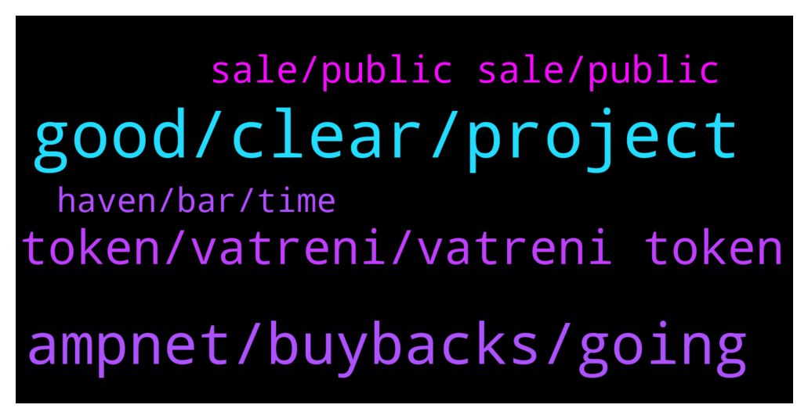

# **@ampnetapxchat**
 ## Analysis for **2022-01-30** - **2022-02-06**.

---

## 📊 **Basic Stats**

**n_messages_sent**: 94

---

---

## 🔝 **Top keywords and related messages**

1. **good, clear, project**

    @DexTrade_Listing_Dennis --- *Hello Who is the right person to discuss listing proposal?* **--->** [TG Discussion](https://t.me/ampnetapxchat/36846)

    @runex_x1 --- *I wish the team all the luck on this one. We can use some positive investment news after all this technical progress* **--->** [TG Discussion](https://t.me/ampnetapxchat/36883)

    @runex_x1 --- *as an early investor too :)* **--->** [TG Discussion](https://t.me/ampnetapxchat/36884)

    @jakovtradingmentor --- *alright so yeah we agree here :D* **--->** [TG Discussion](https://t.me/ampnetapxchat/36782)

    @jakovtradingmentor --- *well you know how they say, cant time the market, a good word is a good word* **--->** [TG Discussion](https://t.me/ampnetapxchat/36785)

    @RUK2354 --- *The project fundamentals are strong; we are hoping that you will deliver on the huge potential this project has.* **--->** [TG Discussion](https://t.me/ampnetapxchat/36819)

2. **ampnet, buybacks, going**

    @MelonHusk --- *I have never seen a project recover from -98.5% losses.* **--->** [TG Discussion](https://t.me/ampnetapxchat/36820)

    @jakovtradingmentor --- *well i'm told we as ampnet cant really go around and shill the projects on our platform, something about the legality around it doesnt allow us to do so* **--->** [TG Discussion](https://t.me/ampnetapxchat/36779)

    @MelonHusk --- *Don't tell me Ampnet is raising more money?* **--->** [TG Discussion](https://t.me/ampnetapxchat/36814)

    @Mest4r1 --- *What percent does ampnet get for buybacks?* **--->** [TG Discussion](https://t.me/ampnetapxchat/36950)

    @runex_x1 --- *should be more clear that the network is polygon though* **--->** [TG Discussion](https://t.me/ampnetapxchat/36922)

    @scemodonore --- *Don't get too excited over buybacks for now... they won't have much impact on pa. The whole fan token sale was more a showcase for the power of ampnet software for me... If they build on this progress we may see some more speculation driven pa in the near future I think.* **--->** [TG Discussion](https://t.me/ampnetapxchat/36966)

3. **token, vatreni, vatreni token**

    @Tinus_Tussengas_1984 --- *is there somewhere we can see the progress on the prudenzzafc fan token seed sale?* **--->** [TG Discussion](https://t.me/ampnetapxchat/36828)

    @Braam --- *I see the Vatreni token is 80% funded. However it's only until the 2 feb.  Jakov please explain what happens if the 2nd comes and goes when the funding has reached $500000. And then conversely what happens if it does fulfill the total amount? Thanks* **--->** [TG Discussion](https://t.me/ampnetapxchat/36856)

    @North --- *@jakovtradingmentor what do you think about timing of any shilling to Chiliz community? They obviously have aligned interests and so would probably be interested here too, but we should take care to not get ahead of ourselves* **--->** [TG Discussion](https://t.me/ampnetapxchat/36775)

    @jakovtradingmentor --- *could you elaborate by what you mean with shilling to chilliz community?* **--->** [TG Discussion](https://t.me/ampnetapxchat/36776)

    @jakovtradingmentor --- *The only fan token seed sale ongoing right now on AMPnet platform is Vatreni Token* **--->** [TG Discussion](https://t.me/ampnetapxchat/36830)

    @jakovtradingmentor --- *thats the raise for vatreni token* **--->** [TG Discussion](https://t.me/ampnetapxchat/36815)

4. **sale, public sale, public**

    @jakovtradingmentor --- *Thats public sale, private was over 2 days ago* **--->** [TG Discussion](https://t.me/ampnetapxchat/36959)

    @jakovtradingmentor --- *Thats why im saying wait till public sale is done haha* **--->** [TG Discussion](https://t.me/ampnetapxchat/36955)

    @jakovtradingmentor --- *Private sale was 500k so idk where you got 12.5k from* **--->** [TG Discussion](https://t.me/ampnetapxchat/36954)

    @jakovtradingmentor --- *Not a 100% sure but last i heard its 5%, might have changed though  You will know for sure as public sale gets close to finishing* **--->** [TG Discussion](https://t.me/ampnetapxchat/36951)

    @jakovtradingmentor --- *well technically it's not fully finished yet as the public sale is still going on but yes the presale was successful :D* **--->** [TG Discussion](https://t.me/ampnetapxchat/36941)

    @jakovtradingmentor --- *I have been told if sale is near completion but deadline is near then it will be extended to get those final percentages in* **--->** [TG Discussion](https://t.me/ampnetapxchat/36878)

5. **haven, bar, time**

    @Tinus_Tussengas_1984 --- *thanks m8. that loading bar is looking strange btw... i assume its to see the progress in time to the deadline instead of the percentage of funding 😋* **--->** [TG Discussion](https://t.me/ampnetapxchat/36806)

    @runex_x1 --- *there is clearly something wrong with the progress bar (brave)* **--->** [TG Discussion](https://t.me/ampnetapxchat/36882)

    @jakovtradingmentor --- *i'm not a 100% sure as I haven't been told so maybe one of the devs can answer this* **--->** [TG Discussion](https://t.me/ampnetapxchat/36859)

    @mislavjavor --- *there is a bug though, it seems* **--->** [TG Discussion](https://t.me/ampnetapxchat/36811)

    @matejmz --- *Yeah, it is bugged apparently. (Time would be at 50%, so this is not the case)  @mislavjavor* **--->** [TG Discussion](https://t.me/ampnetapxchat/36807)

    @jakovtradingmentor --- *Haven't gotten updates on it yet* **--->** [TG Discussion](https://t.me/ampnetapxchat/36934)

