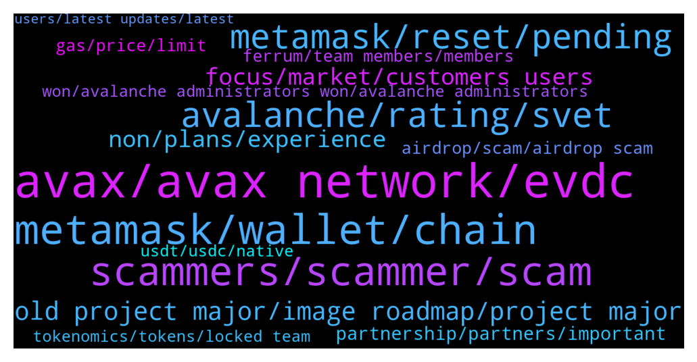

# **@avalancheavax**
 ## Analysis for **2022-01-30** - **2022-02-06**.

---

## 📊 **Basic Stats**

**n_messages_sent**: 1397

---

---

## 🔝 **Top keywords and related messages**

1. **avax, avax network, evdc**

    @arcterex --- *Thanks.  I've followed Avalaunch, Avaxholic, AvxLaunchpad, Avalanche Today....any other ones for new projects?* **--->** [TG Discussion](https://t.me/avalancheavax/325385)

    @Lukmankhalique --- *Hey there. Are there any avax specific launchpads beside avalaunch?* **--->** [TG Discussion](https://t.me/avalancheavax/324138)

    @Smiley --- *how do you tell when someone is actually with avax? lol* **--->** [TG Discussion](https://t.me/avalancheavax/326218)

    @lclouis7 --- *i would like to start my own token on the avax blockchain i have unlimited time but no avax so if you donate i would be very appreciative if you did* **--->** [TG Discussion](https://t.me/avalancheavax/325367)

    @CypherBlock --- *You can delegate avax using the wallet.avax.network website . You don't need a "place" like Binance or anything if you have your own wallet.* **--->** [TG Discussion](https://t.me/avalancheavax/325137)

    @CryptoRookeez --- *Is Nino a legit Avax support? He told me in the group chat to dm him for instructions on how to stake. He asked if I had  validator and if I have connected to the Avax firmware Bridge.* **--->** [TG Discussion](https://t.me/avalancheavax/325657)

2. **metamask, wallet, chain**

    @EJoker99 --- *https://docs.avax.network/build/tutorials/nodes-and-staking/run-avalanche-node  follow this page ,when synchronization is complete,can use RPC-API Service with C-chain ?* **--->** [TG Discussion](https://t.me/avalancheavax/324389)

    @Block_Monkey --- *Transfered some AVAX from my P chain to C chain. Does not show. The transaction shows that it is in Atomic Memory. What is that and how do I get it?* **--->** [TG Discussion](https://t.me/avalancheavax/324653)

    @FelixAdi --- *Hey guys, I have a problem. Anyway I was in the process of transferring my metamask to ledger nano s, and I'm about all done besides my AVAX. So I tested a small amount, it shows both in wallet and app and snowtrace, then I transferred my full amount. After that I find out somehow there's a bug with metamask and I can't access that avax, it's giving enable smart contract error (it's already enabled ofc),,, I contacted metamask support already and filed a ticket but not confident they will get back to me quickly. Is there any way I can access that AVAX? I tried different PC, different metamask, same bug.* **--->** [TG Discussion](https://t.me/avalancheavax/324191)

    @defirlkp --- *just check on snowtrace which address has that avax, your avax is only ever on the blockchain its never stored on any external device* **--->** [TG Discussion](https://t.me/avalancheavax/324192)

    @raghav4288 --- *Buy avax Send in your wallet  then exchange it on dex* **--->** [TG Discussion](https://t.me/avalancheavax/326816)

    @Fozler82 --- *Hello sir Avax C chain RPC need to set up it to metamask* **--->** [TG Discussion](https://t.me/avalancheavax/326333)

3. **scammers, scammer, scam**

    @Amatio12 --- *Nicolas is a scammed me last week  please don't trust these people they are all scammer, they take my money from my wallets last week* **--->** [TG Discussion](https://t.me/avalancheavax/326070)

    @Vico007 --- *To all the scammers: i wish that all your children pay the karma that you have left them through theft. I condemn them to eternal poverty.* **--->** [TG Discussion](https://t.me/avalancheavax/325591)

    @strikefox77 --- *I like when scammers send me DM. They help me a lot to practice my English.* **--->** [TG Discussion](https://t.me/avalancheavax/326883)

    @lord --- *just had the following text, is this another scammer ...* **--->** [TG Discussion](https://t.me/avalancheavax/325053)

    @Gengar622inu --- *Many scammers around here are sending me DMs.* **--->** [TG Discussion](https://t.me/avalancheavax/325799)

    @Amatio12 --- *from all direction the say we can solve the issue but all are scammers* **--->** [TG Discussion](https://t.me/avalancheavax/325101)

4. **avalanche, rating, svet**

    @Baribalthedruid --- *Hi, I'd like to setup Avalanche blockchain datas in Metamask. Would you please share them?* **--->** [TG Discussion](https://t.me/avalancheavax/326955)

    @lord --- *no does not support avalanche at this time, this is why i need to convert it to another token first, just wondering if anyone has a suggestion* **--->** [TG Discussion](https://t.me/avalancheavax/325045)

    @say0ga --- *When avalanche no suspend in exchange?* **--->** [TG Discussion](https://t.me/avalancheavax/325821)

    @Natethegreat762 --- *Can any avalanche experts comment on this paper?https://medium.com/@itsnear/what-avalanche-paper-is-not-c047cf512c16?s=09* **--->** [TG Discussion](https://t.me/avalancheavax/324939)

    @Nicolas_A --- *There are non at the moment. Can use Metamask but no official Avalanche app yet* **--->** [TG Discussion](https://t.me/avalancheavax/325641)

    @TheSEOdude --- *Heya, where can I find Dex aggregators list which supports Avalanche* **--->** [TG Discussion](https://t.me/avalancheavax/324473)

5. **metamask, reset, pending**

    @bubee82 --- *Anyone experiencing issues with txs in MM? I have multiple txs pending even after cancellation. No trace can be found on Snowtrace. I can't use the network. I have tried on BSC and it just works.* **--->** [TG Discussion](https://t.me/avalancheavax/325728)

    @Vico007 --- *Is your network, check it and update it* **--->** [TG Discussion](https://t.me/avalancheavax/325584)

    @sen666 --- *i has wait for 5days, but it not completed* **--->** [TG Discussion](https://t.me/avalancheavax/324643)

    @TheSEOdude --- *you need to reset your metamask, then redo the transactions.* **--->** [TG Discussion](https://t.me/avalancheavax/325878)

    @Wes --- *Is anyone else having issues with pending txs using MetaMask & ledger?  Everything was working fine until about 2 days ago.  I keep upping my gas rate but still can’t complete a new tx* **--->** [TG Discussion](https://t.me/avalancheavax/325877)

    @LONGDONGWONG --- *network grinding to a halt again* **--->** [TG Discussion](https://t.me/avalancheavax/324903)

6. **old project major, image roadmap, project major**

    @elnaluan --- *By the way what's the road map for this project* **--->** [TG Discussion](https://t.me/avalancheavax/325943)

    @arcterex --- *Whats a good project thats coming up?* **--->** [TG Discussion](https://t.me/avalancheavax/325976)

    @b777all --- *How old is Your project? What are the major plans ahead? Could you show to us image of your roadmap?* **--->** [TG Discussion](https://t.me/avalancheavax/326608)

    @shardaarndt35 --- *How old is Your project? What are the major plans ahead? Could you show to us image of your roadmap?* **--->** [TG Discussion](https://t.me/avalancheavax/326472)

    @Rossieblanton --- *What is the most ambitious goal of your project? Could share with us any Upcoming Updates?* **--->** [TG Discussion](https://t.me/avalancheavax/326430)

    @barnhill_2002 --- *Your project name seems to be very interesting. Does it have any story behind it? Can you share us with the inspiron for approaching to this name?* **--->** [TG Discussion](https://t.me/avalancheavax/326435)

7. **non, plans, experience**

    @dominic_gould --- *How many team members do you have? Do they have enough experience in the blockchain field? Do they have any experience on working in crypto and non-crypto project?* **--->** [TG Discussion](https://t.me/avalancheavax/326777)

    @siunhms --- *Do you have any plans to attract non-crypto investors to join your project? Because the success of a project attracts more investors who haven't yet entered the crypto world. What are the plans to raise awareness about your project in the non-crypto space.* **--->** [TG Discussion](https://t.me/avalancheavax/326457)

    @Melsie_word_83 --- *Do you have any plans to attract non-crypto investors to join your project? Because the success of a project attracts more investors who haven't yet entered the crypto world. What are the plans to raise awareness about your project in the non-crypto space.* **--->** [TG Discussion](https://t.me/avalancheavax/326636)

    @colson1995 --- *Do you have any plans to attract non-crypto investors to join your project? Because the success of a project attracts more investors who haven't yet entered the crypto world. What are the plans to raise awareness about your project in the non-crypto space.* **--->** [TG Discussion](https://t.me/avalancheavax/326500)

    @diamond_tycoona --- *Security and anonymity are always prioritized by BlockChain projects in the development of project platforms and technologies. So, does you have any technological solutions or plans to enhance user trust in these issues?* **--->** [TG Discussion](https://t.me/avalancheavax/326441)

    @nerdnutlash --- *Many projects have problems with UI / UX and this one turns off new users. How do you plan to improve the interaction with new users and with users outside the crypto space?* **--->** [TG Discussion](https://t.me/avalancheavax/326549)

8. **focus, market, customers users**

    @kristinakern47 --- *Marketing is a central element for every project, so that everyone knows the potential that a project can bring is vital to achieve the goals set. What is your strategy to attract new users and Investor to your platform and keep them long term.* **--->** [TG Discussion](https://t.me/avalancheavax/326705)

    @Renate_driscoll_54 --- *Marketing is a central element for every project, so that everyone knows the potential that a project can bring is vital to achieve the goals set. What is your strategy to attract new users and Investor to your platform and keep them long term.* **--->** [TG Discussion](https://t.me/avalancheavax/326469)

    @NorbertMccue --- *Marketing is a central element for every project, so that everyone knows the potential that a project can bring is vital to achieve the goals set. What is your strategy to attract new users and Investor to your platform and keep them long term.* **--->** [TG Discussion](https://t.me/avalancheavax/326670)

    @DeathNWar --- *Marketing is a central element for every project, so that everyone knows the potential that a project can bring is vital to achieve the goals set. What is your strategy to attract new users and Investor to your platform and keep them long term.* **--->** [TG Discussion](https://t.me/avalancheavax/326473)

    @lison_knott --- *Are you a global project or local project? At present, which market are you focus on, or is it focused on building and growing to gain customers, users and partners?* **--->** [TG Discussion](https://t.me/avalancheavax/326552)

    @Steviewonder3 --- *What are plans in for global expansion? Are you focusing on market at this time or focus on building and developing or getting customers and users, or partnerships?* **--->** [TG Discussion](https://t.me/avalancheavax/326676)

9. **partnership, partners, important**

    @ifriend05 --- *We have relationships with hundreds of projects across the industry, some are parternships, some gave us grants, some use our staking/defi tech, and others we have incubated/launched.  To learn more and see a complete list, you can refer to our Ecosystem page: https://ferrum.network/iron-alliance/* **--->** [TG Discussion](https://t.me/avalancheavax/326402)

    @arkinsona --- *Partnership is always an important factor for every project. So who is your partner? What are the benefits you get from those relatiionships?* **--->** [TG Discussion](https://t.me/avalancheavax/326556)

    @banhpia --- *PARTNERS are the most important that strengthen the ecosystems of all projects. Could you tell us about your project partners and the partnership strategy it has adopted?* **--->** [TG Discussion](https://t.me/avalancheavax/326674)

    @M_Boogie_C --- *PARTNERS are the most important that strengthen the ecosystems of all projects. Could you tell us about your project partners and the partnership strategy it has adopted?* **--->** [TG Discussion](https://t.me/avalancheavax/326721)

    @quintanil --- *PARTNERS are the most important that strengthen the ecosystems of all projects. Could you tell us about your project partners and the partnership strategy it has adopted?* **--->** [TG Discussion](https://t.me/avalancheavax/326562)

    @Blind5ighta --- *Can you briefly describe your PARTNERSHIP so far and upcoming partnerships?* **--->** [TG Discussion](https://t.me/avalancheavax/326477)

10. **gas, price, limit**

    @penguinthegrey --- *Im about to unstake JLP But gas is on the high side.   Gas Limit 372,550 Max Priority Fees: 130 Max Fee: 130* **--->** [TG Discussion](https://t.me/avalancheavax/324531)

    @CryptoPoly1 --- *Tried limit orders on 1 inch, but not one limit order got filled. Even though market price crossed limit price several times.  Any tips to modify slippage on limit orders?   Or order things that could help limit orders getting filled?* **--->** [TG Discussion](https://t.me/avalancheavax/325301)

    @alchemyz668 --- *Anyone has any idea why the gas is high and why the traffic is suck🤣* **--->** [TG Discussion](https://t.me/avalancheavax/325613)

    @ruch149 --- *Hi guys. Why are gas fees so high? Could you please again share the link where we can track that* **--->** [TG Discussion](https://t.me/avalancheavax/325193)

    @defirlkp --- *dont seem to be a gas spike at the moment* **--->** [TG Discussion](https://t.me/avalancheavax/325601)

    @Nicolas_A --- *Your gas price  is simply too low* **--->** [TG Discussion](https://t.me/avalancheavax/326937)

11. **airdrop, scam, airdrop scam**

    @crypto_phyles --- *I ve got like 3 Avalanche telegram offering 3x airdrop.* **--->** [TG Discussion](https://t.me/avalancheavax/326104)

    @fpole --- *What is the use of 10 wgm tokens which was airdroped* **--->** [TG Discussion](https://t.me/avalancheavax/325274)

    @Smellthebull_ridetherun --- *I will give anyone who finds that prick who airdrop robbed my dumbass and ousts them to me, my car as a thiank you. No bs nothin special 2019 altima but outta principal its all yours, so i can beat this prick with my mybook and cut off his scum fingers* **--->** [TG Discussion](https://t.me/avalancheavax/324780)

    @scarcitywhale --- *There’s an airdrop scam happening now that I’d like to report* **--->** [TG Discussion](https://t.me/avalancheavax/324553)

    @lovingcrypto_mytelegram --- *Is AVAX running an airdrop currently* **--->** [TG Discussion](https://t.me/avalancheavax/324717)

    @Sam --- *Hi all, there is another group with same name mentioning about AVAX airdrops, seems scam…anyone has face this?* **--->** [TG Discussion](https://t.me/avalancheavax/326132)

12. **ferrum, team members, members**

    @Nicolas_A --- *Okay first question : Can you tell us a bit about Ferrum Network, what your project is about, and any notable accomplishments?* **--->** [TG Discussion](https://t.me/avalancheavax/326390)

    @Nicolas_A --- *What is the Ferrum Network Iron Alliance? Can you tell us a bit about the projects that are associated with the Iron Alliance?* **--->** [TG Discussion](https://t.me/avalancheavax/326403)

    @Nicolas_A --- *How many different cryptocurrency projects and/or protocols does Ferrum Network have a relationship with? More specifically, how many different projects have signed up to use Ferrum Technology?* **--->** [TG Discussion](https://t.me/avalancheavax/326401)

    @Nicolas_A --- *Are there any exciting promotions or events that are happening right now at Ferrum Network that you suggest we look into?* **--->** [TG Discussion](https://t.me/avalancheavax/326406)

    @ifriend05 --- *Of course! Theres always a ton of exciting things happening at Ferrum, with regular buybacks, token burns, product releases, parternships and more. The thing that the community loves the most is the access to exclusive private sales. If you hold 25,000 FRM/.3. FRMx you get a guaranteed allocation into all projects that we launch. Some of these projects have performed incredibly well ( e.g. we have had 3 100x+ projects and many other very successful ones). Plus. our system is stress free (not first come first serve) and we bring out new deals almost every week. For more info check out our pre sale page: https://ferrum.network/presales/* **--->** [TG Discussion](https://t.me/avalancheavax/326407)

    @ifriend05 --- *The next major product release is The Crucible - a next generation DeFi staking product that allows you to earn sustainable APY, access our pre sales, and will burn FRM with each transaction. Its a revolutionary new DeFi product that essentially turns any token into a reflection token and from there, we can add all sorts of custom features. Its going to revolutionize the way our users interact with our ecosystem. After Crucible, the focus is on the Ferrum Network main net, which is built on top of the Polkadot/Kusama technology. We are releasing more information about our interoperability main net in the coming months ahead and it is slated for launch in 2022.* **--->** [TG Discussion](https://t.me/avalancheavax/326789)

13. **won, avalanche administrators won, avalanche administrators**

    @oathtobarbatos --- *Be carefull with anyone's DM, guys. Avalanche administrators won't DM you first!* **--->** [TG Discussion](https://t.me/avalancheavax/327002)

    @oathtobarbatos --- *Avalanche administrators won't DM you first, also, they won't ask you for money. Be careful with anyone's DM!* **--->** [TG Discussion](https://t.me/avalancheavax/325658)

    @oathtobarbatos --- *Be careful with anyone's DM. Avalanche administrators won't DM you first and, they won't ask you for money!* **--->** [TG Discussion](https://t.me/avalancheavax/324309)

    @oathtobarbatos --- *Be careful with anyone's DM. Avalanche administrators won't DM you first!* **--->** [TG Discussion](https://t.me/avalancheavax/325258)

    @Jacpot777AltAcc --- *I got Just got 3 dm from Avalanche admins those are fake right?!* **--->** [TG Discussion](https://t.me/avalancheavax/324303)

    @oathtobarbatos --- *Be careful with anyone's DM, Avalanche administrators won't DM you first and, they won't ask you for money* **--->** [TG Discussion](https://t.me/avalancheavax/326126)

14. **tokenomics, tokens, locked team**

    @partybara --- *Here's a direct link to the mint: https://nfts.partyswap.io/* **--->** [TG Discussion](https://t.me/avalancheavax/324350)

    @demetrius_downey_27 --- *Can you explain how is your Tokenomics Distribution? How many tokens Will be minted ? And How many tokens Will be locked by the team?* **--->** [TG Discussion](https://t.me/avalancheavax/326647)

    @Kassialabc --- *Can you explain how is your Tokenomics Distribution? How many tokens Will be minted ? And How many tokens Will be locked by the team?* **--->** [TG Discussion](https://t.me/avalancheavax/326431)

    @Garrett_Hallman --- *Can you share to us your tokenomics? How much is the total and circulation supply of your tokens? Will there be buy back system or token burning in the future?* **--->** [TG Discussion](https://t.me/avalancheavax/326753)

    @Melda_jacks --- *Can you explain how is your Tokenomics Distribution? How many tokens Will be minted ? And How many tokens Will be locked by the team?* **--->** [TG Discussion](https://t.me/avalancheavax/326732)

    @siamattox1996 --- *Can you explain how is your Tokenomics Distribution? How many tokens Will be minted ? And How many tokens Will be locked by the team?* **--->** [TG Discussion](https://t.me/avalancheavax/326553)

15. **usdt, usdc, native**

    @jonijonimyfren --- *Whats the different usdt and usdt.e?* **--->** [TG Discussion](https://t.me/avalancheavax/326991)

    @mehmet07btc --- *Guys in which cexes are native usdt and usdc traded* **--->** [TG Discussion](https://t.me/avalancheavax/324687)

    @Ace422 --- *what about USDC & USDT, and what's the different between *.e and the regular ones?* **--->** [TG Discussion](https://t.me/avalancheavax/325424)

    @Nicolas_A --- *Crypto.com / Bitfinex have USDC / Usdt I believe* **--->** [TG Discussion](https://t.me/avalancheavax/326821)

    @War dog --- *While USDT is used more frequently for trading and payments, USDC is often described as a safer stablecoin since Centre makes a greater effort to comply with audits and governmental regulation, and has more transparent, fully-backed reserves. USDC vs USDT at a glance.* **--->** [TG Discussion](https://t.me/avalancheavax/326992)

    @Sweetie --- *Have a great day my friends! I would like to offer to you some profits by buying USDT. If you want to know about USDT, inform me. Wishing you to have a sweet day !* **--->** [TG Discussion](https://t.me/avalancheavax/324964)

