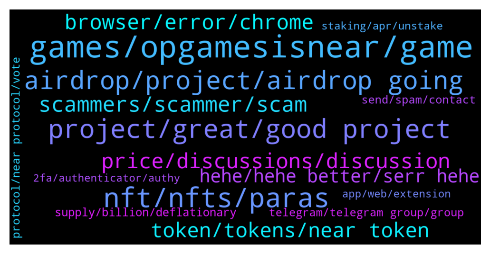

# **@cryptonear**
 ## Analysis for **2022-01-30** - **2022-02-06**.

---

## 📊 **Basic Stats**

**n_messages_sent**: 3187

---

---

## 🔝 **Top keywords and related messages**

1. **games, opgamesisnear, game**

    @chasefreo --- *I think in this new age of web3 this is definitely bound to happen. To bring players more skin in the game by giving them a level of ownership and for devs to have the backing of the community in a much deeper level.* **--->** [TG Discussion](https://t.me/cryptonear/325030)

    @felicia_124 --- *Sure, we're happy to provide you updates. Over the past couple of weeks, the team worked hard to push out a number of updates including:  -Platform improvements both on backend and frontend to improve overall gaming experience -Faster onboarding of games in our gaming platform, Arcadia -We are preparing for the upcoming Game Night on February 5th with one new game in the pipeline -Arcadeum Arena soon to be payable in Arcadia!  In this Medium article we fleshed out each of these features and also discussed what you can expect as we further refine these features: https://opgames.medium.com/community-buff-arcadia-patches-93f137071281* **--->** [TG Discussion](https://t.me/cryptonear/325185)

    @felicia_124 --- *2021 was the year where the team steadily built up its roster with world class talent to a 35-strong team in order to support our goal of empowering more game developers for Web 3.0. The team is composed of a mix of veterans in the game development / blockchain scene while we also welcomed members who were highly interested in shaping the future of Web 3 with us. 🙌  We're also hiring! View our job openings at https://twitter.com/OPGames_/status/1478717389877710849* **--->** [TG Discussion](https://t.me/cryptonear/325183)

    @hayabusa2506 --- *@chasefreo #OpGamesIsNear How many team members do you have? Do they have enough experience in the blockchain field? Do they have any experience on working in crypto and non-crypto project?* **--->** [TG Discussion](https://t.me/cryptonear/325070)

    @chasefreo --- *To answer that yes, there will be a token launch happening fo OP Games.* **--->** [TG Discussion](https://t.me/cryptonear/325037)

    @chasefreo --- *There are several things that's really cool about OP Games  1. Game Legos - these are open source composable tools that game developers can use to plug in blockchain and crypto into theiur games 2. Arcadia - Our platform where all games are playable.* **--->** [TG Discussion](https://t.me/cryptonear/325014)

2. **nft, nfts, paras**

    @oppzsmoKe --- *Well Paras claiming this was the first   This is the first NFTs by an artist: https://paras.id/token/x.paras.near::2  This the first NFTs from the team: https://paras.id/token/x.paras.near::1  This is the first collection on Paras: https://paras.id/collection/zodiacs-ascension-by-parasnear* **--->** [TG Discussion](https://t.me/cryptonear/296750)

    @oppzsmoKe --- *See I’m heavily invested in Ethereum‘s NFTs The reason why I asked these questions is because I invested in early Ethereum NFT projects and they all have been success I brought a bunch of CryptoPunks which was the first so now I am moving over to near and I’m trying to find the Cryptopunk of near* **--->** [TG Discussion](https://t.me/cryptonear/296758)

    @Taurus990 --- *I clicked on the NFT on the collectibles and it showed me that* **--->** [TG Discussion](https://t.me/cryptonear/323711)

    @harryfrottercrypto --- *nfts are garbage, and on near especially theyre all so low effort and low quality* **--->** [TG Discussion](https://t.me/cryptonear/326058)

    @larry_lang --- *hmm didnt most NFTs projects all have little to no use cases=))) IMO i think the key part to build an solid NFTs is to build community =)) if u can build a large amount of pp u then u can make profit=))* **--->** [TG Discussion](https://t.me/cryptonear/326063)

    @AfroRick --- *Hey team. I'm trying to find out how I can implement attributes for NFTs using NEAR. I don't see a section in the standard for defining attributes as I would with OpenSea.   In the spec I see that in type TokenMetadata {} there is "extra" which can hold other stuff I want to store, but I'm not sure that's what I'm looking for.* **--->** [TG Discussion](https://t.me/cryptonear/321832)

3. **project, great, good project**

    @praveen9008 --- *That's a really amazing project. I'm so excited and happy to be participating in this project. I hope this project will gain more popularity in the future. ❤️🎉* **--->** [TG Discussion](https://t.me/cryptonear/315516)

    @Kripto_Raptor --- *I bet this will help boost adaptation for your great platform.* **--->** [TG Discussion](https://t.me/cryptonear/325039)

    @momotazchy --- *A good project and strong team in a predictable and transparent road map, planned and projected. I think in the near future we will see an unprecedented growth of this project.* **--->** [TG Discussion](https://t.me/cryptonear/300862)

    @upance --- *This is excellent project for the future with strong team, a transparent, planned and project roadmap. it will be successfulI. Always be waiting for the progress of this project.* **--->** [TG Discussion](https://t.me/cryptonear/301438)

    @susugandul --- *I'm interested, I've participated and I fully support this project* **--->** [TG Discussion](https://t.me/cryptonear/327246)

    @hava_marosi --- *Excellent💯 project with bright future ahead and i want to be a part of this project.* **--->** [TG Discussion](https://t.me/cryptonear/304511)

4. **airdrop, project, airdrop going**

    @bailey_12 --- *Hey gangz, 1 Airdrop from Bitstore is not enough ?? Bow Bow, another Airdrop is on the line to hunt down  https://twitter.com/BaileyVu12/status/1486980604097089538* **--->** [TG Discussion](https://t.me/cryptonear/303901)

    @mayanktanwar2 --- *Hey i submit form i m eligible to Airdrop?* **--->** [TG Discussion](https://t.me/cryptonear/300458)

    @crazytoken --- *when start distri airdrop sir ?* **--->** [TG Discussion](https://t.me/cryptonear/298753)

    @Sheriff --- *I was just asking about the airdrop you guys tweeted about the other day.* **--->** [TG Discussion](https://t.me/cryptonear/316069)

    @Shubh007123 --- *Can You Announce this here so everyone can can join our cahnnel , also there will Airdrop for near early adopters* **--->** [TG Discussion](https://t.me/cryptonear/299985)

    @larry_lang --- *hehe im afraid we dont do airdrop like that=)))* **--->** [TG Discussion](https://t.me/cryptonear/322160)

5. **scammers, scammer, scam**

    @cuiking --- *The more I chat here. More those scammers DM me at the end of the day there will be about 50 to 100 scammers in my DM* **--->** [TG Discussion](https://t.me/cryptonear/297771)

    @harryfrottercrypto --- *Imagine if they put the effort they did in scamming in getting a job* **--->** [TG Discussion](https://t.me/cryptonear/299623)

    @cuiking --- *So how do people punish scammer?* **--->** [TG Discussion](https://t.me/cryptonear/319020)

    @cuiking --- *I got scam. Any way to punish the scammer I have the scammer wallet address* **--->** [TG Discussion](https://t.me/cryptonear/319031)

    @plat123456 | plat123456.sol --- *cex,  the second i post a question, tons of scammer dm me, i better delete my question, its too annoying* **--->** [TG Discussion](https://t.me/cryptonear/296684)

    @AbuZakariya09 --- *User - Kripto Raptor is a scammer in this group  DMed me.  Admin please investigate.* **--->** [TG Discussion](https://t.me/cryptonear/326916)

6. **price, discussions, discussion**

    @iamkemoo --- *Hey, for price discussion please go to the unofficial price chat: https://t.me/merchantsofnear* **--->** [TG Discussion](https://t.me/cryptonear/318950)

    @Anabeli2 --- *And the last time i checked i was not talking about price* **--->** [TG Discussion](https://t.me/cryptonear/297534)

    @GeorgePro1 --- *Maybe you love talking about prices. This unofficial chat group is for that  https://t.me/merchantsofnear* **--->** [TG Discussion](https://t.me/cryptonear/297040)

    @kv9990 --- *To the mooon 🌝🚀 But price talks here please ⬇️ https://t.me/merchantsofnear* **--->** [TG Discussion](https://t.me/cryptonear/321207)

    @GeorgePro1 --- *You can have price discussions at this channel https://t.me/merchantsofnear* **--->** [TG Discussion](https://t.me/cryptonear/297928)

    @iamkemoo --- *No price discussions in this chat please, you can talk about price in the price chat: https://t.me/merchantsofnear* **--->** [TG Discussion](https://t.me/cryptonear/299884)

7. **browser, error, chrome**

    @TheGo1denBull --- *Try a browser that's not Chrome or brave If you're using them* **--->** [TG Discussion](https://t.me/cryptonear/300079)

    @Tom --- *Also tried Chrome, Edge, Firefox, Opera, Opera+VPN* **--->** [TG Discussion](https://t.me/cryptonear/300130)

    @harryfrottercrypto --- *hi guys - on ref finance - for a few days the farms show up as like. rap-52a047ee d9c2d319-wrap etc, doesnt happen on chrome but happens on Firefox, troubleshooted everything* **--->** [TG Discussion](https://t.me/cryptonear/298057)

    @Faceless --- *The address is right, I've tried on other browsers. With or without vpn* **--->** [TG Discussion](https://t.me/cryptonear/326710)

    @stevenn00 --- *i have done to try other browser* **--->** [TG Discussion](https://t.me/cryptonear/298071)

    @larry_lang --- *hmm can u try to restart your internet, of maybe turn on VPN to see if it works* **--->** [TG Discussion](https://t.me/cryptonear/298913)

8. **token, tokens, near token**

    @larry_lang --- *this guy Ghazian got some gold token and were asking for the source of it, so i just sent him the annoucement of that project* **--->** [TG Discussion](https://t.me/cryptonear/327318)

    @thodo --- *Ok. But can I check token address in Near? I can do it if some token sent to my Metamask wallet. I dont know how to do that in Near.* **--->** [TG Discussion](https://t.me/cryptonear/327352)

    @crypto_blckhntr --- *Is that NEAR TOKENS or USA DOLLAR 💰💰* **--->** [TG Discussion](https://t.me/cryptonear/323535)

    @kid --- *How to get the Near token* **--->** [TG Discussion](https://t.me/cryptonear/324792)

    @NearFritz --- *I share this pic with you to see that you can have any token on your wallet* **--->** [TG Discussion](https://t.me/cryptonear/297783)

    @heartradiance --- *You cant really search token transactions very well right? Also cannot search for specific tokens such as Octopus network...* **--->** [TG Discussion](https://t.me/cryptonear/325299)

9. **hehe, hehe better, serr hehe**

    @larry_lang --- *and your level of criticism as well=))) i can tell that from the time u ask for Skyward=))))* **--->** [TG Discussion](https://t.me/cryptonear/296817)

    @larry_lang --- *=))) better keep an eye on this one ser=))) https://medium.com/nearprotocol/wannaswap-brings-new-app-launchpad-to-near-ecosystem-8e7501a2554d* **--->** [TG Discussion](https://t.me/cryptonear/297000)

    @kv9990 --- *Yeah,wish waited few mins more =))* **--->** [TG Discussion](https://t.me/cryptonear/326053)

    @butola_ravi --- *Yes he said talk later =))))* **--->** [TG Discussion](https://t.me/cryptonear/326039)

    @larry_lang --- *=)) ah okie let me cover some for u, see if that works after that=)))* **--->** [TG Discussion](https://t.me/cryptonear/296648)

    @larry_lang --- *=))) hehe im down as well if u want some companion=)))* **--->** [TG Discussion](https://t.me/cryptonear/300309)

10. **supply, billion, deflationary**

    @stevenn00 --- *so the supply is will be increase every year?* **--->** [TG Discussion](https://t.me/cryptonear/298304)

    @stevenn00 --- *but the supply max is 1billion right?* **--->** [TG Discussion](https://t.me/cryptonear/298292)

    @Lgranadeiro --- *So once 1b tokens is reached it becomes deflationary right??* **--->** [TG Discussion](https://t.me/cryptonear/296284)

    @dehraw --- *Damn, I thought the max supply was 1B. Thanks for the info anyway.* **--->** [TG Discussion](https://t.me/cryptonear/300196)

    @iamkemoo --- *Nope, 1 billion + 5% every year* **--->** [TG Discussion](https://t.me/cryptonear/298294)

    @kv9990 --- *Yeah tokens are burnt on every transaction so in future that's possible, currently it's inflationary though ,read more below https://near.org/blog/near-token-supply-and-distribution/* **--->** [TG Discussion](https://t.me/cryptonear/296277)

11. **telegram, telegram group, group**

    @TheGo1denBull --- *Send me a dm so I can give you in sight on amas on telegram* **--->** [TG Discussion](https://t.me/cryptonear/325222)

    @GeorgePro1 --- *You can also join ref telegram https://t.me/ref_finance for more information concerning ref* **--->** [TG Discussion](https://t.me/cryptonear/297625)

    @bvlgvkov --- *@bvlgvkov Recipient wasn't recognized. Private chats are not supported.* **--->** [TG Discussion](https://t.me/cryptonear/296423)

    @GeorgePro1 --- *Metapool has no telegram join their discord and ask all your questions they will be glad to help   https://discord.gg/H36tqQbX* **--->** [TG Discussion](https://t.me/cryptonear/326658)

    @iforbusiness2 --- *it asking to update my Telegram ☺️* **--->** [TG Discussion](https://t.me/cryptonear/325788)

    @mayanktanwar2 --- *Lol they telegram admin say you are doing* **--->** [TG Discussion](https://t.me/cryptonear/300477)

12. **protocol, near protocol, vote**

    @rahulgoel007 --- *Which of these #smartcontract protocols will hold the best 30-day rating at the end of January?  https://twitter.com/evai_io/status/1485632526475534340?s=20  Let's vote for #NEAR* **--->** [TG Discussion](https://t.me/cryptonear/299102)

    @stakesstone --- *Glad to support the Near protocol with our validating services now! 🙌🏻 If you have any questions, please feel free to ask!* **--->** [TG Discussion](https://t.me/cryptonear/323046)

    @Andy --- *Hi all, i'm new here. Is Near an L1 protocol?* **--->** [TG Discussion](https://t.me/cryptonear/298347)

    @iaman38 --- *NEAR Protocol Official Official NEAR Protocol Community Channel. @cryptonear  NEAR is a builder's fastest path to market. Do things that you didn’t think were possible  A climate-neutral, high-speed, and low transaction fee Layer1 Blockchain platform. Reimagine your world NEAR. https://t.me/cryptonear_near* **--->** [TG Discussion](https://t.me/cryptonear/298158)

    @KRYPTODraker --- *Near protocol keeps giving me reasons to Hodl on , they are rapidly growing and is so community driven.* **--->** [TG Discussion](https://t.me/cryptonear/324686)

    @oppzsmoKe --- *How’s it going team any new news on near protocol* **--->** [TG Discussion](https://t.me/cryptonear/300253)

13. **send, spam, contact**

    @TheGo1denBull --- *You can send me a dm or reach out to https://t.me/NEARSupport* **--->** [TG Discussion](https://t.me/cryptonear/323739)

    @spectre011 --- *I cant dm you first @iamkemoo please dm me* **--->** [TG Discussion](https://t.me/cryptonear/299185)

    @Brownhawks_Memolabs --- *l can't send a dm. Guess l could contact mutual contacts* **--->** [TG Discussion](https://t.me/cryptonear/299002)

    @MisusPikuls --- *Anyone needs a graphic artist? I can provide my service. Serious partners only. Dm me :)* **--->** [TG Discussion](https://t.me/cryptonear/323778)

    @Kripto_Raptor --- *if you're still struggling, just dm me 😊* **--->** [TG Discussion](https://t.me/cryptonear/297290)

    @iamkemoo --- *Can you please send me a DM, so I can look through* **--->** [TG Discussion](https://t.me/cryptonear/326854)

14. **staking, apr, unstake**

    @NearFritz --- *If everyone unstake then the few that keep staking will earn more rewards* **--->** [TG Discussion](https://t.me/cryptonear/297799)

    @stevenn00 --- *so if the staker increase the apr is decrease* **--->** [TG Discussion](https://t.me/cryptonear/297811)

    @Germany --- *Where has a higher yield for staking? I saw Binance has 13% APR* **--->** [TG Discussion](https://t.me/cryptonear/298466)

    @Patos27 --- *Hey guys good day, first time staking near, how long does it usually take to unstake?* **--->** [TG Discussion](https://t.me/cryptonear/299990)

    @kv9990 --- *I guess you mean APR on Farming Pools :) https://app.ref.finance/farms* **--->** [TG Discussion](https://t.me/cryptonear/296269)

    @CryptoCoinPanda --- *when i use the liquid staking on meta. do i have to click on "liquid unstake"? because when im on ref, it already shows my stnear already* **--->** [TG Discussion](https://t.me/cryptonear/299467)

15. **app, web, extension**

    @becausetelegram --- *link to explore apps on near wallet website is broken* **--->** [TG Discussion](https://t.me/cryptonear/323696)

    @Seej01 --- *thanks! Is there any web extension or app? I’m in asia and cant see on my App Store* **--->** [TG Discussion](https://t.me/cryptonear/299834)

    @Bui_Long --- *Hello admin do we have near wallet app for ios? Thanks* **--->** [TG Discussion](https://t.me/cryptonear/325425)

    @selfllover --- *Can u give me near app* **--->** [TG Discussion](https://t.me/cryptonear/322640)

    @NEARverse_xd --- *No app, only web wallet is available.* **--->** [TG Discussion](https://t.me/cryptonear/322645)

    @crypto_blckhntr --- *Let me know if you want me to develop an app.* **--->** [TG Discussion](https://t.me/cryptonear/323461)

