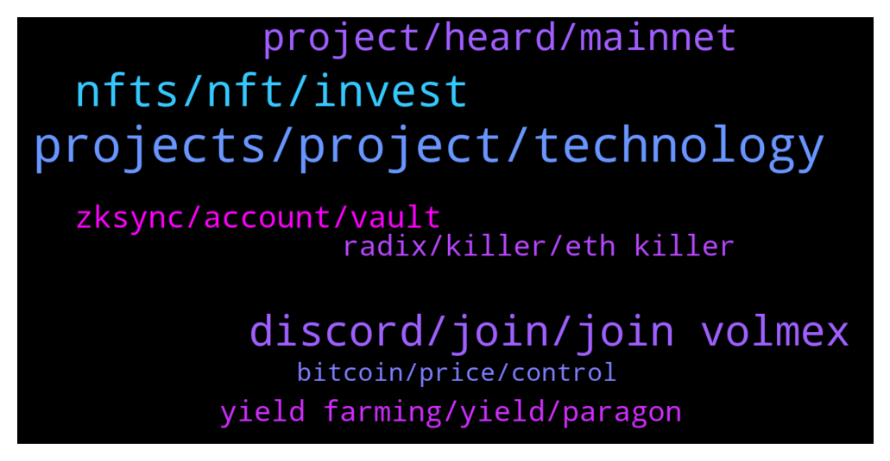

# **@de_fi**
 ## Analysis for **2022-01-30** - **2022-02-06**.

---

## 📊 **Basic Stats**

**n_messages_sent**: 162

---

---

## 🔝 **Top keywords and related messages**

1. **projects, project, technology**

    @Thomasgagnon11 --- *this project is called Heartbeats by humansdotai and it has a very strong project behind, it s a deep tech AI company* **--->** [TG Discussion](https://t.me/de_fi/245718)

    @anastasialiski --- *do you know any cool projects?* **--->** [TG Discussion](https://t.me/de_fi/245715)

    @Feyin --- *Hi guys, I am new here I would love to learn about defi any resources for me to learn from  beginner to advanced level* **--->** [TG Discussion](https://t.me/de_fi/245708)

    @altstrom --- *Many projects out there told the same, but ya lets see* **--->** [TG Discussion](https://t.me/de_fi/245162)

    @xnatasx --- *For this group we just volunteerer.  Better to contact projects you like.* **--->** [TG Discussion](https://t.me/de_fi/235389)

    @Thomasgagnon11 --- *No worries, also if you want to know anything about projects* **--->** [TG Discussion](https://t.me/de_fi/245712)

2. **nfts, nft, invest**

    @anastasialiski --- *I m really interested in NFTs* **--->** [TG Discussion](https://t.me/de_fi/245714)

    @nelsonblue --- *Hey , have y'all heard about the project called "Stripto" .. doxxed team with Certik Audit .. has a real utility of getting NFTs at a discounted price of you hold the token .. CEX listing after launching ..* **--->** [TG Discussion](https://t.me/de_fi/245408)

    @Thomasgagnon11 --- *you should also be cautious when investing both in crypto and in nfts* **--->** [TG Discussion](https://t.me/de_fi/245717)

    @Im --- *I'd prefer to invest some of my money elsewhere, given the current situation of the financial markets. Please suggest a worthwhile project to me.* **--->** [TG Discussion](https://t.me/de_fi/235617)

    @Vivon --- *Hello, guys wanted to share with you, and recommend some interesting platform that I have recently found which is able to identify the risk on asset investment.  And help you manage and explore new assets check them out "Valid Networks"* **--->** [TG Discussion](https://t.me/de_fi/245347)

    @irishka159 --- *r there any crypto experts? What do you think of MetaSoccer? Is there any sense in investing there? Their game features r good pumps for my assets.* **--->** [TG Discussion](https://t.me/de_fi/245233)

3. **discord, join, join volmex**

    @xnatasx --- *Will try a bit more later. Send you pic/recording...* **--->** [TG Discussion](https://t.me/de_fi/245289)

    @blckwd --- *Thanks. It’s 4:45am here so I’ll catch some sleep. May not get back to you immediately.* **--->** [TG Discussion](https://t.me/de_fi/245290)

    @colekennelly --- *👋 Join the Volmex community on Discord! https://discord.gg/QCCMVnecBz* **--->** [TG Discussion](https://t.me/de_fi/235265)

    @colekennelly --- *Join the Volmex community on Discord! https://discord.gg/QCCMVnecBz* **--->** [TG Discussion](https://t.me/de_fi/245389)

    @fluhas --- *I just found some new bots if anyone is interested https://wisdom-bots.com* **--->** [TG Discussion](https://t.me/de_fi/235354)

    @Deltasets --- *Hi, we think about it.  https://twitter.com/deltasets* **--->** [TG Discussion](https://t.me/de_fi/245186)

4. **project, heard, mainnet**

    @Taum2 --- *I think i found solid project. Want to know what you guys think of it.  Safechaintoken sct. Low supply, low mc, staking is live and swap is coming. Do you come across this project?* **--->** [TG Discussion](https://t.me/de_fi/235594)

    @Paramkodi --- *Ankr is teaming up with IoTeX to build a robust global network of nodes, through the brand new RPC endpoint.  https://medium.com/ankr-network/ankr-teaming-up-with-iotex-to-speed-global-network-growth-fa48947a386* **--->** [TG Discussion](https://t.me/de_fi/245765)

    @Somurocks --- *We are teaming up with Maxihost  to scale  web3 infrastructure globally!  Maxihost’s platform will monetize existing unused server capacity through Ankr Protocol while supporting the node network that will benefit Web3 platforms and services.  https://aithority.com/technology/blockchain/ankr-partners-with-bare-metal-cloud-provider-maxihost-to-scale-web3-infrastructure-globally/* **--->** [TG Discussion](https://t.me/de_fi/235722)

    @Taum2 --- *They launched q4 2021 i think.* **--->** [TG Discussion](https://t.me/de_fi/235602)

    @Apealot --- *Sounds fire, never heard of it before tbh* **--->** [TG Discussion](https://t.me/de_fi/235599)

    @Agadashedrack49 --- *Hello, I think I heard about this project before, when did they launch please?🙏 is it a good one to enter?* **--->** [TG Discussion](https://t.me/de_fi/235600)

5. **zksync, account, vault**

    @xnatasx --- *@blckwd or @itamarl   So I sent funds to a friend's brand new argent wallet. Zksync to zksync. But then when she wants to use the received eth, wallet says it's $90 to active!  Should that still be the case? We are inside of zksync section. Have I missed something?* **--->** [TG Discussion](https://t.me/de_fi/245277)

    @xnatasx --- *Brand new installation. Never had account before. Not her. Not device.* **--->** [TG Discussion](https://t.me/de_fi/245288)

    @blckwd --- *If you DM me some screenshots or better a screen recording (if iOs it’s easy) – that will help me understand. Also can you confirm that the app was a new install, and what the version is? (Account switcher > Settings > scroll to bottom)* **--->** [TG Discussion](https://t.me/de_fi/245286)

    @blckwd --- *Ok so maybe she accidentally found her way into the Vault account? She may just need to tap the account switcher top left and switch to zkSync* **--->** [TG Discussion](https://t.me/de_fi/245283)

    @xnatasx --- *Sent a few dollars over to try. She never used a wallet before. But then when wanted to show, was asked to pay $90 to activate first...* **--->** [TG Discussion](https://t.me/de_fi/245282)

    @blckwd --- *It sounds like she has an older Argent wallet, i.e. created before about July 2021?   All new Argent wallets are zkSync by default. But if she has an older L1 Argent wallet, which we now refer to as “Vault”, then she needs to claim her zkSync account with her Vault, to ensure that the Vault is able to recover her zkSync account in future.  Unfortunately even though you’ve already sent the funds, she’ll need to also have funds in her L1 Vault to Claim the funds on L2.  If you have only sent a few dollars, you might want to scrap the account and create a new one, as that will be much cheaper to use.  New accounts are $3-4 to set up and $0.30 per transaction* **--->** [TG Discussion](https://t.me/de_fi/245279)

6. **yield farming, yield, paragon**

    @dunk1000214 --- *🎉 Hey guys Be a family member of the DMM community.🥰   We are continuing to build. The deflationary meme of BSC with auto rewards!  🚀DMM🔗Slippage Tolerance  5%  BUY👉🏻https://pancakeswap.finance/swap?outputCurrency=0x9Ed61460147D828B6442f279fB09BE0E1b3a5E34  Twitter👉🏻https://twitter.com/DogeMuskMars* **--->** [TG Discussion](https://t.me/de_fi/245193)

    @tekatepase --- *♑️💎 Paragon Capital 💎♑️  Buy PARAGON and gain access to yield farming on all chains!  The team also aims to contribute on economic growth by providing jobs to people through P2E scholarships.  🔰PRESALE 🔰Ongoing WL Competition  "MCC fork with better tokenomics and lower tax"  🔒KYCd and Based Team ✅Contract Audited ✅Yield Farming Protocols ✅Dividends in BNB ✅Trynos contract writer  Do yourself a solid! Get to know the next moonshot!  Join us  @ paragoncapital_portal* **--->** [TG Discussion](https://t.me/de_fi/244917)

    @Bobby is lazy --- *♑️💎 Paragon Capital 💎♑️  Buy PARAGON and gain access to yield farming on all chains!  The team also aims to contribute on economic growth by providing jobs to people through P2E scholarships.  🔰PRESALE 🔰Ongoing WL Competition  "MCC fork with better tokenomics and lower tax"  🔒KYCd and Based Team ✅Contract Audited ✅Yield Farming Protocols ✅Dividends in BNB ✅Trynos contract writer  Do yourself a solid! Get to know the next moonshot!  Join us  @ paragoncapital_portal* **--->** [TG Discussion](https://t.me/de_fi/244910)

    @Ronnie --- *🏃 Come get cozy with Campfire 🏕🔥 Recently launched 🥳  ❤️ NFT 🔥 ❤️ Passive Income 🔥 ❤️ Staking Ecosystem 🔥 ❤ huge marketing inbound ❤ private sale for nft mint 27thjan ❤️‍🔥 (4%buy and sell tax)🔥  👇Join  Campfiretoken.io    #dxsale  #BSCGem #Binance #PancakeSwap* **--->** [TG Discussion](https://t.me/de_fi/235623)

    @kuz1998 --- *⚔️ 🔥MetaRaids com🔥 ⚔️  ⚡️Live on PanckeSwap⚡️  ➡️ Group: MetaRaids  🤺NFT RPG Metaverse Game🤺  ✅DOXXED CEO ✅ WHITEPAPER ✅ AUDIT ✅ GDD* **--->** [TG Discussion](https://t.me/de_fi/235517)

    @Bax_the_Wonderer --- *Right now we are connected to bsc testnet and doing open public testing. At the end of testing we plan to award  40 lucky testers by fulfilling their orders from testing* **--->** [TG Discussion](https://t.me/de_fi/235436)

7. **radix, killer, eth killer**

    @Adneycal --- *Not saying would be ETH killer, Radix will bring better ecosystem for DeFi growth dude. Would say it's the competitor* **--->** [TG Discussion](https://t.me/de_fi/245163)

    @Adneycal --- *Bet y'all not too familiar with Radix, isnt it? It has big chance to be the next Layer 1 which gonna be massive IMO, can say it has unlimited potential growth since having better scalling solution and Scrypto is now live. Game changer is here!* **--->** [TG Discussion](https://t.me/de_fi/245160)

    @Hirokondo --- *that s very important, and also DYOR* **--->** [TG Discussion](https://t.me/de_fi/245719)

    @altstrom --- *Is that gonna be next ETH killer? Lmao* **--->** [TG Discussion](https://t.me/de_fi/245161)

    @Adneycal --- *DYOR and see whats differ from Radix and other L1s. Radix can scale limitless without breaking composability as L1* **--->** [TG Discussion](https://t.me/de_fi/245164)

    @Cloudcoins1 --- *hey guys my team and i just started a new coin and we plan on revolutionizing the crypto verse and plan to take the skies in the metaverse* **--->** [TG Discussion](https://t.me/de_fi/243735)

8. **bitcoin, price, control**

    @BoulevardLP --- *Then who sets or how is bitcoin price and rate set?...* **--->** [TG Discussion](https://t.me/de_fi/235194)

    @dereksilva --- *No they don’t, unless they are purposefully selling their BTC under maker value. That would be really odd behaviour against their own self interests.* **--->** [TG Discussion](https://t.me/de_fi/235192)

    @BoulevardLP --- *Do bitcoin miners control and manipulate bitcoin market price anytime they want?* **--->** [TG Discussion](https://t.me/de_fi/235189)

    @xnatasx --- *Problem solved. Human error (my end) by misreading currency tickers. :)* **--->** [TG Discussion](https://t.me/de_fi/245296)

    @BoulevardLP --- *If bitcoin is a free market (meaning having no central government control through regulation, setting price, rate etc. like by the CBs), how'd miners control and manipulate bitcoin price then?...* **--->** [TG Discussion](https://t.me/de_fi/235193)

    @BoulevardLP --- *If miners control and manipulate bitcoin market price, how'd miners do control and manipulate bitcoin market price?* **--->** [TG Discussion](https://t.me/de_fi/235190)

