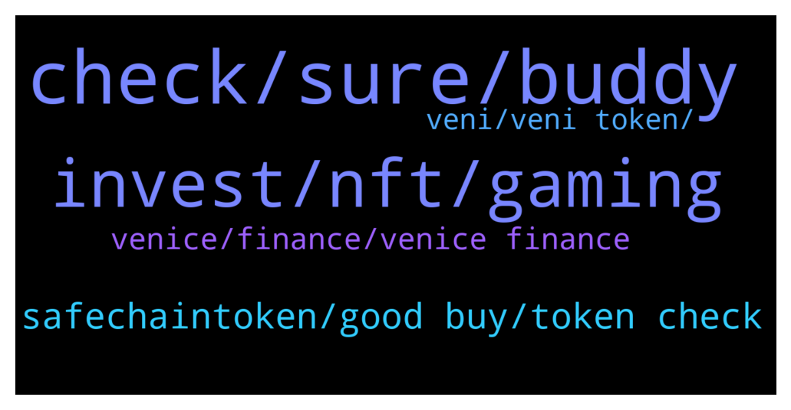

# **@defisearchpublic**
 ## Analysis for **2022-01-30** - **2022-02-06**.

---

## 📊 **Basic Stats**

**n_messages_sent**: 94

---

---

## 🔝 **Top keywords and related messages**

1. **check, sure, buddy**

    @apeng2014 --- *They release a beta test net and you may try that one out.* **--->** [TG Discussion](https://t.me/defisearchpublic/241239)

    @apeng2014 --- *Yeah sure buddy. Check my DM links are complete tg twitter and the website.* **--->** [TG Discussion](https://t.me/defisearchpublic/241241)

    @CryptoMaskeRider --- *Is this for real? Its huge for a new project.* **--->** [TG Discussion](https://t.me/defisearchpublic/241472)

    @CryptoGoki_sensai --- *Thanks to Findora. Bulletproof became the key of answer.* **--->** [TG Discussion](https://t.me/defisearchpublic/241488)

    @vinlens --- *hey come check out Discord with me https://discord.gg/j9ugJMXz* **--->** [TG Discussion](https://t.me/defisearchpublic/241496)

    @Bembembum --- *I hope so! By the way need to go! Thanks again mate.* **--->** [TG Discussion](https://t.me/defisearchpublic/241254)

2. **invest, nft, gaming**

    @theinvestor9 --- *Anyone investing play to earn games here??* **--->** [TG Discussion](https://t.me/defisearchpublic/241292)

    @Crypto1Eagle --- *Any good crypto project to invest in !* **--->** [TG Discussion](https://t.me/defisearchpublic/241267)

    @PianistGoldFinger --- *Doomsdaynft. io get a chance to win 125eth only 40 players remaining. By the creator of the first proof of work nft, andrew parker* **--->** [TG Discussion](https://t.me/defisearchpublic/241443)

    @blews9 --- *I think  their it's worth to invest for longterm.Nft gaming token is good to hold* **--->** [TG Discussion](https://t.me/defisearchpublic/241317)

    @thewise11 --- *I am, Nft gaming is good to invest* **--->** [TG Discussion](https://t.me/defisearchpublic/241296)

    @apeng2014 --- *Maybe just like the other nft game similar in axie.* **--->** [TG Discussion](https://t.me/defisearchpublic/241229)

3. **safechaintoken, good buy, token check**

    @obambami --- *Try the nft project pegaxy a Vis token.* **--->** [TG Discussion](https://t.me/defisearchpublic/241228)

    @Taum2 --- *I have safechaintoken on my radar. Low supply, low mc gem.* **--->** [TG Discussion](https://t.me/defisearchpublic/241271)

    @Bembembum --- *I have that already. I want token for a long term.* **--->** [TG Discussion](https://t.me/defisearchpublic/241231)

    @Bembembum --- *Any suggestion what token is good to buy now?* **--->** [TG Discussion](https://t.me/defisearchpublic/241223)

    @blews9 --- *Nice, It looks like its good to buy this token now* **--->** [TG Discussion](https://t.me/defisearchpublic/241310)

    @Abdulharziz --- *Watch out for the best utility token #SAFECHAIN that is going to explode💥 the crypto space 2022   $SCT is a hyper deflationary utility token for the upcoming Safechainswap platform. Also is a good long term investment token.* **--->** [TG Discussion](https://t.me/defisearchpublic/241210)

4. **venice, finance, venice finance**

    @SkyMeFly21 --- *Unique in a sense of How Venice will handle securing and making private trading* **--->** [TG Discussion](https://t.me/defisearchpublic/241484)

    @CryptoMaskeRider --- *In what feature of venice this can handle frauds?* **--->** [TG Discussion](https://t.me/defisearchpublic/241492)

    @SkyMeFly21 --- *Venice is partnering with top auditing firms including Certik to guarantee the security of users’ money* **--->** [TG Discussion](https://t.me/defisearchpublic/241493)

    @CryptoMaskeRider --- *So it appears traders will became anonymous?* **--->** [TG Discussion](https://t.me/defisearchpublic/241486)

    @apeng2014 --- *It was designed to be under Venice DAO Governance to maintain stability.* **--->** [TG Discussion](https://t.me/defisearchpublic/241236)

    @apeng2014 --- *I'm pretty sure of that. Because Venice Finance Design as Community based.* **--->** [TG Discussion](https://t.me/defisearchpublic/241235)

5. **veni, veni token, **

    @SkyMeFly21 --- *In summary to that: VENI tokens will be minted at genesis. VENI token issuance master smart contract level - a per-transfer 0.2% tax policy will be enforced and sent to a blackhole address. incorporates a tax that creates clear deflation for every on-chain movement. A 5% average movement per day creates an effective deflation of 4% annually.* **--->** [TG Discussion](https://t.me/defisearchpublic/241477)

    @apeng2014 --- *Total supply 1,000,000,000 A total of 1 billion Veni tokens will be minted at Genesis.* **--->** [TG Discussion](https://t.me/defisearchpublic/241243)

    @Bembembum --- *How did you say that?? Veni is for along term??* **--->** [TG Discussion](https://t.me/defisearchpublic/241234)

    @CryptoGoki_sensai --- *VENI token can be used for payment of transaction fees, governance voting, staking, participation of various incentive programs such as lottery* **--->** [TG Discussion](https://t.me/defisearchpublic/241481)

    @SkyMeFly21 --- *6%-Mining across all LP tokens 0.5% -each month from TGE onwards* **--->** [TG Discussion](https://t.me/defisearchpublic/241476)

    @SkyMeFly21 --- *20%- VENI token incentive mining 2% each month for TGE+5mon, 0.5% each month for TGE+5mon onwards until finish* **--->** [TG Discussion](https://t.me/defisearchpublic/241474)

