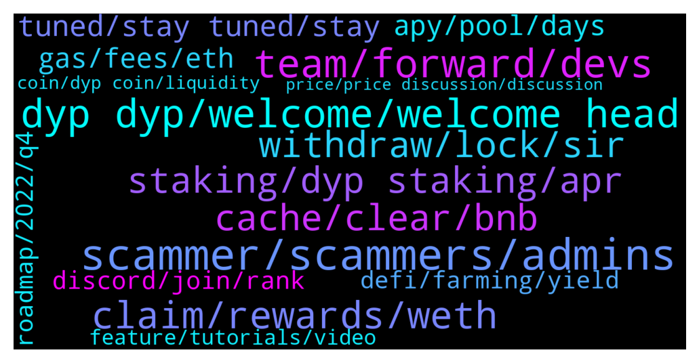

# **@dypfinance**
 ## Analysis for **2022-01-30** - **2022-02-06**.

---

## 📊 **Basic Stats**

**n_messages_sent**: 728

---

---

## 🔝 **Top keywords and related messages**

1. **scammer, scammers, admins**

    @Makrele22hz --- *I will*  Most of the time ppl tried to scam me.. so I ended up just doing nada 😚🍀* **--->** [TG Discussion](https://t.me/dypfinance/244424)

    @DhoniMSD516 --- *In my initial days I got such messages too, once I almost fallen for prey 😅* **--->** [TG Discussion](https://t.me/dypfinance/244778)

    @timdyp --- *Stefano you see this type of messages that are sent every 30-45 min on the group? https://t.me/dypfinance/244343 https://t.me/dypfinance/244350 This messages are in order to avoid users to be scammed.* **--->** [TG Discussion](https://t.me/dypfinance/244396)

    @DhoniMSD516 --- *funny thing is some ppl even message me with my display name and try to scam 😂* **--->** [TG Discussion](https://t.me/dypfinance/244780)

    @shinigamikami --- *Leme explain what happened to you.  A scammer contacted you acting as team then sent you a link where you inputed your wallet details, the scammer then stole your money. It wasn’t team but a scammer acting as team* **--->** [TG Discussion](https://t.me/dypfinance/244772)

    @shinigamikami --- *It was a scammer mate not real team  Never share your wallet seed phrase to anyone not even when the real CEO of a project asks you to, not even when real ELON MUSK ask you* **--->** [TG Discussion](https://t.me/dypfinance/244760)

2. **dyp dyp, welcome, welcome head**

    @DhoniMSD516 --- *This is going bit off topic, please keep this only related to DYP as you are in DYP exclusive group :)* **--->** [TG Discussion](https://t.me/dypfinance/244428)

    @cyryp --- *Hi have DYP self specific its own blacchain.?* **--->** [TG Discussion](https://t.me/dypfinance/243270)

    @timdyp --- *How to buy #DYP using #CoinbaseWallet👇 https://www.coinbase.com/how-to-buy/defi-yield-protocol* **--->** [TG Discussion](https://t.me/dypfinance/243993)

    @DhoniMSD516 --- *Hey welcome head here to learn about DYP :) https://t.me/dypfinance/229271* **--->** [TG Discussion](https://t.me/dypfinance/244193)

    @DhoniMSD516 --- *Hey welcome please head here to start learning about DYP :)  https://t.me/dypfinance/229271* **--->** [TG Discussion](https://t.me/dypfinance/244405)

    @Nazhadi57 --- *I thought there is a mechanism to reduce IL in DYP* **--->** [TG Discussion](https://t.me/dypfinance/242766)

3. **team, forward, devs**

    @Cocopanji89 --- *Almost 20 hours waiting for it sir* **--->** [TG Discussion](https://t.me/dypfinance/243584)

    @DhoniMSD516 --- *Ok I will ask our devs to recheck, but also if you can try on desktop and let me know how it goes* **--->** [TG Discussion](https://t.me/dypfinance/243372)

    @maxwell0507 --- *The team consists of only 8 people or are they more in the backround* **--->** [TG Discussion](https://t.me/dypfinance/243733)

    @Cj --- *alright! duly noted. thanks DoniMSD for your neverending support and patience* **--->** [TG Discussion](https://t.me/dypfinance/243624)

    @DhoniMSD516 --- *Not yet, I requested team for update when I have them will post* **--->** [TG Discussion](https://t.me/dypfinance/242904)

    @iamJubi --- *Understandable. The team will see the possibility 🙂* **--->** [TG Discussion](https://t.me/dypfinance/244849)

4. **claim, rewards, weth**

    @DhoniMSD516 --- *When you click claim and complete transaction you get rewards in WETH* **--->** [TG Discussion](https://t.me/dypfinance/243788)

    @DhoniMSD516 --- *It doesn't matter if it is showing in rewards tab it is ready for claim or reinvest* **--->** [TG Discussion](https://t.me/dypfinance/243360)

    @DhoniMSD516 --- *Hey rewards are allotted every 24H and for the rewards to showup someone or you should click claim  Claim is the trigger to show up rewards on dApp screen, on desktop you can hover on Rewards and see if it says feel free to execute then rewards are ready to be claimed, as ETH fees are high ppl generally claim once in a while and not daily* **--->** [TG Discussion](https://t.me/dypfinance/243782)

    @DhoniMSD516 --- *That gets updated only if trigger happens, you can wait for someone in pool to trigger the claim then it shows up your rewards too* **--->** [TG Discussion](https://t.me/dypfinance/243786)

    @DhoniMSD516 --- *Yes it shows 0 ETH because rewards are paid in WETH, once your claim transaction is success you get WETH in your wallet* **--->** [TG Discussion](https://t.me/dypfinance/243784)

    @DanielFraser --- *It says I can claim when hovering over the button but it shows zero ETH rewards to claim which I should have some over 2 days. I don't want to claim just now but wondering why I don't see any ETH to claim.* **--->** [TG Discussion](https://t.me/dypfinance/243783)

5. **staking, dyp staking, apr**

    @Idaveofficial --- *Are there any chances of increasing APR %  in staking ?* **--->** [TG Discussion](https://t.me/dypfinance/244493)

    @DanielFraser --- *That's a lot of loss for a few hours staking. I was Just testing before I locked the amount up.* **--->** [TG Discussion](https://t.me/dypfinance/243631)

    @hodlergang --- *hi are the old v1 dyp staking options still active?* **--->** [TG Discussion](https://t.me/dypfinance/244581)

    @AladinCrypto --- *How can i add then my dyp for staking ?* **--->** [TG Discussion](https://t.me/dypfinance/242556)

    @Tettluft --- *How much eth should I leave in the wallet to get to pay fees when staking dyp?* **--->** [TG Discussion](https://t.me/dypfinance/243242)

    @DhoniMSD516 --- *Hey DYP staking is active on 3 chains on our website https://dyp.finance/stakev2* **--->** [TG Discussion](https://t.me/dypfinance/242555)

6. **withdraw, lock, sir**

    @Abaddabi --- *Hi sir.. IDYP balance on eth network is empty.. please refill it sir.. because I cant withdrawal my idyp in eth network* **--->** [TG Discussion](https://t.me/dypfinance/243545)

    @Cimmy_revenger --- *Bridge iDYP BSC to Eth not working for withdraw , why sir  ? I have  a little problem* **--->** [TG Discussion](https://t.me/dypfinance/243506)

    @Cocopanji89 --- *Can u refill idyp ballance eth network sir pls.* **--->** [TG Discussion](https://t.me/dypfinance/243582)

    @Joy211ASa --- *How many days will it be locked  Or is only 24hrs* **--->** [TG Discussion](https://t.me/dypfinance/244538)

    @Joy211ASa --- *Is the no lock daily   And what is the minimum deposit* **--->** [TG Discussion](https://t.me/dypfinance/244535)

    @Alexey --- *What do you mean under impermanent loss? Loss due the withdrawal before the end of the lock period or what?* **--->** [TG Discussion](https://t.me/dypfinance/243642)

7. **cache, clear, bnb**

    @DhoniMSD516 --- *Ok I checked contract and I noticed that your friend transactions are failed with error insufficient amount, which mean there is no DYP to claim or reinvest but he is doing it so it is failing* **--->** [TG Discussion](https://t.me/dypfinance/243355)

    @DhoniMSD516 --- *Hey it should be instant, make sure your transactions are completed, clear cache and check again.* **--->** [TG Discussion](https://t.me/dypfinance/242994)

    @Nubarv --- *My friend is having same issue* **--->** [TG Discussion](https://t.me/dypfinance/243332)

    @Nubarv --- *My friend attempted to complete the transaction twice, his bnb got deducted, but transaction failed* **--->** [TG Discussion](https://t.me/dypfinance/243346)

    @Nubarv --- *As far as i remember, his transaction was failing because it showed $0 bnb durring claim,   but in his wallet he does have bnb* **--->** [TG Discussion](https://t.me/dypfinance/243350)

    @DhoniMSD516 --- *I just tried and it went through without failing* **--->** [TG Discussion](https://t.me/dypfinance/243352)

8. **tuned, stay tuned, stay**

    @hemanrock --- *results will be announced soon. kindly please stay tuned.* **--->** [TG Discussion](https://t.me/dypfinance/243837)

    @DhoniMSD516 --- *Hey https://t.me/dypannouncements is good source to know the latest news 😀* **--->** [TG Discussion](https://t.me/dypfinance/242241)

    @Lordofsales --- *Any plans to go on Fantom network???* **--->** [TG Discussion](https://t.me/dypfinance/242231)

    @Vl_investor --- *Hello, when do you plan to release the news?* **--->** [TG Discussion](https://t.me/dypfinance/242238)

    @hemanrock --- *Please stay tuned and follow announcement channel https://t.me/dypannouncements* **--->** [TG Discussion](https://t.me/dypfinance/243846)

    @popper1989 --- *hey guys long time that im here so ask wat is comming news ?* **--->** [TG Discussion](https://t.me/dypfinance/242371)

9. **gas, fees, eth**

    @DhoniMSD516 --- *Metamask shows max gas charge, but in the end the actual cost will be lesser, but also make sure the ETH network is not busy current gas trends are at 150 GWEI* **--->** [TG Discussion](https://t.me/dypfinance/242568)

    @Parker --- *Man the ETH gas fees are brutal* **--->** [TG Discussion](https://t.me/dypfinance/243820)

    @AladinCrypto --- *Have it 45$ avalible for gas at ether* **--->** [TG Discussion](https://t.me/dypfinance/242569)

    @benjamin9999999 --- *is that so? so where can we have less gas fee?* **--->** [TG Discussion](https://t.me/dypfinance/244280)

    @DhoniMSD516 --- *The gas shown in wallet are max gas the actual charge will be less but yea GWEI is above 150 now so fees will be pretty high rn* **--->** [TG Discussion](https://t.me/dypfinance/243821)

    @DhoniMSD516 --- *It depends on gas trends, the metamask shows around 300$ but actual cost will be less* **--->** [TG Discussion](https://t.me/dypfinance/243243)

10. **apy, pool, days**

    @DhoniMSD516 --- *No we cannot APY depends on number of ppl participating in the pool, though lesser days have higher APY the rewards you earn will be more in bigger days* **--->** [TG Discussion](https://t.me/dypfinance/243751)

    @iamJubi --- *APY change depends on TVL, prices of token involved on the pool, etc.   "To Be Burnt/disbursed" iDYP on the pool is yet to be distributed as reward or burnt, so it contributes to the APY. If you check, 60 days pool have no more iDYP that is potentially be disbursed while 90 days still have. This is another factor.  Also, higher lock time have higher allocated iDYP reward daily. let me check with the team  for some other factors that affects the APY. But as said, originally the longer lock days the higher the APY was.* **--->** [TG Discussion](https://t.me/dypfinance/242860)

    @Janes --- *How are yield curves determined in the different v2 farms across the various lock times? It seems odd that there is a mid point on some of the farms where the 30 day pools are actually yielding a lot more than the 60 day and 90 day pools. How dynamic are these yields day to day? Seems like there should be a better way of compensating those that chose a longer lock time.* **--->** [TG Discussion](https://t.me/dypfinance/242849)

    @Barry --- *Can you guys raise APY in the 30 day pool as opposed to 3 day?* **--->** [TG Discussion](https://t.me/dypfinance/243749)

    @unalpotur --- *Farm v2  no lock apy %122 30 lock apy %107 90 lock apy %175 Why?* **--->** [TG Discussion](https://t.me/dypfinance/243406)

    @Janes --- *Thanks, so the yields are Purely TVL driven or is there also an underlying mechanism that also rewards more for a longer lock time? If it’s purely TVL driven, then why would there be a reason to have pools of different lock durations?* **--->** [TG Discussion](https://t.me/dypfinance/242853)

11. **discord, join, rank**

    @iamJubi --- *You need to be active on discord https://discord.gg/dypcaws please head there* **--->** [TG Discussion](https://t.me/dypfinance/242495)

    @balikgini --- *Guys how to up our rank on discord? I want join that giveaway* **--->** [TG Discussion](https://t.me/dypfinance/242494)

    @cryptolobster --- *How to paticipate on the ETH giveaway Join discord server and than ? Find nothing* **--->** [TG Discussion](https://t.me/dypfinance/242602)

    @DhoniMSD516 --- *If you chat on discord you will gain rank, also you can participate in discord events, so join discord for all the fun* **--->** [TG Discussion](https://t.me/dypfinance/242501)

    @Ali pajoo --- *Hi how can I join this giveaway?* **--->** [TG Discussion](https://t.me/dypfinance/243025)

    @DhoniMSD516 --- *Just tell me know your discord name I will help you there* **--->** [TG Discussion](https://t.me/dypfinance/242511)

12. **defi, farming, yield**

    @itismeDH --- *Hey I Heard this is best then aave and refi  , how* **--->** [TG Discussion](https://t.me/dypfinance/244625)

    @Night --- *Defi farming  are creating Messive profit nowdays , Defi dominating the space  , some of the growing on the space are DYP wonderland and REFI ,* **--->** [TG Discussion](https://t.me/dypfinance/244170)

    @Kentus764 --- *Who's a defi expert here? I need assistance?* **--->** [TG Discussion](https://t.me/dypfinance/245036)

    @itismeDH --- *Which is the good defi farming project.* **--->** [TG Discussion](https://t.me/dypfinance/244602)

    @Aloysius De Sa --- *But I mean other defi projects* **--->** [TG Discussion](https://t.me/dypfinance/242779)

    @Aloysius De Sa --- *No discussion just wanted to know when it comes to defi* **--->** [TG Discussion](https://t.me/dypfinance/242784)

13. **roadmap, 2022, q4**

    @DhoniMSD516 --- *No plans for now but we are flexible with roadmap and may include in between* **--->** [TG Discussion](https://t.me/dypfinance/242232)

    @maxwell0507 --- *Is the roadmap in delay ?* **--->** [TG Discussion](https://t.me/dypfinance/243729)

    @Alejandrogonzalezespinosa --- *Do you have plan in the future create your blochain* **--->** [TG Discussion](https://t.me/dypfinance/243279)

    @DhoniMSD516 --- *Thanks for your feedback yes new website and rebranding on roadmap before Q2* **--->** [TG Discussion](https://t.me/dypfinance/243811)

    @hemanrock --- *there no plan yet. please check roadmap https://dyp.finance/roadmap* **--->** [TG Discussion](https://t.me/dypfinance/243280)

    @Mustaphakn --- *I can only see Q4 21 in the end.* **--->** [TG Discussion](https://t.me/dypfinance/244245)

14. **feature, tutorials, video**

    @rvshivsup --- *It’s always done via browser or there is an app too* **--->** [TG Discussion](https://t.me/dypfinance/242997)

    @Oso7us --- *I am completely new to this* **--->** [TG Discussion](https://t.me/dypfinance/244234)

    @iamJubi --- *Please visit this link. brief details and tutorials are provided on every feature https://t.me/dypfinance/229271* **--->** [TG Discussion](https://t.me/dypfinance/244627)

    @DhoniMSD516 --- *Hey we have video tutorials for every feature so decide which feature you want to and select the video https://www.youtube.com/channel/UC6Wrn8A-pq79srb9OC-ufXw* **--->** [TG Discussion](https://t.me/dypfinance/244235)

    @DhoniMSD516 --- *Hey please check here there is video walk through https://dyp.finance/nft and more details* **--->** [TG Discussion](https://t.me/dypfinance/244143)

    @hemanrock --- *please go through more from here https://t.me/dypfinance/229271 and Please watch video tutorials from here https://www.youtube.com/c/DeFiYieldProtocol/videos* **--->** [TG Discussion](https://t.me/dypfinance/242279)

15. **coin, dyp coin, liquidity**

    @Aloysius De Sa --- *Which is the biggest coin that is in the same field as dyp* **--->** [TG Discussion](https://t.me/dypfinance/242775)

    @Aloysius De Sa --- *Is alpaca finance the leader in this or is there an even bigger coin?* **--->** [TG Discussion](https://t.me/dypfinance/242780)

    @LU28ZNk --- *hi I have questions this coin is deflationary??* **--->** [TG Discussion](https://t.me/dypfinance/242281)

    @sonywhale --- *I bought 2100 dyp coins when it was 0.7 dollars* **--->** [TG Discussion](https://t.me/dypfinance/243401)

    @Pablo --- *If Coinbase then expect 500$ dyp in 2024* **--->** [TG Discussion](https://t.me/dypfinance/244002)

    @LovelySuman86 --- *4500$ is now 650 in just 3 month* **--->** [TG Discussion](https://t.me/dypfinance/242948)

