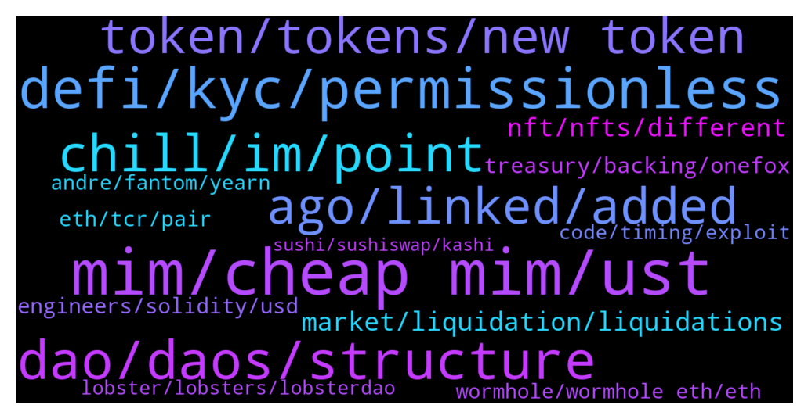

# **@lobsters_chat**
 ## Analysis for **2022-01-30** - **2022-02-06**.

---

## 📊 **Basic Stats**

**n_messages_sent**: 3150

---

---

## 🔝 **Top keywords and related messages**

1. **mim, cheap mim, ust**

    @hasufly --- *Leveraged MIM farmers can be blown up. Further, it would be interesting how much MIM is backed by TIME and SPELL* **--->** [TG Discussion](https://t.me/lobsters_chat/320071)

    @PmRiviere --- *Liquidators need to buy $MIM to liquidate* **--->** [TG Discussion](https://t.me/lobsters_chat/320077)

    @tracksuitcat --- *Hey! I'm with a DAO that wants to move out of $MIM (1.3mm) but doesn't know - should we panic? What's the best route? We haven't done anything like this before 😰* **--->** [TG Discussion](https://t.me/lobsters_chat/320581)

    @fp --- *1. if MIM continues to fall below $1, at some point borrowers will deem the discount good enough and begin buying MIM to pay off their loans at a discount.  2.  if collateral becomes impaired, liquidators will buy MIM to obtain collateral below mkt value.  3.  if collateral goes up in value, the issued MIM is further collateralized and borrowers can withdraw it from the protocol via buying MIM.  so is there really a problem here in the long run, as long as the curve pool continues to exist?* **--->** [TG Discussion](https://t.me/lobsters_chat/321188)

    @Felix --- *Has the MIM drama created opportunity to farm MIM with super high APR at least?* **--->** [TG Discussion](https://t.me/lobsters_chat/321315)

    @nourharidy --- *The question is if MIM price and liquidity can both be restored without restoring demand* **--->** [TG Discussion](https://t.me/lobsters_chat/321147)

2. **defi, kyc, permissionless**

    @ArkyEvi --- *Defi is not a single organism and "we" do not control it or need to direct it into the "right" direction. Devs build, users invest into whatever they want, freedom* **--->** [TG Discussion](https://t.me/lobsters_chat/322212)

    @eager_to_learn --- *Take a break from defi drama to read about the SEC's latest attempt to stifle innovation:  https://lexnode.substack.com/p/urgent-considerations-of-impact-on* **--->** [TG Discussion](https://t.me/lobsters_chat/319626)

    @alexpgc21 --- *Future of DeFi is an algorithmic governance 🏛  We can’t build systems without flexibility and adaptability to the market which is constantly shaping. What we can do is reduce human participation in the protocols evolution.* **--->** [TG Discussion](https://t.me/lobsters_chat/323079)

    @crypticfollower --- *How does Defillama / GC prevent gaming the system?* **--->** [TG Discussion](https://t.me/lobsters_chat/318179)

    @bensams0 --- *I totally agree, eventually defi is going to come to a fork: either it's completely sovereign from meat space and cannot be governed by nation states, or nation states are going to figure out how to impose their will and everyone's gonna have to figure out how to cope with that.  We still don't know which way things are going to end up, so it's important to build an understanding of how we would have to cope if things take a turn towards the worst* **--->** [TG Discussion](https://t.me/lobsters_chat/322951)

    @239 --- *Can someone ELI5 what actually happened? I'm new to DefI and really trying to understand* **--->** [TG Discussion](https://t.me/lobsters_chat/318952)

3. **dao, daos, structure**

    @TyraBlackbeard --- *Plato already said DAOs can't work like over 2000 years ago...so..* **--->** [TG Discussion](https://t.me/lobsters_chat/319712)

    @Swader --- *Been discussing something with a mate, wondering where this modern anti-DAO drive seems to come from: products like syndicate.io/clubs and more broadly treasuries like these wonderland thing etc.  Why did the ecosystem collectively move towards this ez-rug mode where share tokens are no longer used to govern by issuing collective decisions in a quadratic voting or positive turnout bias kind of way, but rather only signal so that the cartel of founders can maybe decide to listen to the community and execute how they vote?   Like… where did all the aragon / colony / daostack people go with their plans to have actual governable multisigs?* **--->** [TG Discussion](https://t.me/lobsters_chat/321636)

    @Sunny --- *DAOs would not exist if companies could legally create protocols in jurisdictions lol, they're a patchwork fill in the gap. Give them time and they will work but fuck right now if they're not unbelievably incompetent, shortsighted and idiotic. I remember reading a compound snapshot post resolving to require the developers to raise the price of a comp token to 2k. It passed. Unregistered securities need patchwork fixes otherwise the regulator shits on them from a great height* **--->** [TG Discussion](https://t.me/lobsters_chat/321458)

    @DeadMeatHK --- *Anyone here have experience with how a DAO interacts with traditional commercial entities? In particular, if a DAO controlled protocol wants to open an account with a CEX, how is the KYC managed? Do DAOs often (at all?) have a legal entity that can interact with other companies?* **--->** [TG Discussion](https://t.me/lobsters_chat/320266)

    @kyle_stargarden --- *Another good write up is from the creator of Cabin DAO here https://creators.mirror.xyz/862A5rBtKX3BC8eEircDnGwPIJJTJ33hn-MvnukByPc* **--->** [TG Discussion](https://t.me/lobsters_chat/322903)

    @SpikeSpiege1 --- *Dao=whales deciding.  The team usual reserves the right to over rule community by exercising their tokens so it's kind of a farce.* **--->** [TG Discussion](https://t.me/lobsters_chat/321460)

4. **chill, im, point**

    @adrianleb --- *that too, im mostly talking about human nature tho* **--->** [TG Discussion](https://t.me/lobsters_chat/318150)

    @bensams0 --- *wait shit maybe i read it the wrong way* **--->** [TG Discussion](https://t.me/lobsters_chat/322617)

    @ivangbi --- *@PmRiviere ^ jr wasn’t talking nonsense, he meant this* **--->** [TG Discussion](https://t.me/lobsters_chat/319658)

    @duckdegen --- *That wasnt my intention. Dont you think there is at least some correlation?* **--->** [TG Discussion](https://t.me/lobsters_chat/323402)

    @Tiarizzi93 --- *No big brain here, what does it mean?* **--->** [TG Discussion](https://t.me/lobsters_chat/318772)

    @alexpgc21 --- *#IT isn’t the best abbreviation here tbh* **--->** [TG Discussion](https://t.me/lobsters_chat/318301)

5. **ago, linked, added**

    @aorfevrebr --- *can't you do that with https://www.coinpayments.net/supported-coins-all ?  (I may say shit, I just opened the website a long time ago and I think you can do it there)* **--->** [TG Discussion](https://t.me/lobsters_chat/318493)

    @river0x --- *https://docs.abracadabra.money/our-ecosystem/our-contracts - it's built using Kashi / bentobox (under license), there's a diffchecker linked but it seems like a distinct and different project to Kashi itself* **--->** [TG Discussion](https://t.me/lobsters_chat/320529)

    @tejas_gravityx --- *if used, any feedback would be awesome* **--->** [TG Discussion](https://t.me/lobsters_chat/321858)

    @muditg --- *yea, did it a couple of weeks ago.* **--->** [TG Discussion](https://t.me/lobsters_chat/321994)

    @ivangbi --- *Yes it did, and currently available* **--->** [TG Discussion](https://t.me/lobsters_chat/321316)

    @AtakanYe --- *Thanks for sharing, it really helps the non-dev people to understand more about the concept, I still don't understand how it's efficient though* **--->** [TG Discussion](https://t.me/lobsters_chat/322234)

6. **token, tokens, new token**

    @koeppelmann --- *5% to all GNO holders and 5% to all traders. Given that the protocol was previously 100% GNO tokens holder owned I think that is a decent deal for all sides.  Find full rules here: https://twitter.com/MEVprotection/status/1487140241102319622* **--->** [TG Discussion](https://t.me/lobsters_chat/320609)

    @Sergelove --- *Guys, can be useful for tokenomic models development.. Cool toy!   https://twitter.com/russiaman/status/1487410158598770689* **--->** [TG Discussion](https://t.me/lobsters_chat/320940)

    @Only25x --- *I have seen a lot of 200K base + tokens...* **--->** [TG Discussion](https://t.me/lobsters_chat/318551)

    @admiralape --- *Speaking of which what happened to cap token going to zero yday? :))* **--->** [TG Discussion](https://t.me/lobsters_chat/319616)

    @alexinlife --- *There's a whole thread on their discord with existing token holders on ETH crying about how they are getting diluted and how a new token for each chain going forward isn't a good idea. The CEO Sid Powell basically said its to enable new farms and that there's a drop in valuation when the same token is used. The total FDV would be higher if they have a new token for each chain.* **--->** [TG Discussion](https://t.me/lobsters_chat/320758)

    @xmons --- *I feel like the discrete rebase was def not ideal bc it could get gamed via strays like the above* **--->** [TG Discussion](https://t.me/lobsters_chat/322098)

7. **market, liquidation, liquidations**

    @dariusrugys --- *Stop the unnecessary fud which is not needed in this market anymore, but if you want to have a conversation you are welcomed* **--->** [TG Discussion](https://t.me/lobsters_chat/320672)

    @sonicblend --- *Everyone gets to buy, leaving no-one left to buy.* **--->** [TG Discussion](https://t.me/lobsters_chat/318497)

    @mrm33seeks --- *The market can stay irrational longer than you can stay solvent. Really rings true lol* **--->** [TG Discussion](https://t.me/lobsters_chat/318845)

    @Steff_Bullishkid --- *Atleast now the *cascades* on all their products make sense - basically collect liquidation money. (Spell had the same before)* **--->** [TG Discussion](https://t.me/lobsters_chat/319223)

    @Steff_Bullishkid --- *so if i read this right - they dumped, liquidated and then they fixed it by buying it back? not sure if thats a fix for people* **--->** [TG Discussion](https://t.me/lobsters_chat/319917)

    @zeThrouzz --- *this is the real quesiton, if there are  huge liquidations and some market are not liquid enough it can create a big problem* **--->** [TG Discussion](https://t.me/lobsters_chat/320076)

8. **nft, nfts, different**

    @mann0000 --- *It’s a they. They’re knee deep in World of Women as well, working with a club of NFT collectors. Really brilliant insights and really patient* **--->** [TG Discussion](https://t.me/lobsters_chat/320837)

    @Cryptographic --- *Use nft Avenue for nft related content pls* **--->** [TG Discussion](https://t.me/lobsters_chat/320983)

    @trgnbn --- *I saw the experiment of that guy making a NFT being shown as different (different metadata I assume) depending on what you'd yes to look at it. It was looking different from OS, form Rarible and from a wallet. In one of his latest blog post (can't find the link back sorry) he was saying that OS blocked the API calls (and delisted?) for that specific NFT and doing so the NFT was blocked everywhere.* **--->** [TG Discussion](https://t.me/lobsters_chat/323420)

    @ArkyEvi --- *Imagine the VC smell if he gives a nft to top 50* **--->** [TG Discussion](https://t.me/lobsters_chat/318192)

    @engineerking --- *Cool idea. Dynamic nfts are sick.. What other cool ideas hooking into markets or real world chainlink info and having the nft changing?* **--->** [TG Discussion](https://t.me/lobsters_chat/318712)

    @naps62 --- *Hi everyone. does anyone know of any ticketing solutions with nft integrations? I'm looking for something probably too specific (unlikely to exist), but just getting a sense of the available options would help  e.g. using NFTs as tickets, but also as just discount codes for later buying tickets. integrations with existing ticketing systems would be a great plus* **--->** [TG Discussion](https://t.me/lobsters_chat/318482)

9. **treasury, backing, onefox**

    @nickbtts --- *"Defi 2.0"...it's Dynamic Set Dollar but with a treasury managed by one guy* **--->** [TG Discussion](https://t.me/lobsters_chat/319636)

    @Steff_Bullishkid --- *What if they have to liquidate treasury? 75 mill in betswap gg  with a daily volume of 160k lol* **--->** [TG Discussion](https://t.me/lobsters_chat/320090)

    @SD107 --- *I wouldn't give the current team any control over the treasury in any way, nit even to "unwind"* **--->** [TG Discussion](https://t.me/lobsters_chat/321398)

    @SD107 --- *But this case is different, we have a valuable treasury with 500m of cold hard assets* **--->** [TG Discussion](https://t.me/lobsters_chat/321395)

    @juju1234534 --- *If you automate buybacks, you can simply frontrun them and empty the treasury in record time.* **--->** [TG Discussion](https://t.me/lobsters_chat/319127)

    @julrach --- *anyone seen good write ups / threads on dao treasury management and its pitfalls / strategies?* **--->** [TG Discussion](https://t.me/lobsters_chat/322899)

10. **engineers, solidity, usd**

    @Only25x --- *What % of equity/tokens can an early engineer expect from a crypto startup? A friend is being offered 0.25% as a backend lead and there are about 5 other engineers in the company. Wondering if that's too low.* **--->** [TG Discussion](https://t.me/lobsters_chat/322977)

    @Ghost_Of_Projection --- *Total now is around 150k ETH, so prob around 5%?  https://dune.xyz/poma/tornado-cash_1* **--->** [TG Discussion](https://t.me/lobsters_chat/321869)

    @Light --- *Actually, been meaning to ask for a while, but what’s the average salary for a blockchain dev? Say solidity or rust.. say the dev is senior web2 and mid-level solidity* **--->** [TG Discussion](https://t.me/lobsters_chat/318543)

    @Only25x --- *The company is about 2 months old and other engineers are just a month or two into it.* **--->** [TG Discussion](https://t.me/lobsters_chat/322980)

    @G03an --- *I think it is 5,8 mil actually, instead of 800k* **--->** [TG Discussion](https://t.me/lobsters_chat/318594)

    @william_s_4 --- *I've seen people mention general rates by month or yr for Solidity devs, but I'm not finding anything on hourly - anyone know what the usual is per hour for an intermediate or senior Solidity dev?* **--->** [TG Discussion](https://t.me/lobsters_chat/321117)

11. **eth, tcr, pair**

    @rahemanAli --- *probably, wrapped eth on other chains backed by eth on eth are exploited.. trying to figure out the exploit rn, looks bad tho..* **--->** [TG Discussion](https://t.me/lobsters_chat/322450)

    @ivangbi --- *rugged, my ens wallet has no eth* **--->** [TG Discussion](https://t.me/lobsters_chat/320875)

    @sonicblend --- *> ETH will be added over the next hours to ensure wETH is backed 1:1.  🔥* **--->** [TG Discussion](https://t.me/lobsters_chat/322626)

    @lay2000lbs --- *wait this was exploited for real ETH? https://etherscan.io/tx/0x24c7d855a0a931561e412d809e2596c3fd861cc7385566fd1cb528f9e93e5f14* **--->** [TG Discussion](https://t.me/lobsters_chat/322433)

    @ChiTimesChi --- *Neat. TCR team managed to fuck up with _allowances params order in burnFrom(). So anyone could burn coins from any address by allowing that address to spend your coins first.  So the exploit is fairly easy. You set up a contract, that buys a bit of TCR -> approves Uniswap pair to spend TCR -> burns almost all TCR supply in Uniswap pair -> syncs Uniswap pair reserves, thus inflating the TCR price -> sells back TCR to drain almost all USDT from the pair.  LPs are rekt, gg.  https://ethtx.info/mainnet/0x81e9918e248d14d78ff7b697355fd9f456c6d7881486ed14fdfb69db16631154/* **--->** [TG Discussion](https://t.me/lobsters_chat/323166)

    @ibogdanv --- *I think the problem is the entire Eth scaling model. Everything needs to be bridged. Long term this will have more security issues like this one.* **--->** [TG Discussion](https://t.me/lobsters_chat/322672)

12. **wormhole, wormhole eth, eth**

    @sf481 --- *if anything, it pumps because people dump wormhole ETH for soETH?* **--->** [TG Discussion](https://t.me/lobsters_chat/322409)

    @CryptoGraham --- *Was wormhole a well established product? I’ve been away a while.* **--->** [TG Discussion](https://t.me/lobsters_chat/322624)

    @Quiveringsphinx --- *Can the same hack or similar be duplicated for the other chains wormhole supports?* **--->** [TG Discussion](https://t.me/lobsters_chat/322539)

    @syed_jafri --- *Anyways you want to borrow wormhole ETH and sell it* **--->** [TG Discussion](https://t.me/lobsters_chat/322423)

    @Internal123456 --- *solend mkt rn, wormhole eth at the top correct?* **--->** [TG Discussion](https://t.me/lobsters_chat/322449)

    @Internal123456 --- *or whatever the synthetic wormhole eth deriv is called* **--->** [TG Discussion](https://t.me/lobsters_chat/322404)

13. **andre, fantom, yearn**

    @Ppwdw --- *Curious on why people keep associating Andre with yearn when he basically left yearn more than 1 year ago* **--->** [TG Discussion](https://t.me/lobsters_chat/319593)

    @admiralape --- *It isn’t curious if you notice how yearn eco continuously supports Andre’s projects along the way. Like one of the daos hunting fantom tvl for the solidly snapshot.* **--->** [TG Discussion](https://t.me/lobsters_chat/319594)

    @alexk1d --- *I hope Andre parts ways with him but most importantly makes sure he can’t access or control anything.  Fantom was on a good path, would be a shame not to become the defi chain because of bad associations.  Yearn and fantom have a solid reputation and an opportunity ahead. Gas fees to expensive on eth. Could take the market share for all <10mio players* **--->** [TG Discussion](https://t.me/lobsters_chat/319584)

    @engineerking --- *Honestly Andre can still do whatever he wants with the drop.. it would be nice if he included top 30-50 and just weight it by Tvl. So at least the tiny tiny projects get some crumbs..* **--->** [TG Discussion](https://t.me/lobsters_chat/318218)

    @Ppwdw --- *It’s fair to say that yearn today is totally different to the yearn Andre left, that is exactly what he wanted when launched YFI. And that happened because a bunch of farm animals inspired by Andre, but he didn’t take part directly* **--->** [TG Discussion](https://t.me/lobsters_chat/319604)

    @Ppwdw --- *Keep3r is the other Andre protocol he actually works on right now, and yearn is the main user of the keepers so it makes sense that they collaborate on that* **--->** [TG Discussion](https://t.me/lobsters_chat/319600)

14. **code, timing, exploit**

    @sir_integra_hellsing --- *Trust the code doesn't make sense until majority of society can read and verify code.* **--->** [TG Discussion](https://t.me/lobsters_chat/320511)

    @river0x --- *Spending time extrapolating compressed code from a block explorer is beyond the capabilities of most of us, put it in a repo so that people can see it* **--->** [TG Discussion](https://t.me/lobsters_chat/320476)

    @nvy_0x --- *You could make the same argument about solely relying on Etherscan for source code verification, no?* **--->** [TG Discussion](https://t.me/lobsters_chat/320484)

    @PeterMm --- *For Friday, we got a nice, small, bug and hack that is easy to understand https://twitter.com/moo9000/status/1489597327778140161* **--->** [TG Discussion](https://t.me/lobsters_chat/323156)

    @coine_r --- *Er, a fairly significant amount of that problem is very much due to the language, or perhaps more accurately, "le EVM":  https://github.com/ethereum/EIPs/issues/1662  When you're forced to jump through a million hoops to get anything non-trivial functional, it shouldn't be any surprise bugs are waiting in the cracks* **--->** [TG Discussion](https://t.me/lobsters_chat/318390)

    @coine_r --- *I mean, it's one thing for "code to be open", the significance of which is more inflated than otherwise — https://en.m.wikipedia.org/wiki/Linus's_law — it's another to give someone the idea there are no issues when you have information it actually isn't* **--->** [TG Discussion](https://t.me/lobsters_chat/322781)

15. **lobster, lobsters, lobsterdao**

    @baldr --- *🤔🤔  https://theconversation.com/amp/psychologist-jordan-peterson-says-lobsters-help-to-explain-why-human-hierarchies-exist-do-they-90489  The higher up a hierarchy a lobster climbs, this brain mechanism helps make more serotonin available.* **--->** [TG Discussion](https://t.me/lobsters_chat/322247)

    @farm42 --- *Thanks Sir 🙏 For those who need an into - here is a detailed lobster DAO history https://graph.org/LobsterProp-01-12* **--->** [TG Discussion](https://t.me/lobsters_chat/319279)

    @CC1777 --- *Hi guys, I am from a defi derivatives exchange. Would want to ask who should I contact to make a sponsor/collaboration proposal to LobsterDAO? Thanks!* **--->** [TG Discussion](https://t.me/lobsters_chat/319144)

    @gas1cent --- *There is no team ser, it’s just a chat. We also have the Lobster NFTs and a separate channel for discussing them. If you’re looking for a cooperation between your project and lobster holders, @lobsterdao is the best place to go. If you want to talk defi / crypto / drama, stay here.* **--->** [TG Discussion](https://t.me/lobsters_chat/319271)

    @ivangbi --- *Shall lobsters buy sushi? Idk wtf to do w it tho* **--->** [TG Discussion](https://t.me/lobsters_chat/321063)

    @alejoamiras --- *For all the lobsters that were part of our closed beta, thank you ❤️ - now fully open to everyone @  https://twitter.com/mean_fi/status/1488248678209007618* **--->** [TG Discussion](https://t.me/lobsters_chat/321761)

