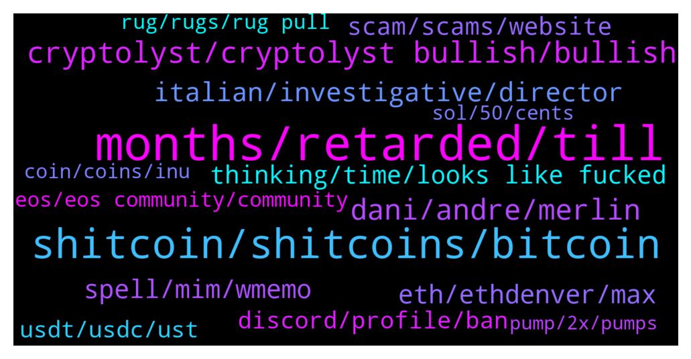

# **@shitpool**
 ## Analysis for **2022-01-30** - **2022-02-06**.

---

## 📊 **Basic Stats**

**n_messages_sent**: 1843

---

---

## 🔝 **Top keywords and related messages**

1. **months, retarded, till**

    @MoneroPal --- *This too is retarded, another clueless…* **--->** [TG Discussion](https://t.me/shitpool/719880)

    @jjj1616 --- *I think big nuke might be biden's executive order that's coming in february. Who knows what the hell they prepared* **--->** [TG Discussion](https://t.me/shitpool/720815)

    @bengotti --- *and yeah the world is changing so fast* **--->** [TG Discussion](https://t.me/shitpool/720590)

    @ptsolorid --- *nobody gives a shit about that declining has been anyway* **--->** [TG Discussion](https://t.me/shitpool/721850)

    @BeAMightyKing --- *Feels like a thousand years in waiting...* **--->** [TG Discussion](https://t.me/shitpool/722084)

    @grammi --- *Why does everyone think it’s gonna happen so fast ?* **--->** [TG Discussion](https://t.me/shitpool/719346)

2. **shitcoin, shitcoins, bitcoin**

    @<UNK> --- *that means he's buying every shitcoin he can get his hands on* **--->** [TG Discussion](https://t.me/shitpool/719939)

    @Zuhaib0095 --- *BTC isn't perfect, not even good compared to many other things out there. But it is the original one, that is the only big difference which makes us label them shitcoins.* **--->** [TG Discussion](https://t.me/shitpool/723115)

    @ManimalX --- *A lot of people shilling shitcoins 🤣🤣* **--->** [TG Discussion](https://t.me/shitpool/723131)

    @bengotti --- *Shitcoins is either used affectionately to describe vaporware designed to make money or used by low iq bitcoiners to cope* **--->** [TG Discussion](https://t.me/shitpool/723121)

    @Moon --- *How is bitcoin suisse a reputable anything? 🤣 with all those turks and indians working there another swiss quality rugpull like shitfinity 🤣🤣🤣* **--->** [TG Discussion](https://t.me/shitpool/722072)

    @Zuhaib0095 --- *By definition everything other than BTC is a shitcoin, the degree of shitiness varies though.* **--->** [TG Discussion](https://t.me/shitpool/723108)

3. **cryptolyst, cryptolyst bullish, bullish**

    @yesbutalsono --- *imagine all of those who quit their jobs to go full time crypto lol* **--->** [TG Discussion](https://t.me/shitpool/720881)

    @XuvIsKing --- *cryptotwitter be like: "I still trust Daniele"* **--->** [TG Discussion](https://t.me/shitpool/721395)

    @ptsolorid --- *yeh nobody in crypto really gives a shit about that though.* **--->** [TG Discussion](https://t.me/shitpool/721437)

    @XuvIsKing --- *Killing crypto slowly without pissing off the big investors* **--->** [TG Discussion](https://t.me/shitpool/719850)

    @Blazmeen --- *I've just taken a break from crypto for a few days and holy shit.   I've got a lot to catch up on...* **--->** [TG Discussion](https://t.me/shitpool/720916)

    @nuckingfutzzzz --- *Bruh. I thought the world was fake. Crypto is fake on steroids.* **--->** [TG Discussion](https://t.me/shitpool/719893)

4. **dani, andre, merlin**

    @OxZilla --- *I don’t think merlin is dani* **--->** [TG Discussion](https://t.me/shitpool/722169)

    @MoneroPal --- *Subtract Merlin, the rest is true, Dani is a total and outright fraud to the height degree...* **--->** [TG Discussion](https://t.me/shitpool/721592)

    @pizza_dog --- *This TIME rug is spreading pretty bad, seeing it all over CT. Dani’s rep is pretty torched and it’ll probably torch his other shitcoins* **--->** [TG Discussion](https://t.me/shitpool/720065)

    @pizza_dog --- *depends how important the dani andre collab is to the ecosystem* **--->** [TG Discussion](https://t.me/shitpool/720423)

    @JVijay --- *My ICE bag has melted 😭 & i thought Dani was one of the key innovators, sounds like he Is just innovating more scams 😰* **--->** [TG Discussion](https://t.me/shitpool/720458)

    @OxZilla --- *Andre gonna have to remove all association from Dani* **--->** [TG Discussion](https://t.me/shitpool/720927)

5. **italian, investigative, director**

    @MoneroPal --- *There is a 50/50 chance, unless you have proof to dispell the rumors, there is a 50% chance it’s true. It’s highly suspicious all of his transfers of USDT went to Bitfinex and not any other exchange. This is the same for Sifu…* **--->** [TG Discussion](https://t.me/shitpool/721607)

    @MoneroPal --- *Have you been living under a rock? Daniele is in person with this guy in Dubai. They collaborated on this project and dumped on investors from day 1. They did this by getting their 5% of free time as salary, per the whitepaper, wrapped it into wMEMO, then borrowed MIM against wMEMO on Abra, then dumped this into fiat via USDT. This was the “lick” the robbery, this allowed them to exit without moving price and maintaining that they too got liquidated when it did, but they received the token for free, the investors did not...  Daniele is linked to known Italian money launders, he has a company in Switzerland where the person was a director, the person was convicted and is serving prison time.   Sifu is a gigacriminal, the entire Wonderland, Abra, Popsicle team is non-doxxed outside of Dani and now Sifu, they’re all Bitfinex employees, 0xMerlin has been uncovered to be the CFO of Bitfinex* **--->** [TG Discussion](https://t.me/shitpool/721393)

    @michael_ssss --- *@Horselorde where do you fit in with all of the drama with TIME today? You mentioned you had some contacts on the inside. Are you in the Italian mafia?* **--->** [TG Discussion](https://t.me/shitpool/720700)

    @ptsolorid --- *Lol at zachbct or whatever being an actual investigative journalist. Hes a spreadsheet warrior* **--->** [TG Discussion](https://t.me/shitpool/721828)

    @MoneroPal --- *And it’s an actual real investigative journalist* **--->** [TG Discussion](https://t.me/shitpool/721802)

    @MoneroPal --- *They wouldn’t be exposed to what is being done behind the scenes by the top level executives, founders, and hidden backers, potentially involved in criminal activity, gtfoh* **--->** [TG Discussion](https://t.me/shitpool/721603)

6. **spell, mim, wmemo**

    @MoneroPal --- *not really, they dumped a shit load of MIM and SPELL, they will likely milk it for whatever its worth until it all collapses* **--->** [TG Discussion](https://t.me/shitpool/722422)

    @MoneroPal --- *MIM is minimal in defi, it is primarily being used to loop through Dani’s bullshit projects, TIME, ICE, and so on, doubt it will cause a huge ripple if it tanks* **--->** [TG Discussion](https://t.me/shitpool/720640)

    @Alwayscooked --- *Lol if spell makes a comeback* **--->** [TG Discussion](https://t.me/shitpool/721365)

    @onchainjoe --- *SPELL was essentially bribing to keep UST liquidity pegged* **--->** [TG Discussion](https://t.me/shitpool/721411)

    @MoneroPal --- *The whole industry is obsessed it’s mentioned on every financial publicaton worldwide including Bloomberg. It is over though and the treasury doesn’t mean shit. They’re offering a $3x,000 buyback for wMEMO. The founders and insiders made off with hundreds of millions directly and indirectly. It’s satisfying seeing the frogs get fucked and still support the clown...* **--->** [TG Discussion](https://t.me/shitpool/721964)

    @ptsolorid --- *I believe that spell and Mim will come back if no funds are stolen* **--->** [TG Discussion](https://t.me/shitpool/721385)

7. **eth, ethdenver, max**

    @gonubie --- *why would you have a yourname.eth* **--->** [TG Discussion](https://t.me/shitpool/720649)

    @EmotionLotion --- *It has been consistently the way  of the market to trap longs that think eth is leading* **--->** [TG Discussion](https://t.me/shitpool/723172)

    @MoneroPal --- *Im about to ape into ETH here fellas, wish me luck, or stop me* **--->** [TG Discussion](https://t.me/shitpool/723157)

    @MoneroPal --- *It is highly unlikely ETH will be dethroned anytime soon it just hasn’t happaned. Nothing of importance has been built on AVAX, FTM, Polygon, SOL, or any of the new L1’s. Literally all dog shit projects, rugs, or VC exit scams. ETH is still king, yes it sucks, yes it’s slow, but it’s king.* **--->** [TG Discussion](https://t.me/shitpool/722496)

    @BlockChainUp --- *ETH < 1k (is not pain) , BTC max pain is 7keks* **--->** [TG Discussion](https://t.me/shitpool/720910)

    @BeAMightyKing --- *it's fine tho & he's right, as it's part of the random free merch at ETHDenver* **--->** [TG Discussion](https://t.me/shitpool/723408)

8. **thinking, time, looks like fucked**

    @BeAMightyKing --- *lmfao I will take that hindsight L* **--->** [TG Discussion](https://t.me/shitpool/723189)

    @Horselorde --- *You’re still going on about this lmao* **--->** [TG Discussion](https://t.me/shitpool/721394)

    @Bigjoeyf --- *I know few who did even myself lmao* **--->** [TG Discussion](https://t.me/shitpool/720887)

    @Horselorde --- *All jokes aside tho, hard pass* **--->** [TG Discussion](https://t.me/shitpool/721143)

    @Bigjoeyf --- *It was obvious even before this* **--->** [TG Discussion](https://t.me/shitpool/721602)

    @Gregoranus --- *Haha now it looks like you fucked it up.* **--->** [TG Discussion](https://t.me/shitpool/720759)

9. **scam, scams, website**

    @onchainjoe --- *what the utility to put "ill never msg u first" in your name if you're not a scammer though* **--->** [TG Discussion](https://t.me/shitpool/720204)

    @wanker007 --- *Btw I called spell scam from first week of launch :) just sayin* **--->** [TG Discussion](https://t.me/shitpool/720621)

    @Horselorde --- *It was only a scam if you didn’t take profits 😉* **--->** [TG Discussion](https://t.me/shitpool/721936)

    @DeathspellOm --- *Do people still fall on those scams?* **--->** [TG Discussion](https://t.me/shitpool/723344)

    @arbullz --- *there is a long distance between things being scams and centralized and it going to 0.. you know how things can pump out of the blue and with no fundamental reason whatsoever* **--->** [TG Discussion](https://t.me/shitpool/722033)

    @tornadotrading --- *I mean, aren't you worried about it being a scam* **--->** [TG Discussion](https://t.me/shitpool/719396)

10. **discord, profile, ban**

    @grammi --- *Does anyone even chat anymore in main ? 😂* **--->** [TG Discussion](https://t.me/shitpool/721549)

    @Horselorde --- *It could also be programmed to ban them if they recently joined the chat as opposed to someone who’s been here for months* **--->** [TG Discussion](https://t.me/shitpool/721323)

    @Gregoranus --- *Because you are always here? Lurking?* **--->** [TG Discussion](https://t.me/shitpool/721473)

    @trollkotze --- *so you would get banned for saying this* **--->** [TG Discussion](https://t.me/shitpool/721322)

    @wanker007 --- *They wanna "regulate " not ban lolol.  No shit.  Man it is way to easy to make dips happen to buy in, if you're powerful enough.* **--->** [TG Discussion](https://t.me/shitpool/719916)

    @Horselorde --- *Always get a red exclamation point next to it saying it failed to send lol* **--->** [TG Discussion](https://t.me/shitpool/723016)

11. **usdt, usdc, ust**

    @MoneroPal --- *I don’t understand why USDT, UST, or USDC would be threatened* **--->** [TG Discussion](https://t.me/shitpool/720973)

    @MoneroPal --- *usdc is fine, mim is rekt though, and likely all his projects will go belly u p* **--->** [TG Discussion](https://t.me/shitpool/720962)

    @Willow --- *If you are thinking about what to do and how to do with your huge amount of usdt, please come and join with me. I'm looking for huge sale from you! Don't worry! I will pay more than what the other offer to you* **--->** [TG Discussion](https://t.me/shitpool/721468)

    @BlockChainUp --- *I really think USDT should be worth moar compared to all this shit that is defi* **--->** [TG Discussion](https://t.me/shitpool/720840)

    @wojackdegreate --- *Nahhh I don’t think so, it was always token margined or usdt* **--->** [TG Discussion](https://t.me/shitpool/720368)

    @BeAMightyKing --- *ATOM-USDT chart seems forced, could get omega-rekt if stonks & corn further dip. Definitely some signs of strength tho (I hold zero)* **--->** [TG Discussion](https://t.me/shitpool/719630)

12. **eos, eos community, community**

    @Horselorde --- *However I think the only people that believe the EOS community is audacious, unapologetic and uncompromising are the EOS community… most others think they’re morons.* **--->** [TG Discussion](https://t.me/shitpool/722932)

    @rektkid --- *Holy shit, are you still that hung up on EOS? Dude, move on.* **--->** [TG Discussion](https://t.me/shitpool/722939)

    @Horselorde --- *“EOS is about to EXPLODE!! Don’t miss out 😉”  They’re never gonna stop lmao* **--->** [TG Discussion](https://t.me/shitpool/722921)

    @rektkid --- *Dude, that's not what this is about. I'm not here to debate EOS with you.* **--->** [TG Discussion](https://t.me/shitpool/722959)

    @kekurikekukaka --- *Why are EOS and XRP not at 1000$ yet ?* **--->** [TG Discussion](https://t.me/shitpool/721946)

    @Horselorde --- *Apparently I, Mr Thiel am an EOS investor, so I, MR THIEL condone buying eos so I can dump on you.* **--->** [TG Discussion](https://t.me/shitpool/722629)

13. **rug, rugs, rug pull**

    @gr1mst0n1 --- *Doubt it's a rug, it's been around for a while now, ruggers don't usually.have that much patience 😂* **--->** [TG Discussion](https://t.me/shitpool/720669)

    @notdao --- *i am excited that DCG is very excited about RAILGUN   https://www.coindesk.com/business/2022/01/26/railgun-aims-for-private-defi-with-10m-backing-from-dcg/* **--->** [TG Discussion](https://t.me/shitpool/720095)

    @MoneroPal --- *It’s a rug, obviously, get in and get out, it’s dumping now profit takers, but it will definitely go back up* **--->** [TG Discussion](https://t.me/shitpool/721380)

    @kentkadewell --- *Champ, it’s an opinion, I love the banter in here, please continue to talk about how time is a rug some more* **--->** [TG Discussion](https://t.me/shitpool/721144)

    @MoneroPal --- *Sounds idiotic and it’s a rug, 99.99% sure* **--->** [TG Discussion](https://t.me/shitpool/720662)

    @gr1mst0n1 --- *Look at how long it took them to rug TIME* **--->** [TG Discussion](https://t.me/shitpool/720670)

14. **sol, 50, cents**

    @Moon --- *I bought on 10 almost -50* **--->** [TG Discussion](https://t.me/shitpool/722016)

    @wojackdegreate --- *It just touched 98 cents, not much yet but it’s a start* **--->** [TG Discussion](https://t.me/shitpool/721215)

    @arbullz --- *i bought cardano at 4 cents.. so it worked out pretty well* **--->** [TG Discussion](https://t.me/shitpool/722043)

    @Horselorde --- *I got into PayPal, Amazon, Apple, and eBay all at $1.* **--->** [TG Discussion](https://t.me/shitpool/722621)

    @Moon --- *Just hodl it down to 4 cents again 😉* **--->** [TG Discussion](https://t.me/shitpool/722044)

    @arbullz --- *sold pretty much all of it at 1.7* **--->** [TG Discussion](https://t.me/shitpool/722045)

15. **coin, coins, inu**

    @boygrt --- *I am looking for a good coin, to buy right now, the market is recovering and I really need to recover my loses I am looking for a coin that has good value* **--->** [TG Discussion](https://t.me/shitpool/723547)

    @R0mster --- *Why should I buy the unnamed coin?* **--->** [TG Discussion](https://t.me/shitpool/720194)

    @XuvIsKing --- *I suggest you look into it to avoid poverty in the future.* **--->** [TG Discussion](https://t.me/shitpool/723463)

    @ptsolorid --- *It is also the only truly decentralised coin.* **--->** [TG Discussion](https://t.me/shitpool/723151)

    @Oldnavy1 --- *You should probably be aping into VOLT INU project, a hyper-deflationary token whose aim is to invest in multiple asset classes such as NFTs, nodes, altcoins, staking & farming of stablecoins.* **--->** [TG Discussion](https://t.me/shitpool/721302)

    @Horselorde --- *I’m surprised anus coin doesn’t exist* **--->** [TG Discussion](https://t.me/shitpool/722973)

